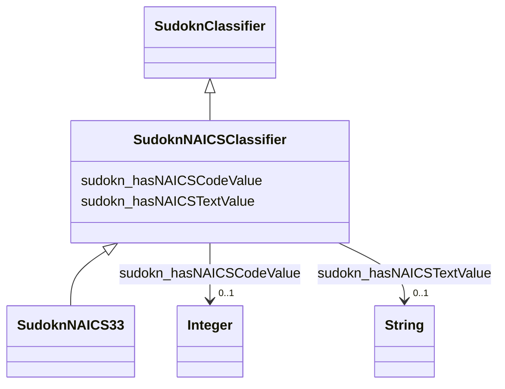

# Class: NAICS classifier (sudokn_NAICSClassifier)


This class occurs 23 times.


URI: [sudokn:NAICSClassifier](http://asu.edu/semantics/SUDOKN/NAICSClassifier)





## Inheritance
* [IoInformationContentEntity](../classes/IoInformationContentEntity.md)
    * [SudoknClassifier](../classes/SudoknClassifier.md)
        * **SudoknNAICSClassifier**
            * [SudoknNAICS33](../classes/SudoknNAICS33.md)


## Slots

| Name | Cardinality and Range | Description | Inheritance | Occurrences |
| ---  | --- | --- | --- | --- |
| [sudokn_hasNAICSTextValue](../slots/sudokn_hasNAICSTextValue.md) | 0..1 <br/> [xsd:string](http://www.w3.org/2001/XMLSchema#string) |  <br/>  | direct | 23 |
| [sudokn_hasNAICSCodeValue](../slots/sudokn_hasNAICSCodeValue.md) | 0..1 <br/> [xsd:integer](http://www.w3.org/2001/XMLSchema#integer) |  <br/>  | direct | 22 |


## Usages

| used by | used in | type | used |
| ---  | --- | --- | --- |
| [IoManufacturer](../classes/IoManufacturer.md) | [sudokn_hasPrimaryNAICSClassifier](../slots/sudokn_hasPrimaryNAICSClassifier.md) | any_of[range] | [SudoknNAICSClassifier](../classes/SudoknNAICSClassifier.md) |
| [IoManufacturer](../classes/IoManufacturer.md) | [sudokn_hasSecondaryNAICSClassifier](../slots/sudokn_hasSecondaryNAICSClassifier.md) | range | [SudoknNAICSClassifier](../classes/SudoknNAICSClassifier.md) |
| [IoManufacturer](../classes/IoManufacturer.md) | [sudokn_hasNAICSClassifier](../slots/sudokn_hasNAICSClassifier.md) | any_of[range] | [SudoknNAICSClassifier](../classes/SudoknNAICSClassifier.md) |
| [SudoknAICS336999](../classes/SudoknAICS336999.md) | [sudokn_hasNAICSTextValue](../slots/sudokn_hasNAICSTextValue.md) | domain | [SudoknNAICSClassifier](../classes/SudoknNAICSClassifier.md) |
| [SudoknAICS336999](../classes/SudoknAICS336999.md) | [sudokn_hasNAICSCodeValue](../slots/sudokn_hasNAICSCodeValue.md) | domain | [SudoknNAICSClassifier](../classes/SudoknNAICSClassifier.md) |
| [SudoknNAICS33](../classes/SudoknNAICS33.md) | [sudokn_hasNAICSTextValue](../slots/sudokn_hasNAICSTextValue.md) | domain | [SudoknNAICSClassifier](../classes/SudoknNAICSClassifier.md) |
| [SudoknNAICS33](../classes/SudoknNAICS33.md) | [sudokn_hasNAICSCodeValue](../slots/sudokn_hasNAICSCodeValue.md) | domain | [SudoknNAICSClassifier](../classes/SudoknNAICSClassifier.md) |
| [SudoknNAICS331](../classes/SudoknNAICS331.md) | [sudokn_hasNAICSTextValue](../slots/sudokn_hasNAICSTextValue.md) | domain | [SudoknNAICSClassifier](../classes/SudoknNAICSClassifier.md) |
| [SudoknNAICS331](../classes/SudoknNAICS331.md) | [sudokn_hasNAICSCodeValue](../slots/sudokn_hasNAICSCodeValue.md) | domain | [SudoknNAICSClassifier](../classes/SudoknNAICSClassifier.md) |
| [SudoknNAICS331110](../classes/SudoknNAICS331110.md) | [sudokn_hasNAICSTextValue](../slots/sudokn_hasNAICSTextValue.md) | domain | [SudoknNAICSClassifier](../classes/SudoknNAICSClassifier.md) |
| [SudoknNAICS331110](../classes/SudoknNAICS331110.md) | [sudokn_hasNAICSCodeValue](../slots/sudokn_hasNAICSCodeValue.md) | domain | [SudoknNAICSClassifier](../classes/SudoknNAICSClassifier.md) |
| [SudoknNAICS331210](../classes/SudoknNAICS331210.md) | [sudokn_hasNAICSTextValue](../slots/sudokn_hasNAICSTextValue.md) | domain | [SudoknNAICSClassifier](../classes/SudoknNAICSClassifier.md) |
| [SudoknNAICS331210](../classes/SudoknNAICS331210.md) | [sudokn_hasNAICSCodeValue](../slots/sudokn_hasNAICSCodeValue.md) | domain | [SudoknNAICSClassifier](../classes/SudoknNAICSClassifier.md) |
| [SudoknNAICS331221](../classes/SudoknNAICS331221.md) | [sudokn_hasNAICSTextValue](../slots/sudokn_hasNAICSTextValue.md) | domain | [SudoknNAICSClassifier](../classes/SudoknNAICSClassifier.md) |
| [SudoknNAICS331221](../classes/SudoknNAICS331221.md) | [sudokn_hasNAICSCodeValue](../slots/sudokn_hasNAICSCodeValue.md) | domain | [SudoknNAICSClassifier](../classes/SudoknNAICSClassifier.md) |
| [SudoknNAICS331222](../classes/SudoknNAICS331222.md) | [sudokn_hasNAICSTextValue](../slots/sudokn_hasNAICSTextValue.md) | domain | [SudoknNAICSClassifier](../classes/SudoknNAICSClassifier.md) |
| [SudoknNAICS331222](../classes/SudoknNAICS331222.md) | [sudokn_hasNAICSCodeValue](../slots/sudokn_hasNAICSCodeValue.md) | domain | [SudoknNAICSClassifier](../classes/SudoknNAICSClassifier.md) |
| [SudoknNAICS331313](../classes/SudoknNAICS331313.md) | [sudokn_hasNAICSTextValue](../slots/sudokn_hasNAICSTextValue.md) | domain | [SudoknNAICSClassifier](../classes/SudoknNAICSClassifier.md) |
| [SudoknNAICS331313](../classes/SudoknNAICS331313.md) | [sudokn_hasNAICSCodeValue](../slots/sudokn_hasNAICSCodeValue.md) | domain | [SudoknNAICSClassifier](../classes/SudoknNAICSClassifier.md) |
| [SudoknNAICS331314](../classes/SudoknNAICS331314.md) | [sudokn_hasNAICSTextValue](../slots/sudokn_hasNAICSTextValue.md) | domain | [SudoknNAICSClassifier](../classes/SudoknNAICSClassifier.md) |
| [SudoknNAICS331314](../classes/SudoknNAICS331314.md) | [sudokn_hasNAICSCodeValue](../slots/sudokn_hasNAICSCodeValue.md) | domain | [SudoknNAICSClassifier](../classes/SudoknNAICSClassifier.md) |
| [SudoknNAICS331315](../classes/SudoknNAICS331315.md) | [sudokn_hasNAICSTextValue](../slots/sudokn_hasNAICSTextValue.md) | domain | [SudoknNAICSClassifier](../classes/SudoknNAICSClassifier.md) |
| [SudoknNAICS331315](../classes/SudoknNAICS331315.md) | [sudokn_hasNAICSCodeValue](../slots/sudokn_hasNAICSCodeValue.md) | domain | [SudoknNAICSClassifier](../classes/SudoknNAICSClassifier.md) |
| [SudoknNAICS331318](../classes/SudoknNAICS331318.md) | [sudokn_hasNAICSTextValue](../slots/sudokn_hasNAICSTextValue.md) | domain | [SudoknNAICSClassifier](../classes/SudoknNAICSClassifier.md) |
| [SudoknNAICS331318](../classes/SudoknNAICS331318.md) | [sudokn_hasNAICSCodeValue](../slots/sudokn_hasNAICSCodeValue.md) | domain | [SudoknNAICSClassifier](../classes/SudoknNAICSClassifier.md) |
| [SudoknNAICS331410](../classes/SudoknNAICS331410.md) | [sudokn_hasNAICSTextValue](../slots/sudokn_hasNAICSTextValue.md) | domain | [SudoknNAICSClassifier](../classes/SudoknNAICSClassifier.md) |
| [SudoknNAICS331410](../classes/SudoknNAICS331410.md) | [sudokn_hasNAICSCodeValue](../slots/sudokn_hasNAICSCodeValue.md) | domain | [SudoknNAICSClassifier](../classes/SudoknNAICSClassifier.md) |
| [SudoknNAICS331420](../classes/SudoknNAICS331420.md) | [sudokn_hasNAICSTextValue](../slots/sudokn_hasNAICSTextValue.md) | domain | [SudoknNAICSClassifier](../classes/SudoknNAICSClassifier.md) |
| [SudoknNAICS331420](../classes/SudoknNAICS331420.md) | [sudokn_hasNAICSCodeValue](../slots/sudokn_hasNAICSCodeValue.md) | domain | [SudoknNAICSClassifier](../classes/SudoknNAICSClassifier.md) |
| [SudoknNAICS331491](../classes/SudoknNAICS331491.md) | [sudokn_hasNAICSTextValue](../slots/sudokn_hasNAICSTextValue.md) | domain | [SudoknNAICSClassifier](../classes/SudoknNAICSClassifier.md) |
| [SudoknNAICS331491](../classes/SudoknNAICS331491.md) | [sudokn_hasNAICSCodeValue](../slots/sudokn_hasNAICSCodeValue.md) | domain | [SudoknNAICSClassifier](../classes/SudoknNAICSClassifier.md) |
| [SudoknNAICS331492](../classes/SudoknNAICS331492.md) | [sudokn_hasNAICSTextValue](../slots/sudokn_hasNAICSTextValue.md) | domain | [SudoknNAICSClassifier](../classes/SudoknNAICSClassifier.md) |
| [SudoknNAICS331492](../classes/SudoknNAICS331492.md) | [sudokn_hasNAICSCodeValue](../slots/sudokn_hasNAICSCodeValue.md) | domain | [SudoknNAICSClassifier](../classes/SudoknNAICSClassifier.md) |
| [SudoknNAICS331511](../classes/SudoknNAICS331511.md) | [sudokn_hasNAICSTextValue](../slots/sudokn_hasNAICSTextValue.md) | domain | [SudoknNAICSClassifier](../classes/SudoknNAICSClassifier.md) |
| [SudoknNAICS331511](../classes/SudoknNAICS331511.md) | [sudokn_hasNAICSCodeValue](../slots/sudokn_hasNAICSCodeValue.md) | domain | [SudoknNAICSClassifier](../classes/SudoknNAICSClassifier.md) |
| [SudoknNAICS331512](../classes/SudoknNAICS331512.md) | [sudokn_hasNAICSTextValue](../slots/sudokn_hasNAICSTextValue.md) | domain | [SudoknNAICSClassifier](../classes/SudoknNAICSClassifier.md) |
| [SudoknNAICS331512](../classes/SudoknNAICS331512.md) | [sudokn_hasNAICSCodeValue](../slots/sudokn_hasNAICSCodeValue.md) | domain | [SudoknNAICSClassifier](../classes/SudoknNAICSClassifier.md) |
| [SudoknNAICS331513](../classes/SudoknNAICS331513.md) | [sudokn_hasNAICSTextValue](../slots/sudokn_hasNAICSTextValue.md) | domain | [SudoknNAICSClassifier](../classes/SudoknNAICSClassifier.md) |
| [SudoknNAICS331513](../classes/SudoknNAICS331513.md) | [sudokn_hasNAICSCodeValue](../slots/sudokn_hasNAICSCodeValue.md) | domain | [SudoknNAICSClassifier](../classes/SudoknNAICSClassifier.md) |
| [SudoknNAICS331523](../classes/SudoknNAICS331523.md) | [sudokn_hasNAICSTextValue](../slots/sudokn_hasNAICSTextValue.md) | domain | [SudoknNAICSClassifier](../classes/SudoknNAICSClassifier.md) |
| [SudoknNAICS331523](../classes/SudoknNAICS331523.md) | [sudokn_hasNAICSCodeValue](../slots/sudokn_hasNAICSCodeValue.md) | domain | [SudoknNAICSClassifier](../classes/SudoknNAICSClassifier.md) |
| [SudoknNAICS331524](../classes/SudoknNAICS331524.md) | [sudokn_hasNAICSTextValue](../slots/sudokn_hasNAICSTextValue.md) | domain | [SudoknNAICSClassifier](../classes/SudoknNAICSClassifier.md) |
| [SudoknNAICS331524](../classes/SudoknNAICS331524.md) | [sudokn_hasNAICSCodeValue](../slots/sudokn_hasNAICSCodeValue.md) | domain | [SudoknNAICSClassifier](../classes/SudoknNAICSClassifier.md) |
| [SudoknNAICS331529](../classes/SudoknNAICS331529.md) | [sudokn_hasNAICSTextValue](../slots/sudokn_hasNAICSTextValue.md) | domain | [SudoknNAICSClassifier](../classes/SudoknNAICSClassifier.md) |
| [SudoknNAICS331529](../classes/SudoknNAICS331529.md) | [sudokn_hasNAICSCodeValue](../slots/sudokn_hasNAICSCodeValue.md) | domain | [SudoknNAICSClassifier](../classes/SudoknNAICSClassifier.md) |
| [SudoknNAICS332](../classes/SudoknNAICS332.md) | [sudokn_hasNAICSTextValue](../slots/sudokn_hasNAICSTextValue.md) | domain | [SudoknNAICSClassifier](../classes/SudoknNAICSClassifier.md) |
| [SudoknNAICS332](../classes/SudoknNAICS332.md) | [sudokn_hasNAICSCodeValue](../slots/sudokn_hasNAICSCodeValue.md) | domain | [SudoknNAICSClassifier](../classes/SudoknNAICSClassifier.md) |
| [SudoknNAICS332111](../classes/SudoknNAICS332111.md) | [sudokn_hasNAICSTextValue](../slots/sudokn_hasNAICSTextValue.md) | domain | [SudoknNAICSClassifier](../classes/SudoknNAICSClassifier.md) |
| [SudoknNAICS332111](../classes/SudoknNAICS332111.md) | [sudokn_hasNAICSCodeValue](../slots/sudokn_hasNAICSCodeValue.md) | domain | [SudoknNAICSClassifier](../classes/SudoknNAICSClassifier.md) |
| [SudoknNAICS332112](../classes/SudoknNAICS332112.md) | [sudokn_hasNAICSTextValue](../slots/sudokn_hasNAICSTextValue.md) | domain | [SudoknNAICSClassifier](../classes/SudoknNAICSClassifier.md) |
| [SudoknNAICS332112](../classes/SudoknNAICS332112.md) | [sudokn_hasNAICSCodeValue](../slots/sudokn_hasNAICSCodeValue.md) | domain | [SudoknNAICSClassifier](../classes/SudoknNAICSClassifier.md) |
| [SudoknNAICS332114](../classes/SudoknNAICS332114.md) | [sudokn_hasNAICSTextValue](../slots/sudokn_hasNAICSTextValue.md) | domain | [SudoknNAICSClassifier](../classes/SudoknNAICSClassifier.md) |
| [SudoknNAICS332114](../classes/SudoknNAICS332114.md) | [sudokn_hasNAICSCodeValue](../slots/sudokn_hasNAICSCodeValue.md) | domain | [SudoknNAICSClassifier](../classes/SudoknNAICSClassifier.md) |
| [SudoknNAICS332115](../classes/SudoknNAICS332115.md) | [sudokn_hasNAICSTextValue](../slots/sudokn_hasNAICSTextValue.md) | domain | [SudoknNAICSClassifier](../classes/SudoknNAICSClassifier.md) |
| [SudoknNAICS332115](../classes/SudoknNAICS332115.md) | [sudokn_hasNAICSCodeValue](../slots/sudokn_hasNAICSCodeValue.md) | domain | [SudoknNAICSClassifier](../classes/SudoknNAICSClassifier.md) |
| [SudoknNAICS332116](../classes/SudoknNAICS332116.md) | [sudokn_hasNAICSTextValue](../slots/sudokn_hasNAICSTextValue.md) | domain | [SudoknNAICSClassifier](../classes/SudoknNAICSClassifier.md) |
| [SudoknNAICS332116](../classes/SudoknNAICS332116.md) | [sudokn_hasNAICSCodeValue](../slots/sudokn_hasNAICSCodeValue.md) | domain | [SudoknNAICSClassifier](../classes/SudoknNAICSClassifier.md) |
| [SudoknNAICS332117](../classes/SudoknNAICS332117.md) | [sudokn_hasNAICSTextValue](../slots/sudokn_hasNAICSTextValue.md) | domain | [SudoknNAICSClassifier](../classes/SudoknNAICSClassifier.md) |
| [SudoknNAICS332117](../classes/SudoknNAICS332117.md) | [sudokn_hasNAICSCodeValue](../slots/sudokn_hasNAICSCodeValue.md) | domain | [SudoknNAICSClassifier](../classes/SudoknNAICSClassifier.md) |
| [SudoknNAICS332119](../classes/SudoknNAICS332119.md) | [sudokn_hasNAICSTextValue](../slots/sudokn_hasNAICSTextValue.md) | domain | [SudoknNAICSClassifier](../classes/SudoknNAICSClassifier.md) |
| [SudoknNAICS332119](../classes/SudoknNAICS332119.md) | [sudokn_hasNAICSCodeValue](../slots/sudokn_hasNAICSCodeValue.md) | domain | [SudoknNAICSClassifier](../classes/SudoknNAICSClassifier.md) |
| [SudoknNAICS332211](../classes/SudoknNAICS332211.md) | [sudokn_hasNAICSTextValue](../slots/sudokn_hasNAICSTextValue.md) | domain | [SudoknNAICSClassifier](../classes/SudoknNAICSClassifier.md) |
| [SudoknNAICS332211](../classes/SudoknNAICS332211.md) | [sudokn_hasNAICSCodeValue](../slots/sudokn_hasNAICSCodeValue.md) | domain | [SudoknNAICSClassifier](../classes/SudoknNAICSClassifier.md) |
| [SudoknNAICS332212](../classes/SudoknNAICS332212.md) | [sudokn_hasNAICSTextValue](../slots/sudokn_hasNAICSTextValue.md) | domain | [SudoknNAICSClassifier](../classes/SudoknNAICSClassifier.md) |
| [SudoknNAICS332212](../classes/SudoknNAICS332212.md) | [sudokn_hasNAICSCodeValue](../slots/sudokn_hasNAICSCodeValue.md) | domain | [SudoknNAICSClassifier](../classes/SudoknNAICSClassifier.md) |
| [SudoknNAICS332213](../classes/SudoknNAICS332213.md) | [sudokn_hasNAICSTextValue](../slots/sudokn_hasNAICSTextValue.md) | domain | [SudoknNAICSClassifier](../classes/SudoknNAICSClassifier.md) |
| [SudoknNAICS332213](../classes/SudoknNAICS332213.md) | [sudokn_hasNAICSCodeValue](../slots/sudokn_hasNAICSCodeValue.md) | domain | [SudoknNAICSClassifier](../classes/SudoknNAICSClassifier.md) |
| [SudoknNAICS332214](../classes/SudoknNAICS332214.md) | [sudokn_hasNAICSTextValue](../slots/sudokn_hasNAICSTextValue.md) | domain | [SudoknNAICSClassifier](../classes/SudoknNAICSClassifier.md) |
| [SudoknNAICS332214](../classes/SudoknNAICS332214.md) | [sudokn_hasNAICSCodeValue](../slots/sudokn_hasNAICSCodeValue.md) | domain | [SudoknNAICSClassifier](../classes/SudoknNAICSClassifier.md) |
| [SudoknNAICS332215](../classes/SudoknNAICS332215.md) | [sudokn_hasNAICSTextValue](../slots/sudokn_hasNAICSTextValue.md) | domain | [SudoknNAICSClassifier](../classes/SudoknNAICSClassifier.md) |
| [SudoknNAICS332215](../classes/SudoknNAICS332215.md) | [sudokn_hasNAICSCodeValue](../slots/sudokn_hasNAICSCodeValue.md) | domain | [SudoknNAICSClassifier](../classes/SudoknNAICSClassifier.md) |
| [SudoknNAICS332216](../classes/SudoknNAICS332216.md) | [sudokn_hasNAICSTextValue](../slots/sudokn_hasNAICSTextValue.md) | domain | [SudoknNAICSClassifier](../classes/SudoknNAICSClassifier.md) |
| [SudoknNAICS332216](../classes/SudoknNAICS332216.md) | [sudokn_hasNAICSCodeValue](../slots/sudokn_hasNAICSCodeValue.md) | domain | [SudoknNAICSClassifier](../classes/SudoknNAICSClassifier.md) |
| [SudoknNAICS332311](../classes/SudoknNAICS332311.md) | [sudokn_hasNAICSTextValue](../slots/sudokn_hasNAICSTextValue.md) | domain | [SudoknNAICSClassifier](../classes/SudoknNAICSClassifier.md) |
| [SudoknNAICS332311](../classes/SudoknNAICS332311.md) | [sudokn_hasNAICSCodeValue](../slots/sudokn_hasNAICSCodeValue.md) | domain | [SudoknNAICSClassifier](../classes/SudoknNAICSClassifier.md) |
| [SudoknNAICS332312](../classes/SudoknNAICS332312.md) | [sudokn_hasNAICSTextValue](../slots/sudokn_hasNAICSTextValue.md) | domain | [SudoknNAICSClassifier](../classes/SudoknNAICSClassifier.md) |
| [SudoknNAICS332312](../classes/SudoknNAICS332312.md) | [sudokn_hasNAICSCodeValue](../slots/sudokn_hasNAICSCodeValue.md) | domain | [SudoknNAICSClassifier](../classes/SudoknNAICSClassifier.md) |
| [SudoknNAICS332313](../classes/SudoknNAICS332313.md) | [sudokn_hasNAICSTextValue](../slots/sudokn_hasNAICSTextValue.md) | domain | [SudoknNAICSClassifier](../classes/SudoknNAICSClassifier.md) |
| [SudoknNAICS332313](../classes/SudoknNAICS332313.md) | [sudokn_hasNAICSCodeValue](../slots/sudokn_hasNAICSCodeValue.md) | domain | [SudoknNAICSClassifier](../classes/SudoknNAICSClassifier.md) |
| [SudoknNAICS332321](../classes/SudoknNAICS332321.md) | [sudokn_hasNAICSTextValue](../slots/sudokn_hasNAICSTextValue.md) | domain | [SudoknNAICSClassifier](../classes/SudoknNAICSClassifier.md) |
| [SudoknNAICS332321](../classes/SudoknNAICS332321.md) | [sudokn_hasNAICSCodeValue](../slots/sudokn_hasNAICSCodeValue.md) | domain | [SudoknNAICSClassifier](../classes/SudoknNAICSClassifier.md) |
| [SudoknNAICS332322](../classes/SudoknNAICS332322.md) | [sudokn_hasNAICSTextValue](../slots/sudokn_hasNAICSTextValue.md) | domain | [SudoknNAICSClassifier](../classes/SudoknNAICSClassifier.md) |
| [SudoknNAICS332322](../classes/SudoknNAICS332322.md) | [sudokn_hasNAICSCodeValue](../slots/sudokn_hasNAICSCodeValue.md) | domain | [SudoknNAICSClassifier](../classes/SudoknNAICSClassifier.md) |
| [SudoknNAICS332323](../classes/SudoknNAICS332323.md) | [sudokn_hasNAICSTextValue](../slots/sudokn_hasNAICSTextValue.md) | domain | [SudoknNAICSClassifier](../classes/SudoknNAICSClassifier.md) |
| [SudoknNAICS332323](../classes/SudoknNAICS332323.md) | [sudokn_hasNAICSCodeValue](../slots/sudokn_hasNAICSCodeValue.md) | domain | [SudoknNAICSClassifier](../classes/SudoknNAICSClassifier.md) |
| [SudoknNAICS332410](../classes/SudoknNAICS332410.md) | [sudokn_hasNAICSTextValue](../slots/sudokn_hasNAICSTextValue.md) | domain | [SudoknNAICSClassifier](../classes/SudoknNAICSClassifier.md) |
| [SudoknNAICS332410](../classes/SudoknNAICS332410.md) | [sudokn_hasNAICSCodeValue](../slots/sudokn_hasNAICSCodeValue.md) | domain | [SudoknNAICSClassifier](../classes/SudoknNAICSClassifier.md) |
| [SudoknNAICS332420](../classes/SudoknNAICS332420.md) | [sudokn_hasNAICSTextValue](../slots/sudokn_hasNAICSTextValue.md) | domain | [SudoknNAICSClassifier](../classes/SudoknNAICSClassifier.md) |
| [SudoknNAICS332420](../classes/SudoknNAICS332420.md) | [sudokn_hasNAICSCodeValue](../slots/sudokn_hasNAICSCodeValue.md) | domain | [SudoknNAICSClassifier](../classes/SudoknNAICSClassifier.md) |
| [SudoknNAICS332431](../classes/SudoknNAICS332431.md) | [sudokn_hasNAICSTextValue](../slots/sudokn_hasNAICSTextValue.md) | domain | [SudoknNAICSClassifier](../classes/SudoknNAICSClassifier.md) |
| [SudoknNAICS332431](../classes/SudoknNAICS332431.md) | [sudokn_hasNAICSCodeValue](../slots/sudokn_hasNAICSCodeValue.md) | domain | [SudoknNAICSClassifier](../classes/SudoknNAICSClassifier.md) |
| [SudoknNAICS332439](../classes/SudoknNAICS332439.md) | [sudokn_hasNAICSTextValue](../slots/sudokn_hasNAICSTextValue.md) | domain | [SudoknNAICSClassifier](../classes/SudoknNAICSClassifier.md) |
| [SudoknNAICS332439](../classes/SudoknNAICS332439.md) | [sudokn_hasNAICSCodeValue](../slots/sudokn_hasNAICSCodeValue.md) | domain | [SudoknNAICSClassifier](../classes/SudoknNAICSClassifier.md) |
| [SudoknNAICS332510](../classes/SudoknNAICS332510.md) | [sudokn_hasNAICSTextValue](../slots/sudokn_hasNAICSTextValue.md) | domain | [SudoknNAICSClassifier](../classes/SudoknNAICSClassifier.md) |
| [SudoknNAICS332510](../classes/SudoknNAICS332510.md) | [sudokn_hasNAICSCodeValue](../slots/sudokn_hasNAICSCodeValue.md) | domain | [SudoknNAICSClassifier](../classes/SudoknNAICSClassifier.md) |
| [SudoknNAICS332611](../classes/SudoknNAICS332611.md) | [sudokn_hasNAICSTextValue](../slots/sudokn_hasNAICSTextValue.md) | domain | [SudoknNAICSClassifier](../classes/SudoknNAICSClassifier.md) |
| [SudoknNAICS332611](../classes/SudoknNAICS332611.md) | [sudokn_hasNAICSCodeValue](../slots/sudokn_hasNAICSCodeValue.md) | domain | [SudoknNAICSClassifier](../classes/SudoknNAICSClassifier.md) |
| [SudoknNAICS332612](../classes/SudoknNAICS332612.md) | [sudokn_hasNAICSTextValue](../slots/sudokn_hasNAICSTextValue.md) | domain | [SudoknNAICSClassifier](../classes/SudoknNAICSClassifier.md) |
| [SudoknNAICS332612](../classes/SudoknNAICS332612.md) | [sudokn_hasNAICSCodeValue](../slots/sudokn_hasNAICSCodeValue.md) | domain | [SudoknNAICSClassifier](../classes/SudoknNAICSClassifier.md) |
| [SudoknNAICS332613](../classes/SudoknNAICS332613.md) | [sudokn_hasNAICSTextValue](../slots/sudokn_hasNAICSTextValue.md) | domain | [SudoknNAICSClassifier](../classes/SudoknNAICSClassifier.md) |
| [SudoknNAICS332613](../classes/SudoknNAICS332613.md) | [sudokn_hasNAICSCodeValue](../slots/sudokn_hasNAICSCodeValue.md) | domain | [SudoknNAICSClassifier](../classes/SudoknNAICSClassifier.md) |
| [SudoknNAICS332618](../classes/SudoknNAICS332618.md) | [sudokn_hasNAICSTextValue](../slots/sudokn_hasNAICSTextValue.md) | domain | [SudoknNAICSClassifier](../classes/SudoknNAICSClassifier.md) |
| [SudoknNAICS332618](../classes/SudoknNAICS332618.md) | [sudokn_hasNAICSCodeValue](../slots/sudokn_hasNAICSCodeValue.md) | domain | [SudoknNAICSClassifier](../classes/SudoknNAICSClassifier.md) |
| [SudoknNAICS332710](../classes/SudoknNAICS332710.md) | [sudokn_hasNAICSTextValue](../slots/sudokn_hasNAICSTextValue.md) | domain | [SudoknNAICSClassifier](../classes/SudoknNAICSClassifier.md) |
| [SudoknNAICS332710](../classes/SudoknNAICS332710.md) | [sudokn_hasNAICSCodeValue](../slots/sudokn_hasNAICSCodeValue.md) | domain | [SudoknNAICSClassifier](../classes/SudoknNAICSClassifier.md) |
| [SudoknNAICS332721](../classes/SudoknNAICS332721.md) | [sudokn_hasNAICSTextValue](../slots/sudokn_hasNAICSTextValue.md) | domain | [SudoknNAICSClassifier](../classes/SudoknNAICSClassifier.md) |
| [SudoknNAICS332721](../classes/SudoknNAICS332721.md) | [sudokn_hasNAICSCodeValue](../slots/sudokn_hasNAICSCodeValue.md) | domain | [SudoknNAICSClassifier](../classes/SudoknNAICSClassifier.md) |
| [SudoknNAICS332722](../classes/SudoknNAICS332722.md) | [sudokn_hasNAICSTextValue](../slots/sudokn_hasNAICSTextValue.md) | domain | [SudoknNAICSClassifier](../classes/SudoknNAICSClassifier.md) |
| [SudoknNAICS332722](../classes/SudoknNAICS332722.md) | [sudokn_hasNAICSCodeValue](../slots/sudokn_hasNAICSCodeValue.md) | domain | [SudoknNAICSClassifier](../classes/SudoknNAICSClassifier.md) |
| [SudoknNAICS332811](../classes/SudoknNAICS332811.md) | [sudokn_hasNAICSTextValue](../slots/sudokn_hasNAICSTextValue.md) | domain | [SudoknNAICSClassifier](../classes/SudoknNAICSClassifier.md) |
| [SudoknNAICS332811](../classes/SudoknNAICS332811.md) | [sudokn_hasNAICSCodeValue](../slots/sudokn_hasNAICSCodeValue.md) | domain | [SudoknNAICSClassifier](../classes/SudoknNAICSClassifier.md) |
| [SudoknNAICS332812](../classes/SudoknNAICS332812.md) | [sudokn_hasNAICSTextValue](../slots/sudokn_hasNAICSTextValue.md) | domain | [SudoknNAICSClassifier](../classes/SudoknNAICSClassifier.md) |
| [SudoknNAICS332812](../classes/SudoknNAICS332812.md) | [sudokn_hasNAICSCodeValue](../slots/sudokn_hasNAICSCodeValue.md) | domain | [SudoknNAICSClassifier](../classes/SudoknNAICSClassifier.md) |
| [SudoknNAICS332813](../classes/SudoknNAICS332813.md) | [sudokn_hasNAICSTextValue](../slots/sudokn_hasNAICSTextValue.md) | domain | [SudoknNAICSClassifier](../classes/SudoknNAICSClassifier.md) |
| [SudoknNAICS332813](../classes/SudoknNAICS332813.md) | [sudokn_hasNAICSCodeValue](../slots/sudokn_hasNAICSCodeValue.md) | domain | [SudoknNAICSClassifier](../classes/SudoknNAICSClassifier.md) |
| [SudoknNAICS332911](../classes/SudoknNAICS332911.md) | [sudokn_hasNAICSTextValue](../slots/sudokn_hasNAICSTextValue.md) | domain | [SudoknNAICSClassifier](../classes/SudoknNAICSClassifier.md) |
| [SudoknNAICS332911](../classes/SudoknNAICS332911.md) | [sudokn_hasNAICSCodeValue](../slots/sudokn_hasNAICSCodeValue.md) | domain | [SudoknNAICSClassifier](../classes/SudoknNAICSClassifier.md) |
| [SudoknNAICS332912](../classes/SudoknNAICS332912.md) | [sudokn_hasNAICSTextValue](../slots/sudokn_hasNAICSTextValue.md) | domain | [SudoknNAICSClassifier](../classes/SudoknNAICSClassifier.md) |
| [SudoknNAICS332912](../classes/SudoknNAICS332912.md) | [sudokn_hasNAICSCodeValue](../slots/sudokn_hasNAICSCodeValue.md) | domain | [SudoknNAICSClassifier](../classes/SudoknNAICSClassifier.md) |
| [SudoknNAICS332913](../classes/SudoknNAICS332913.md) | [sudokn_hasNAICSTextValue](../slots/sudokn_hasNAICSTextValue.md) | domain | [SudoknNAICSClassifier](../classes/SudoknNAICSClassifier.md) |
| [SudoknNAICS332913](../classes/SudoknNAICS332913.md) | [sudokn_hasNAICSCodeValue](../slots/sudokn_hasNAICSCodeValue.md) | domain | [SudoknNAICSClassifier](../classes/SudoknNAICSClassifier.md) |
| [SudoknNAICS332919](../classes/SudoknNAICS332919.md) | [sudokn_hasNAICSTextValue](../slots/sudokn_hasNAICSTextValue.md) | domain | [SudoknNAICSClassifier](../classes/SudoknNAICSClassifier.md) |
| [SudoknNAICS332919](../classes/SudoknNAICS332919.md) | [sudokn_hasNAICSCodeValue](../slots/sudokn_hasNAICSCodeValue.md) | domain | [SudoknNAICSClassifier](../classes/SudoknNAICSClassifier.md) |
| [SudoknNAICS332991](../classes/SudoknNAICS332991.md) | [sudokn_hasNAICSTextValue](../slots/sudokn_hasNAICSTextValue.md) | domain | [SudoknNAICSClassifier](../classes/SudoknNAICSClassifier.md) |
| [SudoknNAICS332991](../classes/SudoknNAICS332991.md) | [sudokn_hasNAICSCodeValue](../slots/sudokn_hasNAICSCodeValue.md) | domain | [SudoknNAICSClassifier](../classes/SudoknNAICSClassifier.md) |
| [SudoknNAICS332992](../classes/SudoknNAICS332992.md) | [sudokn_hasNAICSTextValue](../slots/sudokn_hasNAICSTextValue.md) | domain | [SudoknNAICSClassifier](../classes/SudoknNAICSClassifier.md) |
| [SudoknNAICS332992](../classes/SudoknNAICS332992.md) | [sudokn_hasNAICSCodeValue](../slots/sudokn_hasNAICSCodeValue.md) | domain | [SudoknNAICSClassifier](../classes/SudoknNAICSClassifier.md) |
| [SudoknNAICS332993](../classes/SudoknNAICS332993.md) | [sudokn_hasNAICSTextValue](../slots/sudokn_hasNAICSTextValue.md) | domain | [SudoknNAICSClassifier](../classes/SudoknNAICSClassifier.md) |
| [SudoknNAICS332993](../classes/SudoknNAICS332993.md) | [sudokn_hasNAICSCodeValue](../slots/sudokn_hasNAICSCodeValue.md) | domain | [SudoknNAICSClassifier](../classes/SudoknNAICSClassifier.md) |
| [SudoknNAICS332994](../classes/SudoknNAICS332994.md) | [sudokn_hasNAICSTextValue](../slots/sudokn_hasNAICSTextValue.md) | domain | [SudoknNAICSClassifier](../classes/SudoknNAICSClassifier.md) |
| [SudoknNAICS332994](../classes/SudoknNAICS332994.md) | [sudokn_hasNAICSCodeValue](../slots/sudokn_hasNAICSCodeValue.md) | domain | [SudoknNAICSClassifier](../classes/SudoknNAICSClassifier.md) |
| [SudoknNAICS332995](../classes/SudoknNAICS332995.md) | [sudokn_hasNAICSTextValue](../slots/sudokn_hasNAICSTextValue.md) | domain | [SudoknNAICSClassifier](../classes/SudoknNAICSClassifier.md) |
| [SudoknNAICS332995](../classes/SudoknNAICS332995.md) | [sudokn_hasNAICSCodeValue](../slots/sudokn_hasNAICSCodeValue.md) | domain | [SudoknNAICSClassifier](../classes/SudoknNAICSClassifier.md) |
| [SudoknNAICS332996](../classes/SudoknNAICS332996.md) | [sudokn_hasNAICSTextValue](../slots/sudokn_hasNAICSTextValue.md) | domain | [SudoknNAICSClassifier](../classes/SudoknNAICSClassifier.md) |
| [SudoknNAICS332996](../classes/SudoknNAICS332996.md) | [sudokn_hasNAICSCodeValue](../slots/sudokn_hasNAICSCodeValue.md) | domain | [SudoknNAICSClassifier](../classes/SudoknNAICSClassifier.md) |
| [SudoknNAICS332997](../classes/SudoknNAICS332997.md) | [sudokn_hasNAICSTextValue](../slots/sudokn_hasNAICSTextValue.md) | domain | [SudoknNAICSClassifier](../classes/SudoknNAICSClassifier.md) |
| [SudoknNAICS332997](../classes/SudoknNAICS332997.md) | [sudokn_hasNAICSCodeValue](../slots/sudokn_hasNAICSCodeValue.md) | domain | [SudoknNAICSClassifier](../classes/SudoknNAICSClassifier.md) |
| [SudoknNAICS332998](../classes/SudoknNAICS332998.md) | [sudokn_hasNAICSTextValue](../slots/sudokn_hasNAICSTextValue.md) | domain | [SudoknNAICSClassifier](../classes/SudoknNAICSClassifier.md) |
| [SudoknNAICS332998](../classes/SudoknNAICS332998.md) | [sudokn_hasNAICSCodeValue](../slots/sudokn_hasNAICSCodeValue.md) | domain | [SudoknNAICSClassifier](../classes/SudoknNAICSClassifier.md) |
| [SudoknNAICS332999](../classes/SudoknNAICS332999.md) | [sudokn_hasNAICSTextValue](../slots/sudokn_hasNAICSTextValue.md) | domain | [SudoknNAICSClassifier](../classes/SudoknNAICSClassifier.md) |
| [SudoknNAICS332999](../classes/SudoknNAICS332999.md) | [sudokn_hasNAICSCodeValue](../slots/sudokn_hasNAICSCodeValue.md) | domain | [SudoknNAICSClassifier](../classes/SudoknNAICSClassifier.md) |
| [SudoknNAICS333](../classes/SudoknNAICS333.md) | [sudokn_hasNAICSTextValue](../slots/sudokn_hasNAICSTextValue.md) | domain | [SudoknNAICSClassifier](../classes/SudoknNAICSClassifier.md) |
| [SudoknNAICS333](../classes/SudoknNAICS333.md) | [sudokn_hasNAICSCodeValue](../slots/sudokn_hasNAICSCodeValue.md) | domain | [SudoknNAICSClassifier](../classes/SudoknNAICSClassifier.md) |
| [SudoknNAICS333111](../classes/SudoknNAICS333111.md) | [sudokn_hasNAICSTextValue](../slots/sudokn_hasNAICSTextValue.md) | domain | [SudoknNAICSClassifier](../classes/SudoknNAICSClassifier.md) |
| [SudoknNAICS333111](../classes/SudoknNAICS333111.md) | [sudokn_hasNAICSCodeValue](../slots/sudokn_hasNAICSCodeValue.md) | domain | [SudoknNAICSClassifier](../classes/SudoknNAICSClassifier.md) |
| [SudoknNAICS333112](../classes/SudoknNAICS333112.md) | [sudokn_hasNAICSTextValue](../slots/sudokn_hasNAICSTextValue.md) | domain | [SudoknNAICSClassifier](../classes/SudoknNAICSClassifier.md) |
| [SudoknNAICS333112](../classes/SudoknNAICS333112.md) | [sudokn_hasNAICSCodeValue](../slots/sudokn_hasNAICSCodeValue.md) | domain | [SudoknNAICSClassifier](../classes/SudoknNAICSClassifier.md) |
| [SudoknNAICS333120](../classes/SudoknNAICS333120.md) | [sudokn_hasNAICSTextValue](../slots/sudokn_hasNAICSTextValue.md) | domain | [SudoknNAICSClassifier](../classes/SudoknNAICSClassifier.md) |
| [SudoknNAICS333120](../classes/SudoknNAICS333120.md) | [sudokn_hasNAICSCodeValue](../slots/sudokn_hasNAICSCodeValue.md) | domain | [SudoknNAICSClassifier](../classes/SudoknNAICSClassifier.md) |
| [SudoknNAICS333131](../classes/SudoknNAICS333131.md) | [sudokn_hasNAICSTextValue](../slots/sudokn_hasNAICSTextValue.md) | domain | [SudoknNAICSClassifier](../classes/SudoknNAICSClassifier.md) |
| [SudoknNAICS333131](../classes/SudoknNAICS333131.md) | [sudokn_hasNAICSCodeValue](../slots/sudokn_hasNAICSCodeValue.md) | domain | [SudoknNAICSClassifier](../classes/SudoknNAICSClassifier.md) |
| [SudoknNAICS333132](../classes/SudoknNAICS333132.md) | [sudokn_hasNAICSTextValue](../slots/sudokn_hasNAICSTextValue.md) | domain | [SudoknNAICSClassifier](../classes/SudoknNAICSClassifier.md) |
| [SudoknNAICS333132](../classes/SudoknNAICS333132.md) | [sudokn_hasNAICSCodeValue](../slots/sudokn_hasNAICSCodeValue.md) | domain | [SudoknNAICSClassifier](../classes/SudoknNAICSClassifier.md) |
| [SudoknNAICS333241](../classes/SudoknNAICS333241.md) | [sudokn_hasNAICSTextValue](../slots/sudokn_hasNAICSTextValue.md) | domain | [SudoknNAICSClassifier](../classes/SudoknNAICSClassifier.md) |
| [SudoknNAICS333241](../classes/SudoknNAICS333241.md) | [sudokn_hasNAICSCodeValue](../slots/sudokn_hasNAICSCodeValue.md) | domain | [SudoknNAICSClassifier](../classes/SudoknNAICSClassifier.md) |
| [SudoknNAICS333242](../classes/SudoknNAICS333242.md) | [sudokn_hasNAICSTextValue](../slots/sudokn_hasNAICSTextValue.md) | domain | [SudoknNAICSClassifier](../classes/SudoknNAICSClassifier.md) |
| [SudoknNAICS333242](../classes/SudoknNAICS333242.md) | [sudokn_hasNAICSCodeValue](../slots/sudokn_hasNAICSCodeValue.md) | domain | [SudoknNAICSClassifier](../classes/SudoknNAICSClassifier.md) |
| [SudoknNAICS333243](../classes/SudoknNAICS333243.md) | [sudokn_hasNAICSTextValue](../slots/sudokn_hasNAICSTextValue.md) | domain | [SudoknNAICSClassifier](../classes/SudoknNAICSClassifier.md) |
| [SudoknNAICS333243](../classes/SudoknNAICS333243.md) | [sudokn_hasNAICSCodeValue](../slots/sudokn_hasNAICSCodeValue.md) | domain | [SudoknNAICSClassifier](../classes/SudoknNAICSClassifier.md) |
| [SudoknNAICS333248](../classes/SudoknNAICS333248.md) | [sudokn_hasNAICSTextValue](../slots/sudokn_hasNAICSTextValue.md) | domain | [SudoknNAICSClassifier](../classes/SudoknNAICSClassifier.md) |
| [SudoknNAICS333248](../classes/SudoknNAICS333248.md) | [sudokn_hasNAICSCodeValue](../slots/sudokn_hasNAICSCodeValue.md) | domain | [SudoknNAICSClassifier](../classes/SudoknNAICSClassifier.md) |
| [SudoknNAICS333310](../classes/SudoknNAICS333310.md) | [sudokn_hasNAICSTextValue](../slots/sudokn_hasNAICSTextValue.md) | domain | [SudoknNAICSClassifier](../classes/SudoknNAICSClassifier.md) |
| [SudoknNAICS333310](../classes/SudoknNAICS333310.md) | [sudokn_hasNAICSCodeValue](../slots/sudokn_hasNAICSCodeValue.md) | domain | [SudoknNAICSClassifier](../classes/SudoknNAICSClassifier.md) |
| [SudoknNAICS333413](../classes/SudoknNAICS333413.md) | [sudokn_hasNAICSTextValue](../slots/sudokn_hasNAICSTextValue.md) | domain | [SudoknNAICSClassifier](../classes/SudoknNAICSClassifier.md) |
| [SudoknNAICS333413](../classes/SudoknNAICS333413.md) | [sudokn_hasNAICSCodeValue](../slots/sudokn_hasNAICSCodeValue.md) | domain | [SudoknNAICSClassifier](../classes/SudoknNAICSClassifier.md) |
| [SudoknNAICS333414](../classes/SudoknNAICS333414.md) | [sudokn_hasNAICSTextValue](../slots/sudokn_hasNAICSTextValue.md) | domain | [SudoknNAICSClassifier](../classes/SudoknNAICSClassifier.md) |
| [SudoknNAICS333414](../classes/SudoknNAICS333414.md) | [sudokn_hasNAICSCodeValue](../slots/sudokn_hasNAICSCodeValue.md) | domain | [SudoknNAICSClassifier](../classes/SudoknNAICSClassifier.md) |
| [SudoknNAICS333415](../classes/SudoknNAICS333415.md) | [sudokn_hasNAICSTextValue](../slots/sudokn_hasNAICSTextValue.md) | domain | [SudoknNAICSClassifier](../classes/SudoknNAICSClassifier.md) |
| [SudoknNAICS333415](../classes/SudoknNAICS333415.md) | [sudokn_hasNAICSCodeValue](../slots/sudokn_hasNAICSCodeValue.md) | domain | [SudoknNAICSClassifier](../classes/SudoknNAICSClassifier.md) |
| [SudoknNAICS333511](../classes/SudoknNAICS333511.md) | [sudokn_hasNAICSTextValue](../slots/sudokn_hasNAICSTextValue.md) | domain | [SudoknNAICSClassifier](../classes/SudoknNAICSClassifier.md) |
| [SudoknNAICS333511](../classes/SudoknNAICS333511.md) | [sudokn_hasNAICSCodeValue](../slots/sudokn_hasNAICSCodeValue.md) | domain | [SudoknNAICSClassifier](../classes/SudoknNAICSClassifier.md) |
| [SudoknNAICS333514](../classes/SudoknNAICS333514.md) | [sudokn_hasNAICSTextValue](../slots/sudokn_hasNAICSTextValue.md) | domain | [SudoknNAICSClassifier](../classes/SudoknNAICSClassifier.md) |
| [SudoknNAICS333514](../classes/SudoknNAICS333514.md) | [sudokn_hasNAICSCodeValue](../slots/sudokn_hasNAICSCodeValue.md) | domain | [SudoknNAICSClassifier](../classes/SudoknNAICSClassifier.md) |
| [SudoknNAICS333515](../classes/SudoknNAICS333515.md) | [sudokn_hasNAICSTextValue](../slots/sudokn_hasNAICSTextValue.md) | domain | [SudoknNAICSClassifier](../classes/SudoknNAICSClassifier.md) |
| [SudoknNAICS333515](../classes/SudoknNAICS333515.md) | [sudokn_hasNAICSCodeValue](../slots/sudokn_hasNAICSCodeValue.md) | domain | [SudoknNAICSClassifier](../classes/SudoknNAICSClassifier.md) |
| [SudoknNAICS333517](../classes/SudoknNAICS333517.md) | [sudokn_hasNAICSTextValue](../slots/sudokn_hasNAICSTextValue.md) | domain | [SudoknNAICSClassifier](../classes/SudoknNAICSClassifier.md) |
| [SudoknNAICS333517](../classes/SudoknNAICS333517.md) | [sudokn_hasNAICSCodeValue](../slots/sudokn_hasNAICSCodeValue.md) | domain | [SudoknNAICSClassifier](../classes/SudoknNAICSClassifier.md) |
| [SudoknNAICS333519](../classes/SudoknNAICS333519.md) | [sudokn_hasNAICSTextValue](../slots/sudokn_hasNAICSTextValue.md) | domain | [SudoknNAICSClassifier](../classes/SudoknNAICSClassifier.md) |
| [SudoknNAICS333519](../classes/SudoknNAICS333519.md) | [sudokn_hasNAICSCodeValue](../slots/sudokn_hasNAICSCodeValue.md) | domain | [SudoknNAICSClassifier](../classes/SudoknNAICSClassifier.md) |
| [SudoknNAICS333611](../classes/SudoknNAICS333611.md) | [sudokn_hasNAICSTextValue](../slots/sudokn_hasNAICSTextValue.md) | domain | [SudoknNAICSClassifier](../classes/SudoknNAICSClassifier.md) |
| [SudoknNAICS333611](../classes/SudoknNAICS333611.md) | [sudokn_hasNAICSCodeValue](../slots/sudokn_hasNAICSCodeValue.md) | domain | [SudoknNAICSClassifier](../classes/SudoknNAICSClassifier.md) |
| [SudoknNAICS333612](../classes/SudoknNAICS333612.md) | [sudokn_hasNAICSTextValue](../slots/sudokn_hasNAICSTextValue.md) | domain | [SudoknNAICSClassifier](../classes/SudoknNAICSClassifier.md) |
| [SudoknNAICS333612](../classes/SudoknNAICS333612.md) | [sudokn_hasNAICSCodeValue](../slots/sudokn_hasNAICSCodeValue.md) | domain | [SudoknNAICSClassifier](../classes/SudoknNAICSClassifier.md) |
| [SudoknNAICS333613](../classes/SudoknNAICS333613.md) | [sudokn_hasNAICSTextValue](../slots/sudokn_hasNAICSTextValue.md) | domain | [SudoknNAICSClassifier](../classes/SudoknNAICSClassifier.md) |
| [SudoknNAICS333613](../classes/SudoknNAICS333613.md) | [sudokn_hasNAICSCodeValue](../slots/sudokn_hasNAICSCodeValue.md) | domain | [SudoknNAICSClassifier](../classes/SudoknNAICSClassifier.md) |
| [SudoknNAICS333618](../classes/SudoknNAICS333618.md) | [sudokn_hasNAICSTextValue](../slots/sudokn_hasNAICSTextValue.md) | domain | [SudoknNAICSClassifier](../classes/SudoknNAICSClassifier.md) |
| [SudoknNAICS333618](../classes/SudoknNAICS333618.md) | [sudokn_hasNAICSCodeValue](../slots/sudokn_hasNAICSCodeValue.md) | domain | [SudoknNAICSClassifier](../classes/SudoknNAICSClassifier.md) |
| [SudoknNAICS333912](../classes/SudoknNAICS333912.md) | [sudokn_hasNAICSTextValue](../slots/sudokn_hasNAICSTextValue.md) | domain | [SudoknNAICSClassifier](../classes/SudoknNAICSClassifier.md) |
| [SudoknNAICS333912](../classes/SudoknNAICS333912.md) | [sudokn_hasNAICSCodeValue](../slots/sudokn_hasNAICSCodeValue.md) | domain | [SudoknNAICSClassifier](../classes/SudoknNAICSClassifier.md) |
| [SudoknNAICS333914](../classes/SudoknNAICS333914.md) | [sudokn_hasNAICSTextValue](../slots/sudokn_hasNAICSTextValue.md) | domain | [SudoknNAICSClassifier](../classes/SudoknNAICSClassifier.md) |
| [SudoknNAICS333914](../classes/SudoknNAICS333914.md) | [sudokn_hasNAICSCodeValue](../slots/sudokn_hasNAICSCodeValue.md) | domain | [SudoknNAICSClassifier](../classes/SudoknNAICSClassifier.md) |
| [SudoknNAICS333921](../classes/SudoknNAICS333921.md) | [sudokn_hasNAICSTextValue](../slots/sudokn_hasNAICSTextValue.md) | domain | [SudoknNAICSClassifier](../classes/SudoknNAICSClassifier.md) |
| [SudoknNAICS333921](../classes/SudoknNAICS333921.md) | [sudokn_hasNAICSCodeValue](../slots/sudokn_hasNAICSCodeValue.md) | domain | [SudoknNAICSClassifier](../classes/SudoknNAICSClassifier.md) |
| [SudoknNAICS333922](../classes/SudoknNAICS333922.md) | [sudokn_hasNAICSTextValue](../slots/sudokn_hasNAICSTextValue.md) | domain | [SudoknNAICSClassifier](../classes/SudoknNAICSClassifier.md) |
| [SudoknNAICS333922](../classes/SudoknNAICS333922.md) | [sudokn_hasNAICSCodeValue](../slots/sudokn_hasNAICSCodeValue.md) | domain | [SudoknNAICSClassifier](../classes/SudoknNAICSClassifier.md) |
| [SudoknNAICS333923](../classes/SudoknNAICS333923.md) | [sudokn_hasNAICSTextValue](../slots/sudokn_hasNAICSTextValue.md) | domain | [SudoknNAICSClassifier](../classes/SudoknNAICSClassifier.md) |
| [SudoknNAICS333923](../classes/SudoknNAICS333923.md) | [sudokn_hasNAICSCodeValue](../slots/sudokn_hasNAICSCodeValue.md) | domain | [SudoknNAICSClassifier](../classes/SudoknNAICSClassifier.md) |
| [SudoknNAICS333924](../classes/SudoknNAICS333924.md) | [sudokn_hasNAICSTextValue](../slots/sudokn_hasNAICSTextValue.md) | domain | [SudoknNAICSClassifier](../classes/SudoknNAICSClassifier.md) |
| [SudoknNAICS333924](../classes/SudoknNAICS333924.md) | [sudokn_hasNAICSCodeValue](../slots/sudokn_hasNAICSCodeValue.md) | domain | [SudoknNAICSClassifier](../classes/SudoknNAICSClassifier.md) |
| [SudoknNAICS333991](../classes/SudoknNAICS333991.md) | [sudokn_hasNAICSTextValue](../slots/sudokn_hasNAICSTextValue.md) | domain | [SudoknNAICSClassifier](../classes/SudoknNAICSClassifier.md) |
| [SudoknNAICS333991](../classes/SudoknNAICS333991.md) | [sudokn_hasNAICSCodeValue](../slots/sudokn_hasNAICSCodeValue.md) | domain | [SudoknNAICSClassifier](../classes/SudoknNAICSClassifier.md) |
| [SudoknNAICS333992](../classes/SudoknNAICS333992.md) | [sudokn_hasNAICSTextValue](../slots/sudokn_hasNAICSTextValue.md) | domain | [SudoknNAICSClassifier](../classes/SudoknNAICSClassifier.md) |
| [SudoknNAICS333992](../classes/SudoknNAICS333992.md) | [sudokn_hasNAICSCodeValue](../slots/sudokn_hasNAICSCodeValue.md) | domain | [SudoknNAICSClassifier](../classes/SudoknNAICSClassifier.md) |
| [SudoknNAICS333993](../classes/SudoknNAICS333993.md) | [sudokn_hasNAICSTextValue](../slots/sudokn_hasNAICSTextValue.md) | domain | [SudoknNAICSClassifier](../classes/SudoknNAICSClassifier.md) |
| [SudoknNAICS333993](../classes/SudoknNAICS333993.md) | [sudokn_hasNAICSCodeValue](../slots/sudokn_hasNAICSCodeValue.md) | domain | [SudoknNAICSClassifier](../classes/SudoknNAICSClassifier.md) |
| [SudoknNAICS333994](../classes/SudoknNAICS333994.md) | [sudokn_hasNAICSTextValue](../slots/sudokn_hasNAICSTextValue.md) | domain | [SudoknNAICSClassifier](../classes/SudoknNAICSClassifier.md) |
| [SudoknNAICS333994](../classes/SudoknNAICS333994.md) | [sudokn_hasNAICSCodeValue](../slots/sudokn_hasNAICSCodeValue.md) | domain | [SudoknNAICSClassifier](../classes/SudoknNAICSClassifier.md) |
| [SudoknNAICS333995](../classes/SudoknNAICS333995.md) | [sudokn_hasNAICSTextValue](../slots/sudokn_hasNAICSTextValue.md) | domain | [SudoknNAICSClassifier](../classes/SudoknNAICSClassifier.md) |
| [SudoknNAICS333995](../classes/SudoknNAICS333995.md) | [sudokn_hasNAICSCodeValue](../slots/sudokn_hasNAICSCodeValue.md) | domain | [SudoknNAICSClassifier](../classes/SudoknNAICSClassifier.md) |
| [SudoknNAICS333996](../classes/SudoknNAICS333996.md) | [sudokn_hasNAICSTextValue](../slots/sudokn_hasNAICSTextValue.md) | domain | [SudoknNAICSClassifier](../classes/SudoknNAICSClassifier.md) |
| [SudoknNAICS333996](../classes/SudoknNAICS333996.md) | [sudokn_hasNAICSCodeValue](../slots/sudokn_hasNAICSCodeValue.md) | domain | [SudoknNAICSClassifier](../classes/SudoknNAICSClassifier.md) |
| [SudoknNAICS333998](../classes/SudoknNAICS333998.md) | [sudokn_hasNAICSTextValue](../slots/sudokn_hasNAICSTextValue.md) | domain | [SudoknNAICSClassifier](../classes/SudoknNAICSClassifier.md) |
| [SudoknNAICS333998](../classes/SudoknNAICS333998.md) | [sudokn_hasNAICSCodeValue](../slots/sudokn_hasNAICSCodeValue.md) | domain | [SudoknNAICSClassifier](../classes/SudoknNAICSClassifier.md) |
| [SudoknNAICS334](../classes/SudoknNAICS334.md) | [sudokn_hasNAICSTextValue](../slots/sudokn_hasNAICSTextValue.md) | domain | [SudoknNAICSClassifier](../classes/SudoknNAICSClassifier.md) |
| [SudoknNAICS334](../classes/SudoknNAICS334.md) | [sudokn_hasNAICSCodeValue](../slots/sudokn_hasNAICSCodeValue.md) | domain | [SudoknNAICSClassifier](../classes/SudoknNAICSClassifier.md) |
| [SudoknNAICS334111](../classes/SudoknNAICS334111.md) | [sudokn_hasNAICSTextValue](../slots/sudokn_hasNAICSTextValue.md) | domain | [SudoknNAICSClassifier](../classes/SudoknNAICSClassifier.md) |
| [SudoknNAICS334111](../classes/SudoknNAICS334111.md) | [sudokn_hasNAICSCodeValue](../slots/sudokn_hasNAICSCodeValue.md) | domain | [SudoknNAICSClassifier](../classes/SudoknNAICSClassifier.md) |
| [SudoknNAICS334112](../classes/SudoknNAICS334112.md) | [sudokn_hasNAICSTextValue](../slots/sudokn_hasNAICSTextValue.md) | domain | [SudoknNAICSClassifier](../classes/SudoknNAICSClassifier.md) |
| [SudoknNAICS334112](../classes/SudoknNAICS334112.md) | [sudokn_hasNAICSCodeValue](../slots/sudokn_hasNAICSCodeValue.md) | domain | [SudoknNAICSClassifier](../classes/SudoknNAICSClassifier.md) |
| [SudoknNAICS334118](../classes/SudoknNAICS334118.md) | [sudokn_hasNAICSTextValue](../slots/sudokn_hasNAICSTextValue.md) | domain | [SudoknNAICSClassifier](../classes/SudoknNAICSClassifier.md) |
| [SudoknNAICS334118](../classes/SudoknNAICS334118.md) | [sudokn_hasNAICSCodeValue](../slots/sudokn_hasNAICSCodeValue.md) | domain | [SudoknNAICSClassifier](../classes/SudoknNAICSClassifier.md) |
| [SudoknNAICS334210](../classes/SudoknNAICS334210.md) | [sudokn_hasNAICSTextValue](../slots/sudokn_hasNAICSTextValue.md) | domain | [SudoknNAICSClassifier](../classes/SudoknNAICSClassifier.md) |
| [SudoknNAICS334210](../classes/SudoknNAICS334210.md) | [sudokn_hasNAICSCodeValue](../slots/sudokn_hasNAICSCodeValue.md) | domain | [SudoknNAICSClassifier](../classes/SudoknNAICSClassifier.md) |
| [SudoknNAICS334220](../classes/SudoknNAICS334220.md) | [sudokn_hasNAICSTextValue](../slots/sudokn_hasNAICSTextValue.md) | domain | [SudoknNAICSClassifier](../classes/SudoknNAICSClassifier.md) |
| [SudoknNAICS334220](../classes/SudoknNAICS334220.md) | [sudokn_hasNAICSCodeValue](../slots/sudokn_hasNAICSCodeValue.md) | domain | [SudoknNAICSClassifier](../classes/SudoknNAICSClassifier.md) |
| [SudoknNAICS334290](../classes/SudoknNAICS334290.md) | [sudokn_hasNAICSTextValue](../slots/sudokn_hasNAICSTextValue.md) | domain | [SudoknNAICSClassifier](../classes/SudoknNAICSClassifier.md) |
| [SudoknNAICS334290](../classes/SudoknNAICS334290.md) | [sudokn_hasNAICSCodeValue](../slots/sudokn_hasNAICSCodeValue.md) | domain | [SudoknNAICSClassifier](../classes/SudoknNAICSClassifier.md) |
| [SudoknNAICS334310](../classes/SudoknNAICS334310.md) | [sudokn_hasNAICSTextValue](../slots/sudokn_hasNAICSTextValue.md) | domain | [SudoknNAICSClassifier](../classes/SudoknNAICSClassifier.md) |
| [SudoknNAICS334310](../classes/SudoknNAICS334310.md) | [sudokn_hasNAICSCodeValue](../slots/sudokn_hasNAICSCodeValue.md) | domain | [SudoknNAICSClassifier](../classes/SudoknNAICSClassifier.md) |
| [SudoknNAICS334412](../classes/SudoknNAICS334412.md) | [sudokn_hasNAICSTextValue](../slots/sudokn_hasNAICSTextValue.md) | domain | [SudoknNAICSClassifier](../classes/SudoknNAICSClassifier.md) |
| [SudoknNAICS334412](../classes/SudoknNAICS334412.md) | [sudokn_hasNAICSCodeValue](../slots/sudokn_hasNAICSCodeValue.md) | domain | [SudoknNAICSClassifier](../classes/SudoknNAICSClassifier.md) |
| [SudoknNAICS334413](../classes/SudoknNAICS334413.md) | [sudokn_hasNAICSTextValue](../slots/sudokn_hasNAICSTextValue.md) | domain | [SudoknNAICSClassifier](../classes/SudoknNAICSClassifier.md) |
| [SudoknNAICS334413](../classes/SudoknNAICS334413.md) | [sudokn_hasNAICSCodeValue](../slots/sudokn_hasNAICSCodeValue.md) | domain | [SudoknNAICSClassifier](../classes/SudoknNAICSClassifier.md) |
| [SudoknNAICS334416](../classes/SudoknNAICS334416.md) | [sudokn_hasNAICSTextValue](../slots/sudokn_hasNAICSTextValue.md) | domain | [SudoknNAICSClassifier](../classes/SudoknNAICSClassifier.md) |
| [SudoknNAICS334416](../classes/SudoknNAICS334416.md) | [sudokn_hasNAICSCodeValue](../slots/sudokn_hasNAICSCodeValue.md) | domain | [SudoknNAICSClassifier](../classes/SudoknNAICSClassifier.md) |
| [SudoknNAICS334417](../classes/SudoknNAICS334417.md) | [sudokn_hasNAICSTextValue](../slots/sudokn_hasNAICSTextValue.md) | domain | [SudoknNAICSClassifier](../classes/SudoknNAICSClassifier.md) |
| [SudoknNAICS334417](../classes/SudoknNAICS334417.md) | [sudokn_hasNAICSCodeValue](../slots/sudokn_hasNAICSCodeValue.md) | domain | [SudoknNAICSClassifier](../classes/SudoknNAICSClassifier.md) |
| [SudoknNAICS334418](../classes/SudoknNAICS334418.md) | [sudokn_hasNAICSTextValue](../slots/sudokn_hasNAICSTextValue.md) | domain | [SudoknNAICSClassifier](../classes/SudoknNAICSClassifier.md) |
| [SudoknNAICS334418](../classes/SudoknNAICS334418.md) | [sudokn_hasNAICSCodeValue](../slots/sudokn_hasNAICSCodeValue.md) | domain | [SudoknNAICSClassifier](../classes/SudoknNAICSClassifier.md) |
| [SudoknNAICS334419](../classes/SudoknNAICS334419.md) | [sudokn_hasNAICSTextValue](../slots/sudokn_hasNAICSTextValue.md) | domain | [SudoknNAICSClassifier](../classes/SudoknNAICSClassifier.md) |
| [SudoknNAICS334419](../classes/SudoknNAICS334419.md) | [sudokn_hasNAICSCodeValue](../slots/sudokn_hasNAICSCodeValue.md) | domain | [SudoknNAICSClassifier](../classes/SudoknNAICSClassifier.md) |
| [SudoknNAICS334510](../classes/SudoknNAICS334510.md) | [sudokn_hasNAICSTextValue](../slots/sudokn_hasNAICSTextValue.md) | domain | [SudoknNAICSClassifier](../classes/SudoknNAICSClassifier.md) |
| [SudoknNAICS334510](../classes/SudoknNAICS334510.md) | [sudokn_hasNAICSCodeValue](../slots/sudokn_hasNAICSCodeValue.md) | domain | [SudoknNAICSClassifier](../classes/SudoknNAICSClassifier.md) |
| [SudoknNAICS334511](../classes/SudoknNAICS334511.md) | [sudokn_hasNAICSTextValue](../slots/sudokn_hasNAICSTextValue.md) | domain | [SudoknNAICSClassifier](../classes/SudoknNAICSClassifier.md) |
| [SudoknNAICS334511](../classes/SudoknNAICS334511.md) | [sudokn_hasNAICSCodeValue](../slots/sudokn_hasNAICSCodeValue.md) | domain | [SudoknNAICSClassifier](../classes/SudoknNAICSClassifier.md) |
| [SudoknNAICS334512](../classes/SudoknNAICS334512.md) | [sudokn_hasNAICSTextValue](../slots/sudokn_hasNAICSTextValue.md) | domain | [SudoknNAICSClassifier](../classes/SudoknNAICSClassifier.md) |
| [SudoknNAICS334512](../classes/SudoknNAICS334512.md) | [sudokn_hasNAICSCodeValue](../slots/sudokn_hasNAICSCodeValue.md) | domain | [SudoknNAICSClassifier](../classes/SudoknNAICSClassifier.md) |
| [SudoknNAICS334513](../classes/SudoknNAICS334513.md) | [sudokn_hasNAICSTextValue](../slots/sudokn_hasNAICSTextValue.md) | domain | [SudoknNAICSClassifier](../classes/SudoknNAICSClassifier.md) |
| [SudoknNAICS334513](../classes/SudoknNAICS334513.md) | [sudokn_hasNAICSCodeValue](../slots/sudokn_hasNAICSCodeValue.md) | domain | [SudoknNAICSClassifier](../classes/SudoknNAICSClassifier.md) |
| [SudoknNAICS334514](../classes/SudoknNAICS334514.md) | [sudokn_hasNAICSTextValue](../slots/sudokn_hasNAICSTextValue.md) | domain | [SudoknNAICSClassifier](../classes/SudoknNAICSClassifier.md) |
| [SudoknNAICS334514](../classes/SudoknNAICS334514.md) | [sudokn_hasNAICSCodeValue](../slots/sudokn_hasNAICSCodeValue.md) | domain | [SudoknNAICSClassifier](../classes/SudoknNAICSClassifier.md) |
| [SudoknNAICS334515](../classes/SudoknNAICS334515.md) | [sudokn_hasNAICSTextValue](../slots/sudokn_hasNAICSTextValue.md) | domain | [SudoknNAICSClassifier](../classes/SudoknNAICSClassifier.md) |
| [SudoknNAICS334515](../classes/SudoknNAICS334515.md) | [sudokn_hasNAICSCodeValue](../slots/sudokn_hasNAICSCodeValue.md) | domain | [SudoknNAICSClassifier](../classes/SudoknNAICSClassifier.md) |
| [SudoknNAICS334516](../classes/SudoknNAICS334516.md) | [sudokn_hasNAICSTextValue](../slots/sudokn_hasNAICSTextValue.md) | domain | [SudoknNAICSClassifier](../classes/SudoknNAICSClassifier.md) |
| [SudoknNAICS334516](../classes/SudoknNAICS334516.md) | [sudokn_hasNAICSCodeValue](../slots/sudokn_hasNAICSCodeValue.md) | domain | [SudoknNAICSClassifier](../classes/SudoknNAICSClassifier.md) |
| [SudoknNAICS334517](../classes/SudoknNAICS334517.md) | [sudokn_hasNAICSTextValue](../slots/sudokn_hasNAICSTextValue.md) | domain | [SudoknNAICSClassifier](../classes/SudoknNAICSClassifier.md) |
| [SudoknNAICS334517](../classes/SudoknNAICS334517.md) | [sudokn_hasNAICSCodeValue](../slots/sudokn_hasNAICSCodeValue.md) | domain | [SudoknNAICSClassifier](../classes/SudoknNAICSClassifier.md) |
| [SudoknNAICS334519](../classes/SudoknNAICS334519.md) | [sudokn_hasNAICSTextValue](../slots/sudokn_hasNAICSTextValue.md) | domain | [SudoknNAICSClassifier](../classes/SudoknNAICSClassifier.md) |
| [SudoknNAICS334519](../classes/SudoknNAICS334519.md) | [sudokn_hasNAICSCodeValue](../slots/sudokn_hasNAICSCodeValue.md) | domain | [SudoknNAICSClassifier](../classes/SudoknNAICSClassifier.md) |
| [SudoknNAICS334610](../classes/SudoknNAICS334610.md) | [sudokn_hasNAICSTextValue](../slots/sudokn_hasNAICSTextValue.md) | domain | [SudoknNAICSClassifier](../classes/SudoknNAICSClassifier.md) |
| [SudoknNAICS334610](../classes/SudoknNAICS334610.md) | [sudokn_hasNAICSCodeValue](../slots/sudokn_hasNAICSCodeValue.md) | domain | [SudoknNAICSClassifier](../classes/SudoknNAICSClassifier.md) |
| [SudoknNAICS335](../classes/SudoknNAICS335.md) | [sudokn_hasNAICSTextValue](../slots/sudokn_hasNAICSTextValue.md) | domain | [SudoknNAICSClassifier](../classes/SudoknNAICSClassifier.md) |
| [SudoknNAICS335](../classes/SudoknNAICS335.md) | [sudokn_hasNAICSCodeValue](../slots/sudokn_hasNAICSCodeValue.md) | domain | [SudoknNAICSClassifier](../classes/SudoknNAICSClassifier.md) |
| [SudoknNAICS335131](../classes/SudoknNAICS335131.md) | [sudokn_hasNAICSTextValue](../slots/sudokn_hasNAICSTextValue.md) | domain | [SudoknNAICSClassifier](../classes/SudoknNAICSClassifier.md) |
| [SudoknNAICS335131](../classes/SudoknNAICS335131.md) | [sudokn_hasNAICSCodeValue](../slots/sudokn_hasNAICSCodeValue.md) | domain | [SudoknNAICSClassifier](../classes/SudoknNAICSClassifier.md) |
| [SudoknNAICS335132](../classes/SudoknNAICS335132.md) | [sudokn_hasNAICSTextValue](../slots/sudokn_hasNAICSTextValue.md) | domain | [SudoknNAICSClassifier](../classes/SudoknNAICSClassifier.md) |
| [SudoknNAICS335132](../classes/SudoknNAICS335132.md) | [sudokn_hasNAICSCodeValue](../slots/sudokn_hasNAICSCodeValue.md) | domain | [SudoknNAICSClassifier](../classes/SudoknNAICSClassifier.md) |
| [SudoknNAICS335139](../classes/SudoknNAICS335139.md) | [sudokn_hasNAICSTextValue](../slots/sudokn_hasNAICSTextValue.md) | domain | [SudoknNAICSClassifier](../classes/SudoknNAICSClassifier.md) |
| [SudoknNAICS335139](../classes/SudoknNAICS335139.md) | [sudokn_hasNAICSCodeValue](../slots/sudokn_hasNAICSCodeValue.md) | domain | [SudoknNAICSClassifier](../classes/SudoknNAICSClassifier.md) |
| [SudoknNAICS335210](../classes/SudoknNAICS335210.md) | [sudokn_hasNAICSTextValue](../slots/sudokn_hasNAICSTextValue.md) | domain | [SudoknNAICSClassifier](../classes/SudoknNAICSClassifier.md) |
| [SudoknNAICS335210](../classes/SudoknNAICS335210.md) | [sudokn_hasNAICSCodeValue](../slots/sudokn_hasNAICSCodeValue.md) | domain | [SudoknNAICSClassifier](../classes/SudoknNAICSClassifier.md) |
| [SudoknNAICS335220](../classes/SudoknNAICS335220.md) | [sudokn_hasNAICSTextValue](../slots/sudokn_hasNAICSTextValue.md) | domain | [SudoknNAICSClassifier](../classes/SudoknNAICSClassifier.md) |
| [SudoknNAICS335220](../classes/SudoknNAICS335220.md) | [sudokn_hasNAICSCodeValue](../slots/sudokn_hasNAICSCodeValue.md) | domain | [SudoknNAICSClassifier](../classes/SudoknNAICSClassifier.md) |
| [SudoknNAICS335311](../classes/SudoknNAICS335311.md) | [sudokn_hasNAICSTextValue](../slots/sudokn_hasNAICSTextValue.md) | domain | [SudoknNAICSClassifier](../classes/SudoknNAICSClassifier.md) |
| [SudoknNAICS335311](../classes/SudoknNAICS335311.md) | [sudokn_hasNAICSCodeValue](../slots/sudokn_hasNAICSCodeValue.md) | domain | [SudoknNAICSClassifier](../classes/SudoknNAICSClassifier.md) |
| [SudoknNAICS335312](../classes/SudoknNAICS335312.md) | [sudokn_hasNAICSTextValue](../slots/sudokn_hasNAICSTextValue.md) | domain | [SudoknNAICSClassifier](../classes/SudoknNAICSClassifier.md) |
| [SudoknNAICS335312](../classes/SudoknNAICS335312.md) | [sudokn_hasNAICSCodeValue](../slots/sudokn_hasNAICSCodeValue.md) | domain | [SudoknNAICSClassifier](../classes/SudoknNAICSClassifier.md) |
| [SudoknNAICS335313](../classes/SudoknNAICS335313.md) | [sudokn_hasNAICSTextValue](../slots/sudokn_hasNAICSTextValue.md) | domain | [SudoknNAICSClassifier](../classes/SudoknNAICSClassifier.md) |
| [SudoknNAICS335313](../classes/SudoknNAICS335313.md) | [sudokn_hasNAICSCodeValue](../slots/sudokn_hasNAICSCodeValue.md) | domain | [SudoknNAICSClassifier](../classes/SudoknNAICSClassifier.md) |
| [SudoknNAICS335314](../classes/SudoknNAICS335314.md) | [sudokn_hasNAICSTextValue](../slots/sudokn_hasNAICSTextValue.md) | domain | [SudoknNAICSClassifier](../classes/SudoknNAICSClassifier.md) |
| [SudoknNAICS335314](../classes/SudoknNAICS335314.md) | [sudokn_hasNAICSCodeValue](../slots/sudokn_hasNAICSCodeValue.md) | domain | [SudoknNAICSClassifier](../classes/SudoknNAICSClassifier.md) |
| [SudoknNAICS335910](../classes/SudoknNAICS335910.md) | [sudokn_hasNAICSTextValue](../slots/sudokn_hasNAICSTextValue.md) | domain | [SudoknNAICSClassifier](../classes/SudoknNAICSClassifier.md) |
| [SudoknNAICS335910](../classes/SudoknNAICS335910.md) | [sudokn_hasNAICSCodeValue](../slots/sudokn_hasNAICSCodeValue.md) | domain | [SudoknNAICSClassifier](../classes/SudoknNAICSClassifier.md) |
| [SudoknNAICS335921](../classes/SudoknNAICS335921.md) | [sudokn_hasNAICSTextValue](../slots/sudokn_hasNAICSTextValue.md) | domain | [SudoknNAICSClassifier](../classes/SudoknNAICSClassifier.md) |
| [SudoknNAICS335921](../classes/SudoknNAICS335921.md) | [sudokn_hasNAICSCodeValue](../slots/sudokn_hasNAICSCodeValue.md) | domain | [SudoknNAICSClassifier](../classes/SudoknNAICSClassifier.md) |
| [SudoknNAICS335929](../classes/SudoknNAICS335929.md) | [sudokn_hasNAICSTextValue](../slots/sudokn_hasNAICSTextValue.md) | domain | [SudoknNAICSClassifier](../classes/SudoknNAICSClassifier.md) |
| [SudoknNAICS335929](../classes/SudoknNAICS335929.md) | [sudokn_hasNAICSCodeValue](../slots/sudokn_hasNAICSCodeValue.md) | domain | [SudoknNAICSClassifier](../classes/SudoknNAICSClassifier.md) |
| [SudoknNAICS335931](../classes/SudoknNAICS335931.md) | [sudokn_hasNAICSTextValue](../slots/sudokn_hasNAICSTextValue.md) | domain | [SudoknNAICSClassifier](../classes/SudoknNAICSClassifier.md) |
| [SudoknNAICS335931](../classes/SudoknNAICS335931.md) | [sudokn_hasNAICSCodeValue](../slots/sudokn_hasNAICSCodeValue.md) | domain | [SudoknNAICSClassifier](../classes/SudoknNAICSClassifier.md) |
| [SudoknNAICS335932](../classes/SudoknNAICS335932.md) | [sudokn_hasNAICSTextValue](../slots/sudokn_hasNAICSTextValue.md) | domain | [SudoknNAICSClassifier](../classes/SudoknNAICSClassifier.md) |
| [SudoknNAICS335932](../classes/SudoknNAICS335932.md) | [sudokn_hasNAICSCodeValue](../slots/sudokn_hasNAICSCodeValue.md) | domain | [SudoknNAICSClassifier](../classes/SudoknNAICSClassifier.md) |
| [SudoknNAICS335991](../classes/SudoknNAICS335991.md) | [sudokn_hasNAICSTextValue](../slots/sudokn_hasNAICSTextValue.md) | domain | [SudoknNAICSClassifier](../classes/SudoknNAICSClassifier.md) |
| [SudoknNAICS335991](../classes/SudoknNAICS335991.md) | [sudokn_hasNAICSCodeValue](../slots/sudokn_hasNAICSCodeValue.md) | domain | [SudoknNAICSClassifier](../classes/SudoknNAICSClassifier.md) |
| [SudoknNAICS335999](../classes/SudoknNAICS335999.md) | [sudokn_hasNAICSTextValue](../slots/sudokn_hasNAICSTextValue.md) | domain | [SudoknNAICSClassifier](../classes/SudoknNAICSClassifier.md) |
| [SudoknNAICS335999](../classes/SudoknNAICS335999.md) | [sudokn_hasNAICSCodeValue](../slots/sudokn_hasNAICSCodeValue.md) | domain | [SudoknNAICSClassifier](../classes/SudoknNAICSClassifier.md) |
| [SudoknNAICS336](../classes/SudoknNAICS336.md) | [sudokn_hasNAICSTextValue](../slots/sudokn_hasNAICSTextValue.md) | domain | [SudoknNAICSClassifier](../classes/SudoknNAICSClassifier.md) |
| [SudoknNAICS336](../classes/SudoknNAICS336.md) | [sudokn_hasNAICSCodeValue](../slots/sudokn_hasNAICSCodeValue.md) | domain | [SudoknNAICSClassifier](../classes/SudoknNAICSClassifier.md) |
| [SudoknNAICS336110](../classes/SudoknNAICS336110.md) | [sudokn_hasNAICSTextValue](../slots/sudokn_hasNAICSTextValue.md) | domain | [SudoknNAICSClassifier](../classes/SudoknNAICSClassifier.md) |
| [SudoknNAICS336110](../classes/SudoknNAICS336110.md) | [sudokn_hasNAICSCodeValue](../slots/sudokn_hasNAICSCodeValue.md) | domain | [SudoknNAICSClassifier](../classes/SudoknNAICSClassifier.md) |
| [SudoknNAICS336120](../classes/SudoknNAICS336120.md) | [sudokn_hasNAICSTextValue](../slots/sudokn_hasNAICSTextValue.md) | domain | [SudoknNAICSClassifier](../classes/SudoknNAICSClassifier.md) |
| [SudoknNAICS336120](../classes/SudoknNAICS336120.md) | [sudokn_hasNAICSCodeValue](../slots/sudokn_hasNAICSCodeValue.md) | domain | [SudoknNAICSClassifier](../classes/SudoknNAICSClassifier.md) |
| [SudoknNAICS336211](../classes/SudoknNAICS336211.md) | [sudokn_hasNAICSTextValue](../slots/sudokn_hasNAICSTextValue.md) | domain | [SudoknNAICSClassifier](../classes/SudoknNAICSClassifier.md) |
| [SudoknNAICS336211](../classes/SudoknNAICS336211.md) | [sudokn_hasNAICSCodeValue](../slots/sudokn_hasNAICSCodeValue.md) | domain | [SudoknNAICSClassifier](../classes/SudoknNAICSClassifier.md) |
| [SudoknNAICS336212](../classes/SudoknNAICS336212.md) | [sudokn_hasNAICSTextValue](../slots/sudokn_hasNAICSTextValue.md) | domain | [SudoknNAICSClassifier](../classes/SudoknNAICSClassifier.md) |
| [SudoknNAICS336212](../classes/SudoknNAICS336212.md) | [sudokn_hasNAICSCodeValue](../slots/sudokn_hasNAICSCodeValue.md) | domain | [SudoknNAICSClassifier](../classes/SudoknNAICSClassifier.md) |
| [SudoknNAICS336213](../classes/SudoknNAICS336213.md) | [sudokn_hasNAICSTextValue](../slots/sudokn_hasNAICSTextValue.md) | domain | [SudoknNAICSClassifier](../classes/SudoknNAICSClassifier.md) |
| [SudoknNAICS336213](../classes/SudoknNAICS336213.md) | [sudokn_hasNAICSCodeValue](../slots/sudokn_hasNAICSCodeValue.md) | domain | [SudoknNAICSClassifier](../classes/SudoknNAICSClassifier.md) |
| [SudoknNAICS336214](../classes/SudoknNAICS336214.md) | [sudokn_hasNAICSTextValue](../slots/sudokn_hasNAICSTextValue.md) | domain | [SudoknNAICSClassifier](../classes/SudoknNAICSClassifier.md) |
| [SudoknNAICS336214](../classes/SudoknNAICS336214.md) | [sudokn_hasNAICSCodeValue](../slots/sudokn_hasNAICSCodeValue.md) | domain | [SudoknNAICSClassifier](../classes/SudoknNAICSClassifier.md) |
| [SudoknNAICS336310](../classes/SudoknNAICS336310.md) | [sudokn_hasNAICSTextValue](../slots/sudokn_hasNAICSTextValue.md) | domain | [SudoknNAICSClassifier](../classes/SudoknNAICSClassifier.md) |
| [SudoknNAICS336310](../classes/SudoknNAICS336310.md) | [sudokn_hasNAICSCodeValue](../slots/sudokn_hasNAICSCodeValue.md) | domain | [SudoknNAICSClassifier](../classes/SudoknNAICSClassifier.md) |
| [SudoknNAICS336320](../classes/SudoknNAICS336320.md) | [sudokn_hasNAICSTextValue](../slots/sudokn_hasNAICSTextValue.md) | domain | [SudoknNAICSClassifier](../classes/SudoknNAICSClassifier.md) |
| [SudoknNAICS336320](../classes/SudoknNAICS336320.md) | [sudokn_hasNAICSCodeValue](../slots/sudokn_hasNAICSCodeValue.md) | domain | [SudoknNAICSClassifier](../classes/SudoknNAICSClassifier.md) |
| [SudoknNAICS336330](../classes/SudoknNAICS336330.md) | [sudokn_hasNAICSTextValue](../slots/sudokn_hasNAICSTextValue.md) | domain | [SudoknNAICSClassifier](../classes/SudoknNAICSClassifier.md) |
| [SudoknNAICS336330](../classes/SudoknNAICS336330.md) | [sudokn_hasNAICSCodeValue](../slots/sudokn_hasNAICSCodeValue.md) | domain | [SudoknNAICSClassifier](../classes/SudoknNAICSClassifier.md) |
| [SudoknNAICS336340](../classes/SudoknNAICS336340.md) | [sudokn_hasNAICSTextValue](../slots/sudokn_hasNAICSTextValue.md) | domain | [SudoknNAICSClassifier](../classes/SudoknNAICSClassifier.md) |
| [SudoknNAICS336340](../classes/SudoknNAICS336340.md) | [sudokn_hasNAICSCodeValue](../slots/sudokn_hasNAICSCodeValue.md) | domain | [SudoknNAICSClassifier](../classes/SudoknNAICSClassifier.md) |
| [SudoknNAICS336350](../classes/SudoknNAICS336350.md) | [sudokn_hasNAICSTextValue](../slots/sudokn_hasNAICSTextValue.md) | domain | [SudoknNAICSClassifier](../classes/SudoknNAICSClassifier.md) |
| [SudoknNAICS336350](../classes/SudoknNAICS336350.md) | [sudokn_hasNAICSCodeValue](../slots/sudokn_hasNAICSCodeValue.md) | domain | [SudoknNAICSClassifier](../classes/SudoknNAICSClassifier.md) |
| [SudoknNAICS336360](../classes/SudoknNAICS336360.md) | [sudokn_hasNAICSTextValue](../slots/sudokn_hasNAICSTextValue.md) | domain | [SudoknNAICSClassifier](../classes/SudoknNAICSClassifier.md) |
| [SudoknNAICS336360](../classes/SudoknNAICS336360.md) | [sudokn_hasNAICSCodeValue](../slots/sudokn_hasNAICSCodeValue.md) | domain | [SudoknNAICSClassifier](../classes/SudoknNAICSClassifier.md) |
| [SudoknNAICS336370](../classes/SudoknNAICS336370.md) | [sudokn_hasNAICSTextValue](../slots/sudokn_hasNAICSTextValue.md) | domain | [SudoknNAICSClassifier](../classes/SudoknNAICSClassifier.md) |
| [SudoknNAICS336370](../classes/SudoknNAICS336370.md) | [sudokn_hasNAICSCodeValue](../slots/sudokn_hasNAICSCodeValue.md) | domain | [SudoknNAICSClassifier](../classes/SudoknNAICSClassifier.md) |
| [SudoknNAICS336390](../classes/SudoknNAICS336390.md) | [sudokn_hasNAICSTextValue](../slots/sudokn_hasNAICSTextValue.md) | domain | [SudoknNAICSClassifier](../classes/SudoknNAICSClassifier.md) |
| [SudoknNAICS336390](../classes/SudoknNAICS336390.md) | [sudokn_hasNAICSCodeValue](../slots/sudokn_hasNAICSCodeValue.md) | domain | [SudoknNAICSClassifier](../classes/SudoknNAICSClassifier.md) |
| [SudoknNAICS336411](../classes/SudoknNAICS336411.md) | [sudokn_hasNAICSTextValue](../slots/sudokn_hasNAICSTextValue.md) | domain | [SudoknNAICSClassifier](../classes/SudoknNAICSClassifier.md) |
| [SudoknNAICS336411](../classes/SudoknNAICS336411.md) | [sudokn_hasNAICSCodeValue](../slots/sudokn_hasNAICSCodeValue.md) | domain | [SudoknNAICSClassifier](../classes/SudoknNAICSClassifier.md) |
| [SudoknNAICS336412](../classes/SudoknNAICS336412.md) | [sudokn_hasNAICSTextValue](../slots/sudokn_hasNAICSTextValue.md) | domain | [SudoknNAICSClassifier](../classes/SudoknNAICSClassifier.md) |
| [SudoknNAICS336412](../classes/SudoknNAICS336412.md) | [sudokn_hasNAICSCodeValue](../slots/sudokn_hasNAICSCodeValue.md) | domain | [SudoknNAICSClassifier](../classes/SudoknNAICSClassifier.md) |
| [SudoknNAICS336413](../classes/SudoknNAICS336413.md) | [sudokn_hasNAICSTextValue](../slots/sudokn_hasNAICSTextValue.md) | domain | [SudoknNAICSClassifier](../classes/SudoknNAICSClassifier.md) |
| [SudoknNAICS336413](../classes/SudoknNAICS336413.md) | [sudokn_hasNAICSCodeValue](../slots/sudokn_hasNAICSCodeValue.md) | domain | [SudoknNAICSClassifier](../classes/SudoknNAICSClassifier.md) |
| [SudoknNAICS336414](../classes/SudoknNAICS336414.md) | [sudokn_hasNAICSTextValue](../slots/sudokn_hasNAICSTextValue.md) | domain | [SudoknNAICSClassifier](../classes/SudoknNAICSClassifier.md) |
| [SudoknNAICS336414](../classes/SudoknNAICS336414.md) | [sudokn_hasNAICSCodeValue](../slots/sudokn_hasNAICSCodeValue.md) | domain | [SudoknNAICSClassifier](../classes/SudoknNAICSClassifier.md) |
| [SudoknNAICS336415](../classes/SudoknNAICS336415.md) | [sudokn_hasNAICSTextValue](../slots/sudokn_hasNAICSTextValue.md) | domain | [SudoknNAICSClassifier](../classes/SudoknNAICSClassifier.md) |
| [SudoknNAICS336415](../classes/SudoknNAICS336415.md) | [sudokn_hasNAICSCodeValue](../slots/sudokn_hasNAICSCodeValue.md) | domain | [SudoknNAICSClassifier](../classes/SudoknNAICSClassifier.md) |
| [SudoknNAICS336419](../classes/SudoknNAICS336419.md) | [sudokn_hasNAICSTextValue](../slots/sudokn_hasNAICSTextValue.md) | domain | [SudoknNAICSClassifier](../classes/SudoknNAICSClassifier.md) |
| [SudoknNAICS336419](../classes/SudoknNAICS336419.md) | [sudokn_hasNAICSCodeValue](../slots/sudokn_hasNAICSCodeValue.md) | domain | [SudoknNAICSClassifier](../classes/SudoknNAICSClassifier.md) |
| [SudoknNAICS336510](../classes/SudoknNAICS336510.md) | [sudokn_hasNAICSTextValue](../slots/sudokn_hasNAICSTextValue.md) | domain | [SudoknNAICSClassifier](../classes/SudoknNAICSClassifier.md) |
| [SudoknNAICS336510](../classes/SudoknNAICS336510.md) | [sudokn_hasNAICSCodeValue](../slots/sudokn_hasNAICSCodeValue.md) | domain | [SudoknNAICSClassifier](../classes/SudoknNAICSClassifier.md) |
| [SudoknNAICS336611](../classes/SudoknNAICS336611.md) | [sudokn_hasNAICSTextValue](../slots/sudokn_hasNAICSTextValue.md) | domain | [SudoknNAICSClassifier](../classes/SudoknNAICSClassifier.md) |
| [SudoknNAICS336611](../classes/SudoknNAICS336611.md) | [sudokn_hasNAICSCodeValue](../slots/sudokn_hasNAICSCodeValue.md) | domain | [SudoknNAICSClassifier](../classes/SudoknNAICSClassifier.md) |
| [SudoknNAICS336612](../classes/SudoknNAICS336612.md) | [sudokn_hasNAICSTextValue](../slots/sudokn_hasNAICSTextValue.md) | domain | [SudoknNAICSClassifier](../classes/SudoknNAICSClassifier.md) |
| [SudoknNAICS336612](../classes/SudoknNAICS336612.md) | [sudokn_hasNAICSCodeValue](../slots/sudokn_hasNAICSCodeValue.md) | domain | [SudoknNAICSClassifier](../classes/SudoknNAICSClassifier.md) |
| [SudoknNAICS336991](../classes/SudoknNAICS336991.md) | [sudokn_hasNAICSTextValue](../slots/sudokn_hasNAICSTextValue.md) | domain | [SudoknNAICSClassifier](../classes/SudoknNAICSClassifier.md) |
| [SudoknNAICS336991](../classes/SudoknNAICS336991.md) | [sudokn_hasNAICSCodeValue](../slots/sudokn_hasNAICSCodeValue.md) | domain | [SudoknNAICSClassifier](../classes/SudoknNAICSClassifier.md) |
| [SudoknNAICS336992](../classes/SudoknNAICS336992.md) | [sudokn_hasNAICSTextValue](../slots/sudokn_hasNAICSTextValue.md) | domain | [SudoknNAICSClassifier](../classes/SudoknNAICSClassifier.md) |
| [SudoknNAICS336992](../classes/SudoknNAICS336992.md) | [sudokn_hasNAICSCodeValue](../slots/sudokn_hasNAICSCodeValue.md) | domain | [SudoknNAICSClassifier](../classes/SudoknNAICSClassifier.md) |
| [SudoknNAICS337](../classes/SudoknNAICS337.md) | [sudokn_hasNAICSTextValue](../slots/sudokn_hasNAICSTextValue.md) | domain | [SudoknNAICSClassifier](../classes/SudoknNAICSClassifier.md) |
| [SudoknNAICS337](../classes/SudoknNAICS337.md) | [sudokn_hasNAICSCodeValue](../slots/sudokn_hasNAICSCodeValue.md) | domain | [SudoknNAICSClassifier](../classes/SudoknNAICSClassifier.md) |
| [SudoknNAICS337110](../classes/SudoknNAICS337110.md) | [sudokn_hasNAICSTextValue](../slots/sudokn_hasNAICSTextValue.md) | domain | [SudoknNAICSClassifier](../classes/SudoknNAICSClassifier.md) |
| [SudoknNAICS337110](../classes/SudoknNAICS337110.md) | [sudokn_hasNAICSCodeValue](../slots/sudokn_hasNAICSCodeValue.md) | domain | [SudoknNAICSClassifier](../classes/SudoknNAICSClassifier.md) |
| [SudoknNAICS337121](../classes/SudoknNAICS337121.md) | [sudokn_hasNAICSTextValue](../slots/sudokn_hasNAICSTextValue.md) | domain | [SudoknNAICSClassifier](../classes/SudoknNAICSClassifier.md) |
| [SudoknNAICS337121](../classes/SudoknNAICS337121.md) | [sudokn_hasNAICSCodeValue](../slots/sudokn_hasNAICSCodeValue.md) | domain | [SudoknNAICSClassifier](../classes/SudoknNAICSClassifier.md) |
| [SudoknNAICS337122](../classes/SudoknNAICS337122.md) | [sudokn_hasNAICSTextValue](../slots/sudokn_hasNAICSTextValue.md) | domain | [SudoknNAICSClassifier](../classes/SudoknNAICSClassifier.md) |
| [SudoknNAICS337122](../classes/SudoknNAICS337122.md) | [sudokn_hasNAICSCodeValue](../slots/sudokn_hasNAICSCodeValue.md) | domain | [SudoknNAICSClassifier](../classes/SudoknNAICSClassifier.md) |
| [SudoknNAICS337126](../classes/SudoknNAICS337126.md) | [sudokn_hasNAICSTextValue](../slots/sudokn_hasNAICSTextValue.md) | domain | [SudoknNAICSClassifier](../classes/SudoknNAICSClassifier.md) |
| [SudoknNAICS337126](../classes/SudoknNAICS337126.md) | [sudokn_hasNAICSCodeValue](../slots/sudokn_hasNAICSCodeValue.md) | domain | [SudoknNAICSClassifier](../classes/SudoknNAICSClassifier.md) |
| [SudoknNAICS337127](../classes/SudoknNAICS337127.md) | [sudokn_hasNAICSTextValue](../slots/sudokn_hasNAICSTextValue.md) | domain | [SudoknNAICSClassifier](../classes/SudoknNAICSClassifier.md) |
| [SudoknNAICS337127](../classes/SudoknNAICS337127.md) | [sudokn_hasNAICSCodeValue](../slots/sudokn_hasNAICSCodeValue.md) | domain | [SudoknNAICSClassifier](../classes/SudoknNAICSClassifier.md) |
| [SudoknNAICS337211](../classes/SudoknNAICS337211.md) | [sudokn_hasNAICSTextValue](../slots/sudokn_hasNAICSTextValue.md) | domain | [SudoknNAICSClassifier](../classes/SudoknNAICSClassifier.md) |
| [SudoknNAICS337211](../classes/SudoknNAICS337211.md) | [sudokn_hasNAICSCodeValue](../slots/sudokn_hasNAICSCodeValue.md) | domain | [SudoknNAICSClassifier](../classes/SudoknNAICSClassifier.md) |
| [SudoknNAICS337212](../classes/SudoknNAICS337212.md) | [sudokn_hasNAICSTextValue](../slots/sudokn_hasNAICSTextValue.md) | domain | [SudoknNAICSClassifier](../classes/SudoknNAICSClassifier.md) |
| [SudoknNAICS337212](../classes/SudoknNAICS337212.md) | [sudokn_hasNAICSCodeValue](../slots/sudokn_hasNAICSCodeValue.md) | domain | [SudoknNAICSClassifier](../classes/SudoknNAICSClassifier.md) |
| [SudoknNAICS337214](../classes/SudoknNAICS337214.md) | [sudokn_hasNAICSTextValue](../slots/sudokn_hasNAICSTextValue.md) | domain | [SudoknNAICSClassifier](../classes/SudoknNAICSClassifier.md) |
| [SudoknNAICS337214](../classes/SudoknNAICS337214.md) | [sudokn_hasNAICSCodeValue](../slots/sudokn_hasNAICSCodeValue.md) | domain | [SudoknNAICSClassifier](../classes/SudoknNAICSClassifier.md) |
| [SudoknNAICS337215](../classes/SudoknNAICS337215.md) | [sudokn_hasNAICSTextValue](../slots/sudokn_hasNAICSTextValue.md) | domain | [SudoknNAICSClassifier](../classes/SudoknNAICSClassifier.md) |
| [SudoknNAICS337215](../classes/SudoknNAICS337215.md) | [sudokn_hasNAICSCodeValue](../slots/sudokn_hasNAICSCodeValue.md) | domain | [SudoknNAICSClassifier](../classes/SudoknNAICSClassifier.md) |
| [SudoknNAICS337910](../classes/SudoknNAICS337910.md) | [sudokn_hasNAICSTextValue](../slots/sudokn_hasNAICSTextValue.md) | domain | [SudoknNAICSClassifier](../classes/SudoknNAICSClassifier.md) |
| [SudoknNAICS337910](../classes/SudoknNAICS337910.md) | [sudokn_hasNAICSCodeValue](../slots/sudokn_hasNAICSCodeValue.md) | domain | [SudoknNAICSClassifier](../classes/SudoknNAICSClassifier.md) |
| [SudoknNAICS337920](../classes/SudoknNAICS337920.md) | [sudokn_hasNAICSTextValue](../slots/sudokn_hasNAICSTextValue.md) | domain | [SudoknNAICSClassifier](../classes/SudoknNAICSClassifier.md) |
| [SudoknNAICS337920](../classes/SudoknNAICS337920.md) | [sudokn_hasNAICSCodeValue](../slots/sudokn_hasNAICSCodeValue.md) | domain | [SudoknNAICSClassifier](../classes/SudoknNAICSClassifier.md) |
| [SudoknNAICS339](../classes/SudoknNAICS339.md) | [sudokn_hasNAICSTextValue](../slots/sudokn_hasNAICSTextValue.md) | domain | [SudoknNAICSClassifier](../classes/SudoknNAICSClassifier.md) |
| [SudoknNAICS339](../classes/SudoknNAICS339.md) | [sudokn_hasNAICSCodeValue](../slots/sudokn_hasNAICSCodeValue.md) | domain | [SudoknNAICSClassifier](../classes/SudoknNAICSClassifier.md) |
| [SudoknNAICS339112](../classes/SudoknNAICS339112.md) | [sudokn_hasNAICSTextValue](../slots/sudokn_hasNAICSTextValue.md) | domain | [SudoknNAICSClassifier](../classes/SudoknNAICSClassifier.md) |
| [SudoknNAICS339112](../classes/SudoknNAICS339112.md) | [sudokn_hasNAICSCodeValue](../slots/sudokn_hasNAICSCodeValue.md) | domain | [SudoknNAICSClassifier](../classes/SudoknNAICSClassifier.md) |
| [SudoknNAICS339113](../classes/SudoknNAICS339113.md) | [sudokn_hasNAICSTextValue](../slots/sudokn_hasNAICSTextValue.md) | domain | [SudoknNAICSClassifier](../classes/SudoknNAICSClassifier.md) |
| [SudoknNAICS339113](../classes/SudoknNAICS339113.md) | [sudokn_hasNAICSCodeValue](../slots/sudokn_hasNAICSCodeValue.md) | domain | [SudoknNAICSClassifier](../classes/SudoknNAICSClassifier.md) |
| [SudoknNAICS339114](../classes/SudoknNAICS339114.md) | [sudokn_hasNAICSTextValue](../slots/sudokn_hasNAICSTextValue.md) | domain | [SudoknNAICSClassifier](../classes/SudoknNAICSClassifier.md) |
| [SudoknNAICS339114](../classes/SudoknNAICS339114.md) | [sudokn_hasNAICSCodeValue](../slots/sudokn_hasNAICSCodeValue.md) | domain | [SudoknNAICSClassifier](../classes/SudoknNAICSClassifier.md) |
| [SudoknNAICS339115](../classes/SudoknNAICS339115.md) | [sudokn_hasNAICSTextValue](../slots/sudokn_hasNAICSTextValue.md) | domain | [SudoknNAICSClassifier](../classes/SudoknNAICSClassifier.md) |
| [SudoknNAICS339115](../classes/SudoknNAICS339115.md) | [sudokn_hasNAICSCodeValue](../slots/sudokn_hasNAICSCodeValue.md) | domain | [SudoknNAICSClassifier](../classes/SudoknNAICSClassifier.md) |
| [SudoknNAICS339116](../classes/SudoknNAICS339116.md) | [sudokn_hasNAICSTextValue](../slots/sudokn_hasNAICSTextValue.md) | domain | [SudoknNAICSClassifier](../classes/SudoknNAICSClassifier.md) |
| [SudoknNAICS339116](../classes/SudoknNAICS339116.md) | [sudokn_hasNAICSCodeValue](../slots/sudokn_hasNAICSCodeValue.md) | domain | [SudoknNAICSClassifier](../classes/SudoknNAICSClassifier.md) |
| [SudoknNAICS339910](../classes/SudoknNAICS339910.md) | [sudokn_hasNAICSTextValue](../slots/sudokn_hasNAICSTextValue.md) | domain | [SudoknNAICSClassifier](../classes/SudoknNAICSClassifier.md) |
| [SudoknNAICS339910](../classes/SudoknNAICS339910.md) | [sudokn_hasNAICSCodeValue](../slots/sudokn_hasNAICSCodeValue.md) | domain | [SudoknNAICSClassifier](../classes/SudoknNAICSClassifier.md) |
| [SudoknNAICS339920](../classes/SudoknNAICS339920.md) | [sudokn_hasNAICSTextValue](../slots/sudokn_hasNAICSTextValue.md) | domain | [SudoknNAICSClassifier](../classes/SudoknNAICSClassifier.md) |
| [SudoknNAICS339920](../classes/SudoknNAICS339920.md) | [sudokn_hasNAICSCodeValue](../slots/sudokn_hasNAICSCodeValue.md) | domain | [SudoknNAICSClassifier](../classes/SudoknNAICSClassifier.md) |
| [SudoknNAICS339930](../classes/SudoknNAICS339930.md) | [sudokn_hasNAICSTextValue](../slots/sudokn_hasNAICSTextValue.md) | domain | [SudoknNAICSClassifier](../classes/SudoknNAICSClassifier.md) |
| [SudoknNAICS339930](../classes/SudoknNAICS339930.md) | [sudokn_hasNAICSCodeValue](../slots/sudokn_hasNAICSCodeValue.md) | domain | [SudoknNAICSClassifier](../classes/SudoknNAICSClassifier.md) |
| [SudoknNAICS339940](../classes/SudoknNAICS339940.md) | [sudokn_hasNAICSTextValue](../slots/sudokn_hasNAICSTextValue.md) | domain | [SudoknNAICSClassifier](../classes/SudoknNAICSClassifier.md) |
| [SudoknNAICS339940](../classes/SudoknNAICS339940.md) | [sudokn_hasNAICSCodeValue](../slots/sudokn_hasNAICSCodeValue.md) | domain | [SudoknNAICSClassifier](../classes/SudoknNAICSClassifier.md) |
| [SudoknNAICS339950](../classes/SudoknNAICS339950.md) | [sudokn_hasNAICSTextValue](../slots/sudokn_hasNAICSTextValue.md) | domain | [SudoknNAICSClassifier](../classes/SudoknNAICSClassifier.md) |
| [SudoknNAICS339950](../classes/SudoknNAICS339950.md) | [sudokn_hasNAICSCodeValue](../slots/sudokn_hasNAICSCodeValue.md) | domain | [SudoknNAICSClassifier](../classes/SudoknNAICSClassifier.md) |
| [SudoknNAICS339991](../classes/SudoknNAICS339991.md) | [sudokn_hasNAICSTextValue](../slots/sudokn_hasNAICSTextValue.md) | domain | [SudoknNAICSClassifier](../classes/SudoknNAICSClassifier.md) |
| [SudoknNAICS339991](../classes/SudoknNAICS339991.md) | [sudokn_hasNAICSCodeValue](../slots/sudokn_hasNAICSCodeValue.md) | domain | [SudoknNAICSClassifier](../classes/SudoknNAICSClassifier.md) |
| [SudoknNAICS339992](../classes/SudoknNAICS339992.md) | [sudokn_hasNAICSTextValue](../slots/sudokn_hasNAICSTextValue.md) | domain | [SudoknNAICSClassifier](../classes/SudoknNAICSClassifier.md) |
| [SudoknNAICS339992](../classes/SudoknNAICS339992.md) | [sudokn_hasNAICSCodeValue](../slots/sudokn_hasNAICSCodeValue.md) | domain | [SudoknNAICSClassifier](../classes/SudoknNAICSClassifier.md) |
| [SudoknNAICS339993](../classes/SudoknNAICS339993.md) | [sudokn_hasNAICSTextValue](../slots/sudokn_hasNAICSTextValue.md) | domain | [SudoknNAICSClassifier](../classes/SudoknNAICSClassifier.md) |
| [SudoknNAICS339993](../classes/SudoknNAICS339993.md) | [sudokn_hasNAICSCodeValue](../slots/sudokn_hasNAICSCodeValue.md) | domain | [SudoknNAICSClassifier](../classes/SudoknNAICSClassifier.md) |
| [SudoknNAICS339994](../classes/SudoknNAICS339994.md) | [sudokn_hasNAICSTextValue](../slots/sudokn_hasNAICSTextValue.md) | domain | [SudoknNAICSClassifier](../classes/SudoknNAICSClassifier.md) |
| [SudoknNAICS339994](../classes/SudoknNAICS339994.md) | [sudokn_hasNAICSCodeValue](../slots/sudokn_hasNAICSCodeValue.md) | domain | [SudoknNAICSClassifier](../classes/SudoknNAICSClassifier.md) |
| [SudoknNAICS339995](../classes/SudoknNAICS339995.md) | [sudokn_hasNAICSTextValue](../slots/sudokn_hasNAICSTextValue.md) | domain | [SudoknNAICSClassifier](../classes/SudoknNAICSClassifier.md) |
| [SudoknNAICS339995](../classes/SudoknNAICS339995.md) | [sudokn_hasNAICSCodeValue](../slots/sudokn_hasNAICSCodeValue.md) | domain | [SudoknNAICSClassifier](../classes/SudoknNAICSClassifier.md) |
| [SudoknNAICS339999](../classes/SudoknNAICS339999.md) | [sudokn_hasNAICSTextValue](../slots/sudokn_hasNAICSTextValue.md) | domain | [SudoknNAICSClassifier](../classes/SudoknNAICSClassifier.md) |
| [SudoknNAICS339999](../classes/SudoknNAICS339999.md) | [sudokn_hasNAICSCodeValue](../slots/sudokn_hasNAICSCodeValue.md) | domain | [SudoknNAICSClassifier](../classes/SudoknNAICSClassifier.md) |
| [SudoknNAICSClassifier](../classes/SudoknNAICSClassifier.md) | [sudokn_hasNAICSTextValue](../slots/sudokn_hasNAICSTextValue.md) | domain | [SudoknNAICSClassifier](../classes/SudoknNAICSClassifier.md) |
| [SudoknNAICSClassifier](../classes/SudoknNAICSClassifier.md) | [sudokn_hasNAICSCodeValue](../slots/sudokn_hasNAICSCodeValue.md) | domain | [SudoknNAICSClassifier](../classes/SudoknNAICSClassifier.md) |


## LinkML Source

<!-- TODO: investigate https://stackoverflow.com/questions/37606292/how-to-create-tabbed-code-blocks-in-mkdocs-or-sphinx -->

### Direct

<details>

```yaml
name: sudokn_NAICSClassifier
title: NAICS classifier
from_schema: okns:sudokn-kg
rank: 1000
is_a: sudokn_Classifier
slots:
- sudokn_hasNAICSTextValue
- sudokn_hasNAICSCodeValue
class_uri: sudokn:NAICSClassifier

```
</details>

### Induced

<details>

```yaml
name: sudokn_NAICSClassifier
title: NAICS classifier
from_schema: okns:sudokn-kg
rank: 1000
is_a: sudokn_Classifier
attributes:
  sudokn_hasNAICSTextValue:
    name: sudokn_hasNAICSTextValue
    title: has NAICS text value
    from_schema: okns:sudokn-kg
    rank: 1000
    domain: sudokn_NAICSClassifier
    slot_uri: sudokn:hasNAICSTextValue
    alias: sudokn_hasNAICSTextValue
    owner: sudokn_NAICSClassifier
    domain_of:
    - sudokn_NAICS332111
    - sudokn_NAICS332112
    - sudokn_NAICS332114
    - sudokn_NAICS332115
    - sudokn_NAICS332116
    - sudokn_NAICS332117
    - sudokn_NAICS332211
    - sudokn_NAICS332212
    - sudokn_NAICS332213
    - sudokn_NAICS332214
    - sudokn_NAICS332311
    - sudokn_NAICS332312
    - sudokn_NAICS332313
    - sudokn_NAICS332321
    - sudokn_NAICS332322
    - sudokn_NAICS332323
    - sudokn_NAICS332410
    - sudokn_NAICS332420
    - sudokn_NAICS332431
    - sudokn_NAICS332439
    - sudokn_NAICS332510
    - sudokn_NAICS332611
    - sudokn_NAICS332612
    - sudokn_NAICS332618
    - sudokn_NAICS332710
    - sudokn_NAICS332721
    - sudokn_NAICS332722
    - sudokn_NAICS332811
    - sudokn_NAICS332812
    - sudokn_NAICS332813
    - sudokn_NAICS332911
    - sudokn_NAICS332912
    - sudokn_NAICS332913
    - sudokn_NAICS332919
    - sudokn_NAICS332991
    - sudokn_NAICS332992
    - sudokn_NAICS332994
    - sudokn_NAICS332995
    - sudokn_NAICS332996
    - sudokn_NAICS332997
    - sudokn_NAICS332998
    - sudokn_NAICS332999
    - sudokn_NAICSClassifier
    subproperty_of: iosc_hasTextValue
    range: string
  sudokn_hasNAICSCodeValue:
    name: sudokn_hasNAICSCodeValue
    title: has NAICS code value
    from_schema: okns:sudokn-kg
    rank: 1000
    domain: sudokn_NAICSClassifier
    slot_uri: sudokn:hasNAICSCodeValue
    alias: sudokn_hasNAICSCodeValue
    owner: sudokn_NAICSClassifier
    domain_of:
    - sudokn_NAICS332111
    - sudokn_NAICS332112
    - sudokn_NAICS332114
    - sudokn_NAICS332115
    - sudokn_NAICS332116
    - sudokn_NAICS332117
    - sudokn_NAICS332211
    - sudokn_NAICS332212
    - sudokn_NAICS332213
    - sudokn_NAICS332214
    - sudokn_NAICS332311
    - sudokn_NAICS332312
    - sudokn_NAICS332313
    - sudokn_NAICS332321
    - sudokn_NAICS332322
    - sudokn_NAICS332323
    - sudokn_NAICS332410
    - sudokn_NAICS332420
    - sudokn_NAICS332431
    - sudokn_NAICS332439
    - sudokn_NAICS332510
    - sudokn_NAICS332611
    - sudokn_NAICS332612
    - sudokn_NAICS332618
    - sudokn_NAICS332710
    - sudokn_NAICS332721
    - sudokn_NAICS332722
    - sudokn_NAICS332811
    - sudokn_NAICS332812
    - sudokn_NAICS332813
    - sudokn_NAICS332911
    - sudokn_NAICS332912
    - sudokn_NAICS332913
    - sudokn_NAICS332919
    - sudokn_NAICS332991
    - sudokn_NAICS332992
    - sudokn_NAICS332994
    - sudokn_NAICS332995
    - sudokn_NAICS332996
    - sudokn_NAICS332997
    - sudokn_NAICS332998
    - sudokn_NAICS332999
    - sudokn_NAICSClassifier
    range: integer
class_uri: sudokn:NAICSClassifier

```
</details>