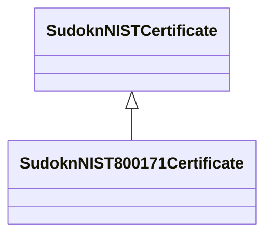

# Class: NIST 800-171 certificate (sudokn_NIST800171Certificate)


URI: [sudokn:NIST800171Certificate](http://asu.edu/semantics/SUDOKN/NIST800171Certificate)





## Inheritance
* [IoInformationContentEntity](../classes/IoInformationContentEntity.md)
    * [SudoknCertificate](../classes/SudoknCertificate.md)
        * [SudoknQualityCertificate](../classes/SudoknQualityCertificate.md)
            * [SudoknNISTCertificate](../classes/SudoknNISTCertificate.md)
                * **SudoknNIST800171Certificate**


## Slots

| Name | Cardinality and Range | Description | Inheritance | Occurrences |
| ---  | --- | --- | --- | --- |


## LinkML Source

<!-- TODO: investigate https://stackoverflow.com/questions/37606292/how-to-create-tabbed-code-blocks-in-mkdocs-or-sphinx -->

### Direct

<details>

```yaml
name: sudokn_NIST800171Certificate
title: NIST 800-171 certificate
from_schema: okns:sudokn-kg
rank: 1000
is_a: sudokn_NISTCertificate
class_uri: sudokn:NIST800171Certificate

```
</details>

### Induced

<details>

```yaml
name: sudokn_NIST800171Certificate
title: NIST 800-171 certificate
from_schema: okns:sudokn-kg
rank: 1000
is_a: sudokn_NISTCertificate
class_uri: sudokn:NIST800171Certificate

```
</details>