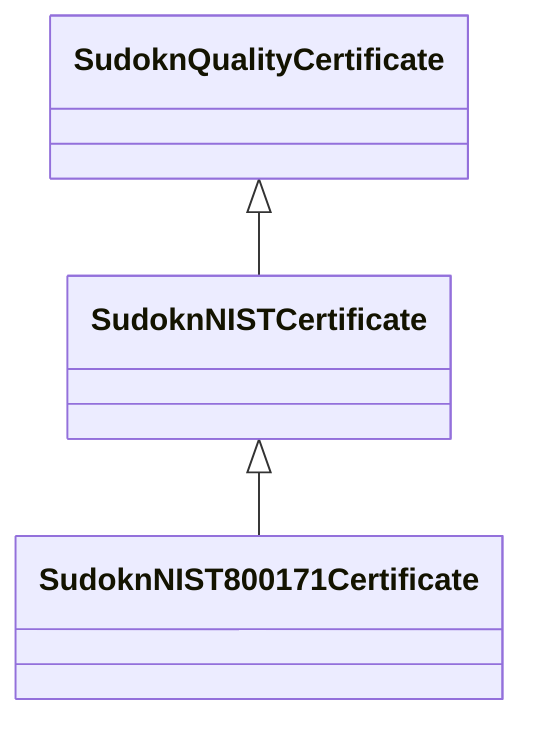

# Class: NIST certificate (sudokn_NISTCertificate)


URI: [sudokn:NISTCertificate](http://asu.edu/semantics/SUDOKN/NISTCertificate)





## Inheritance
* [IoInformationContentEntity](../classes/IoInformationContentEntity.md)
    * [SudoknCertificate](../classes/SudoknCertificate.md)
        * [SudoknQualityCertificate](../classes/SudoknQualityCertificate.md)
            * **SudoknNISTCertificate**
                * [SudoknNIST800171Certificate](../classes/SudoknNIST800171Certificate.md)


## Slots

| Name | Cardinality and Range | Description | Inheritance | Occurrences |
| ---  | --- | --- | --- | --- |


## LinkML Source

<!-- TODO: investigate https://stackoverflow.com/questions/37606292/how-to-create-tabbed-code-blocks-in-mkdocs-or-sphinx -->

### Direct

<details>

```yaml
name: sudokn_NISTCertificate
title: NIST certificate
from_schema: okns:sudokn-kg
rank: 1000
is_a: sudokn_QualityCertificate
class_uri: sudokn:NISTCertificate

```
</details>

### Induced

<details>

```yaml
name: sudokn_NISTCertificate
title: NIST certificate
from_schema: okns:sudokn-kg
rank: 1000
is_a: sudokn_QualityCertificate
class_uri: sudokn:NISTCertificate

```
</details>