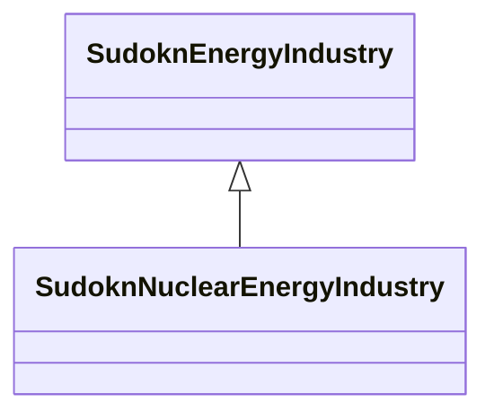

# Class: nuclear energy industry (sudokn_NuclearEnergyIndustry)


URI: [sudokn:NuclearEnergyIndustry](http://asu.edu/semantics/SUDOKN/NuclearEnergyIndustry)





## Inheritance
* [IoscIndustry](../classes/IoscIndustry.md)
    * [SudoknEnergyIndustry](../classes/SudoknEnergyIndustry.md)
        * **SudoknNuclearEnergyIndustry**


## Slots

| Name | Cardinality and Range | Description | Inheritance | Occurrences |
| ---  | --- | --- | --- | --- |


## LinkML Source

<!-- TODO: investigate https://stackoverflow.com/questions/37606292/how-to-create-tabbed-code-blocks-in-mkdocs-or-sphinx -->

### Direct

<details>

```yaml
name: sudokn_NuclearEnergyIndustry
title: nuclear energy industry
from_schema: okns:sudokn-kg
rank: 1000
is_a: sudokn_EnergyIndustry
class_uri: sudokn:NuclearEnergyIndustry

```
</details>

### Induced

<details>

```yaml
name: sudokn_NuclearEnergyIndustry
title: nuclear energy industry
from_schema: okns:sudokn-kg
rank: 1000
is_a: sudokn_EnergyIndustry
class_uri: sudokn:NuclearEnergyIndustry

```
</details>