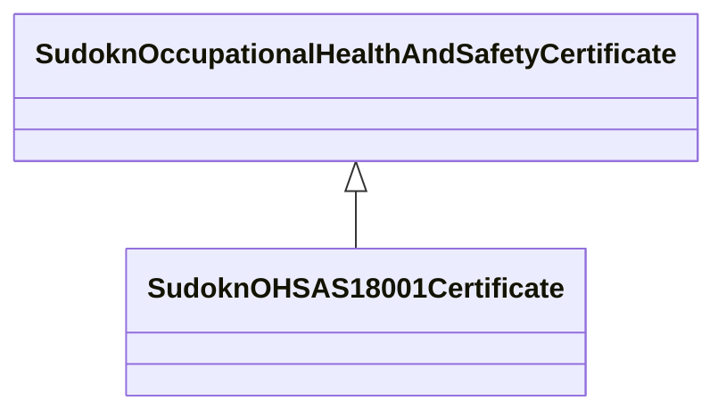

# Class: OHSAS 18001 certificate (sudokn_OHSAS18001Certificate)


URI: [sudokn:OHSAS18001Certificate](http://asu.edu/semantics/SUDOKN/OHSAS18001Certificate)





## Inheritance
* [IoInformationContentEntity](../classes/IoInformationContentEntity.md)
    * [SudoknCertificate](../classes/SudoknCertificate.md)
        * [SudoknOccupationalHealthAndSafetyCertificate](../classes/SudoknOccupationalHealthAndSafetyCertificate.md)
            * **SudoknOHSAS18001Certificate**


## Slots

| Name | Cardinality and Range | Description | Inheritance | Occurrences |
| ---  | --- | --- | --- | --- |


## LinkML Source

<!-- TODO: investigate https://stackoverflow.com/questions/37606292/how-to-create-tabbed-code-blocks-in-mkdocs-or-sphinx -->

### Direct

<details>

```yaml
name: sudokn_OHSAS18001Certificate
title: OHSAS 18001 certificate
from_schema: okns:sudokn-kg
rank: 1000
is_a: sudokn_OccupationalHealthAndSafetyCertificate
class_uri: sudokn:OHSAS18001Certificate

```
</details>

### Induced

<details>

```yaml
name: sudokn_OHSAS18001Certificate
title: OHSAS 18001 certificate
from_schema: okns:sudokn-kg
rank: 1000
is_a: sudokn_OccupationalHealthAndSafetyCertificate
class_uri: sudokn:OHSAS18001Certificate

```
</details>