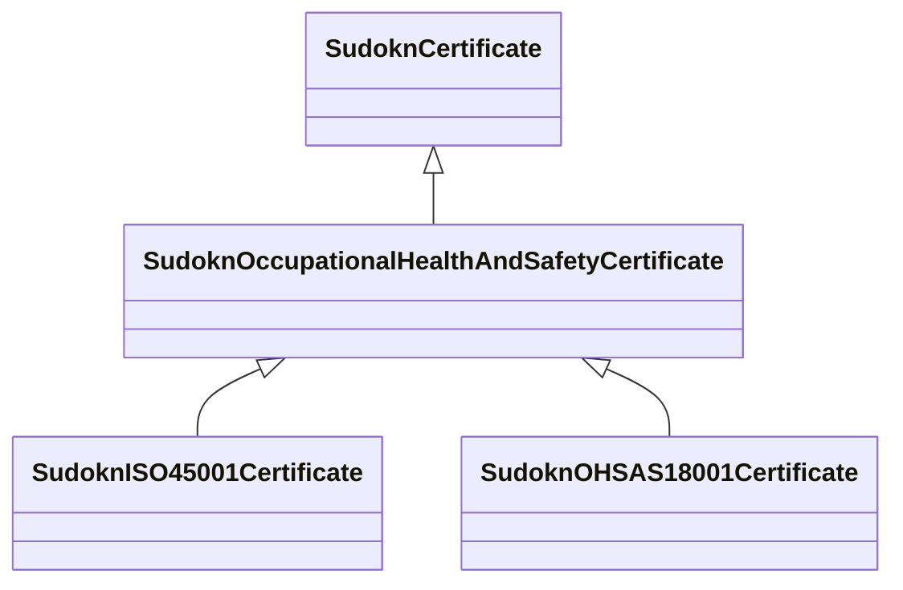

# Class: occupational health and safety certificate (sudokn_OccupationalHealthAndSafetyCertificate)


URI: [sudokn:OccupationalHealthAndSafetyCertificate](http://asu.edu/semantics/SUDOKN/OccupationalHealthAndSafetyCertificate)





## Inheritance
* [IoInformationContentEntity](../classes/IoInformationContentEntity.md)
    * [SudoknCertificate](../classes/SudoknCertificate.md)
        * **SudoknOccupationalHealthAndSafetyCertificate**
            * [SudoknISO45001Certificate](../classes/SudoknISO45001Certificate.md)
            * [SudoknOHSAS18001Certificate](../classes/SudoknOHSAS18001Certificate.md)


## Slots

| Name | Cardinality and Range | Description | Inheritance | Occurrences |
| ---  | --- | --- | --- | --- |


## LinkML Source

<!-- TODO: investigate https://stackoverflow.com/questions/37606292/how-to-create-tabbed-code-blocks-in-mkdocs-or-sphinx -->

### Direct

<details>

```yaml
name: sudokn_OccupationalHealthAndSafetyCertificate
title: occupational health and safety certificate
from_schema: okns:sudokn-kg
rank: 1000
is_a: sudokn_Certificate
class_uri: sudokn:OccupationalHealthAndSafetyCertificate

```
</details>

### Induced

<details>

```yaml
name: sudokn_OccupationalHealthAndSafetyCertificate
title: occupational health and safety certificate
from_schema: okns:sudokn-kg
rank: 1000
is_a: sudokn_Certificate
class_uri: sudokn:OccupationalHealthAndSafetyCertificate

```
</details>