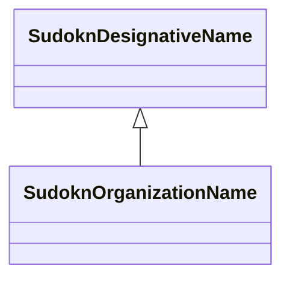

# Class: organization name (sudokn_OrganizationName)


This class occurs 1 times.


URI: [sudokn:OrganizationName](http://asu.edu/semantics/SUDOKN/OrganizationName)





## Inheritance
* [IoIdentifier](../classes/IoIdentifier.md)
    * [SudoknDesignativeName](../classes/SudoknDesignativeName.md)
        * **SudoknOrganizationName**


## Slots

| Name | Cardinality and Range | Description | Inheritance | Occurrences |
| ---  | --- | --- | --- | --- |


## Usages

| used by | used in | type | used |
| ---  | --- | --- | --- |
| [IoManufacturer](../classes/IoManufacturer.md) | [sudokn_hasName](../slots/sudokn_hasName.md) | any_of[range] | [SudoknOrganizationName](../classes/SudoknOrganizationName.md) |


## LinkML Source

<!-- TODO: investigate https://stackoverflow.com/questions/37606292/how-to-create-tabbed-code-blocks-in-mkdocs-or-sphinx -->

### Direct

<details>

```yaml
name: sudokn_OrganizationName
title: organization name
from_schema: okns:sudokn-kg
rank: 1000
is_a: sudokn_DesignativeName
class_uri: sudokn:OrganizationName

```
</details>

### Induced

<details>

```yaml
name: sudokn_OrganizationName
title: organization name
from_schema: okns:sudokn-kg
rank: 1000
is_a: sudokn_DesignativeName
class_uri: sudokn:OrganizationName

```
</details>