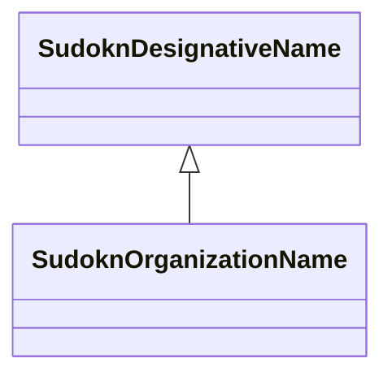

# Class: organization name (sudokn_OrganizationName)


_TODO -- tell the world what this class (type) describes._


URI: [sudokn:OrganizationName](http://asu.edu/semantics/SUDOKN/OrganizationName)





## Inheritance
* [IoIdentifier](../classes/IoIdentifier.md)
    * [SudoknDesignativeName](../classes/SudoknDesignativeName.md)
        * **SudoknOrganizationName**


## Slots

| Name | Cardinality and Range | Description | Inheritance |
| ---  | --- | --- | --- |


## Usages

| used by | used in | type | used |
| ---  | --- | --- | --- |
| [OwlNamedIndividual](../classes/OwlNamedIndividual.md) | [sudokn_hasName](../slots/sudokn_hasName.md) | range | [SudoknOrganizationName](../classes/SudoknOrganizationName.md) |


## Examples

| Value |
| --- |
| sudokn:/OrganizationName_1 |

## TODOs

* TODO -- Todos for this class go here
* or you can delete the todos
* if you think the class is perfect.

## Identifier and Mapping Information


### Schema Source


* from schema: sudokn-kg


## Mappings

| Mapping Type | Mapped Value |
| ---  | ---  |
| self | sudokn:OrganizationName |
| native | sudokn-kg/:SudoknOrganizationName |


## LinkML Source

<!-- TODO: investigate https://stackoverflow.com/questions/37606292/how-to-create-tabbed-code-blocks-in-mkdocs-or-sphinx -->

### Direct

<details>
```yaml
name: sudokn_OrganizationName
description: TODO -- tell the world what this class (type) describes.
title: organization name
todos:
- TODO -- Todos for this class go here
- or you can delete the todos
- if you think the class is perfect.
notes:
- Class with 1 occurences.
examples:
- value: sudokn:/OrganizationName_1
from_schema: sudokn-kg
is_a: sudokn_DesignativeName
class_uri: sudokn:OrganizationName

```
</details>

### Induced

<details>
```yaml
name: sudokn_OrganizationName
description: TODO -- tell the world what this class (type) describes.
title: organization name
todos:
- TODO -- Todos for this class go here
- or you can delete the todos
- if you think the class is perfect.
notes:
- Class with 1 occurences.
examples:
- value: sudokn:/OrganizationName_1
from_schema: sudokn-kg
is_a: sudokn_DesignativeName
class_uri: sudokn:OrganizationName

```
</details>