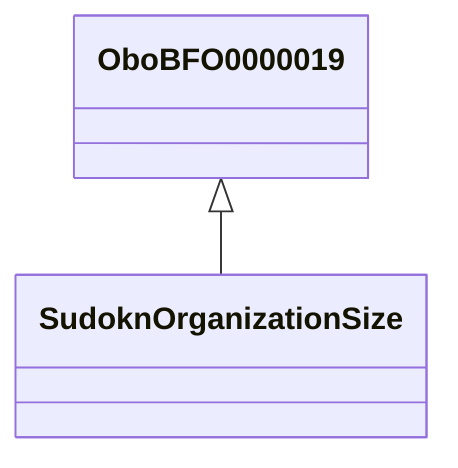

# Class: organization size (sudokn__OrganizationSize)


This class occurs 1 times.


URI: [sudokn:/OrganizationSize](http://asu.edu/semantics/SUDOKN//OrganizationSize)





## Inheritance
* [OboBFO0000019](../classes/OboBFO0000019.md)
    * **SudoknOrganizationSize**


## Slots

| Name | Cardinality and Range | Description | Inheritance | Occurrences |
| ---  | --- | --- | --- | --- |


## LinkML Source

<!-- TODO: investigate https://stackoverflow.com/questions/37606292/how-to-create-tabbed-code-blocks-in-mkdocs-or-sphinx -->

### Direct

<details>

```yaml
name: sudokn__OrganizationSize
title: organization size
from_schema: okns:sudokn-kg
rank: 1000
is_a: obo_BFO_0000019
class_uri: sudokn:/OrganizationSize

```
</details>

### Induced

<details>

```yaml
name: sudokn__OrganizationSize
title: organization size
from_schema: okns:sudokn-kg
rank: 1000
is_a: obo_BFO_0000019
class_uri: sudokn:/OrganizationSize

```
</details>