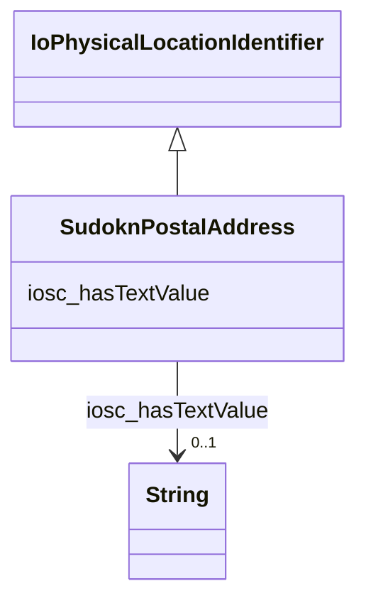

# Class: postal address (sudokn_PostalAddress)


_No type description provided_


URI: [sudokn:PostalAddress](http://asu.edu/semantics/SUDOKN/PostalAddress)





## Inheritance
* [IoPhysicalLocationIdentifier](../classes/IoPhysicalLocationIdentifier.md)
    * **SudoknPostalAddress**


## Slots

| Name | Cardinality and Range | Description | Inheritance |
| ---  | --- | --- | --- |
| [iosc_hasTextValue](../slots/iosc_hasTextValue.md) | 0..1 <br/> [xsd:string](http://www.w3.org/2001/XMLSchema#string) | No slot description provided | direct |


## Usages

| used by | used in | type | used |
| ---  | --- | --- | --- |
| [IoManufacturer](../classes/IoManufacturer.md) | [sudokn_hasPostalAddress](../slots/sudokn_hasPostalAddress.md) | any_of[range] | [SudoknPostalAddress](../classes/SudoknPostalAddress.md) |
| [OwlNamedIndividual](../classes/OwlNamedIndividual.md) | [sudokn_hasPostalAddress](../slots/sudokn_hasPostalAddress.md) | any_of[range] | [SudoknPostalAddress](../classes/SudoknPostalAddress.md) |
| [SudoknGeospatialLocation](../classes/SudoknGeospatialLocation.md) | [sudokn_hasPostalAddress](../slots/sudokn_hasPostalAddress.md) | any_of[range] | [SudoknPostalAddress](../classes/SudoknPostalAddress.md) |


## Examples

| Value |
| --- |
| sudokn:101PIPE-PostalAddress |

## TODOs

* TODO -- Todos for this class go here
* or you can delete the todos
* if you think the class is perfect.

## Identifier and Mapping Information


### Schema Source


* from schema: sudokn-kg


## Mappings

| Mapping Type | Mapped Value |
| ---  | ---  |
| self | sudokn:PostalAddress |
| native | sudokn-kg/:SudoknPostalAddress |


## LinkML Source

<!-- TODO: investigate https://stackoverflow.com/questions/37606292/how-to-create-tabbed-code-blocks-in-mkdocs-or-sphinx -->

### Direct

<details>
```yaml
name: sudokn_PostalAddress
description: No type description provided
title: postal address
todos:
- TODO -- Todos for this class go here
- or you can delete the todos
- if you think the class is perfect.
notes:
- Class with 20728 occurences.
examples:
- value: sudokn:101PIPE-PostalAddress
from_schema: sudokn-kg
rank: 1000
is_a: io_PhysicalLocationIdentifier
slots:
- iosc_hasTextValue
class_uri: sudokn:PostalAddress

```
</details>

### Induced

<details>
```yaml
name: sudokn_PostalAddress
description: No type description provided
title: postal address
todos:
- TODO -- Todos for this class go here
- or you can delete the todos
- if you think the class is perfect.
notes:
- Class with 20728 occurences.
examples:
- value: sudokn:101PIPE-PostalAddress
from_schema: sudokn-kg
rank: 1000
is_a: io_PhysicalLocationIdentifier
attributes:
  iosc_hasTextValue:
    name: iosc_hasTextValue
    description: No slot description provided
    todos:
    - TODO -- Todos for this slot go here
    - or you can delete the todos
    - if you think the class is perfect.
    comments:
    - 19102 occurrences with subject type sudokn_PostalAddress and object type string.
    examples:
    - value: sudokn:101PIPE-PostalAddress iosc:hasTextValue 10255 BEECH AVENUE
    from_schema: sudokn-kg
    rank: 1000
    slot_uri: iosc:hasTextValue
    alias: iosc_hasTextValue
    owner: sudokn_PostalAddress
    domain_of:
    - sudokn_PostalAddress
    range: string
class_uri: sudokn:PostalAddress

```
</details>