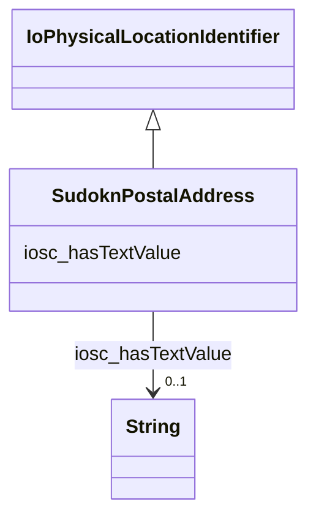

# Class: postal address (sudokn_PostalAddress)


This class occurs 20728 times.


URI: [sudokn:PostalAddress](http://asu.edu/semantics/SUDOKN/PostalAddress)





## Inheritance
* [IoPhysicalLocationIdentifier](../classes/IoPhysicalLocationIdentifier.md)
    * **SudoknPostalAddress**


## Slots

| Name | Cardinality and Range | Description | Inheritance | Occurrences |
| ---  | --- | --- | --- | --- |
| [iosc_hasTextValue](../slots/iosc_hasTextValue.md) | 0..1 <br/> [xsd:string](http://www.w3.org/2001/XMLSchema#string) |  <br/>  | direct | 19102 |


## Usages

| used by | used in | type | used |
| ---  | --- | --- | --- |
| [IoManufacturer](../classes/IoManufacturer.md) | [sudokn_hasPostalAddress](../slots/sudokn_hasPostalAddress.md) | any_of[range] | [SudoknPostalAddress](../classes/SudoknPostalAddress.md) |
| [SudoknGeospatialLocation](../classes/SudoknGeospatialLocation.md) | [sudokn_hasPostalAddress](../slots/sudokn_hasPostalAddress.md) | any_of[range] | [SudoknPostalAddress](../classes/SudoknPostalAddress.md) |


## LinkML Source

<!-- TODO: investigate https://stackoverflow.com/questions/37606292/how-to-create-tabbed-code-blocks-in-mkdocs-or-sphinx -->

### Direct

<details>

```yaml
name: sudokn_PostalAddress
title: postal address
from_schema: okns:sudokn-kg
rank: 1000
is_a: io_PhysicalLocationIdentifier
slots:
- iosc_hasTextValue
class_uri: sudokn:PostalAddress

```
</details>

### Induced

<details>

```yaml
name: sudokn_PostalAddress
title: postal address
from_schema: okns:sudokn-kg
rank: 1000
is_a: io_PhysicalLocationIdentifier
attributes:
  iosc_hasTextValue:
    name: iosc_hasTextValue
    title: No slot (predicate) name specified -- this slot is noted as a subproperty
      of another slot in this graph but has not itself been defined.
    from_schema: okns:sudokn-kg
    rank: 1000
    slot_uri: iosc:hasTextValue
    alias: iosc_hasTextValue
    owner: sudokn_PostalAddress
    domain_of:
    - sudokn_PostalAddress
    range: string
class_uri: sudokn:PostalAddress

```
</details>