# Class: quality certificate (sudokn_QualityCertificate)


URI: [sudokn:QualityCertificate](http://asu.edu/semantics/SUDOKN/QualityCertificate)

```mermaid
 classDiagram
    class SudoknQualityCertificate
    click SudoknQualityCertificate href "../SudoknQualityCertificate"
      SudoknCertificate <|-- SudoknQualityCertificate
        click SudoknCertificate href "../SudoknCertificate"
      

      SudoknQualityCertificate <|-- SudoknASCertificate
        click SudoknASCertificate href "../SudoknASCertificate"
      SudoknQualityCertificate <|-- SudoknASMECertificate
        click SudoknASMECertificate href "../SudoknASMECertificate"
      SudoknQualityCertificate <|-- SudoknBABACertificate
        click SudoknBABACertificate href "../SudoknBABACertificate"
      SudoknQualityCertificate <|-- SudoknBritishRetailConsortiumCertificate
        click SudoknBritishRetailConsortiumCertificate href "../SudoknBritishRetailConsortiumCertificate"
      SudoknQualityCertificate <|-- SudoknFDACertificate
        click SudoknFDACertificate href "../SudoknFDACertificate"
      SudoknQualityCertificate <|-- SudoknGWOCertificate
        click SudoknGWOCertificate href "../SudoknGWOCertificate"
      SudoknQualityCertificate <|-- SudoknHAACPCertificate
        click SudoknHAACPCertificate href "../SudoknHAACPCertificate"
      SudoknQualityCertificate <|-- SudoknIATFCertificate
        click SudoknIATFCertificate href "../SudoknIATFCertificate"
      SudoknQualityCertificate <|-- SudoknISOQualityCertificate
        click SudoknISOQualityCertificate href "../SudoknISOQualityCertificate"
      SudoknQualityCertificate <|-- SudoknISTSCertificate
        click SudoknISTSCertificate href "../SudoknISTSCertificate"
      SudoknQualityCertificate <|-- SudoknITARCertificate
        click SudoknITARCertificate href "../SudoknITARCertificate"
      SudoknQualityCertificate <|-- SudoknKosherApprovedCertificate
        click SudoknKosherApprovedCertificate href "../SudoknKosherApprovedCertificate"
      SudoknQualityCertificate <|-- SudoknNADCAPCertificate
        click SudoknNADCAPCertificate href "../SudoknNADCAPCertificate"
      SudoknQualityCertificate <|-- SudoknNISTCertificate
        click SudoknNISTCertificate href "../SudoknNISTCertificate"
      SudoknQualityCertificate <|-- SudoknQSCertificate
        click SudoknQSCertificate href "../SudoknQSCertificate"
      SudoknQualityCertificate <|-- SudoknTICertificate
        click SudoknTICertificate href "../SudoknTICertificate"
      
      
      
```





## Inheritance
* [IoInformationContentEntity](../classes/IoInformationContentEntity.md)
    * [SudoknCertificate](../classes/SudoknCertificate.md)
        * **SudoknQualityCertificate**
            * [SudoknASCertificate](../classes/SudoknASCertificate.md)
            * [SudoknASMECertificate](../classes/SudoknASMECertificate.md)
            * [SudoknBABACertificate](../classes/SudoknBABACertificate.md)
            * [SudoknBritishRetailConsortiumCertificate](../classes/SudoknBritishRetailConsortiumCertificate.md)
            * [SudoknFDACertificate](../classes/SudoknFDACertificate.md)
            * [SudoknGWOCertificate](../classes/SudoknGWOCertificate.md)
            * [SudoknHAACPCertificate](../classes/SudoknHAACPCertificate.md)
            * [SudoknIATFCertificate](../classes/SudoknIATFCertificate.md)
            * [SudoknISOQualityCertificate](../classes/SudoknISOQualityCertificate.md)
            * [SudoknISTSCertificate](../classes/SudoknISTSCertificate.md)
            * [SudoknITARCertificate](../classes/SudoknITARCertificate.md)
            * [SudoknKosherApprovedCertificate](../classes/SudoknKosherApprovedCertificate.md)
            * [SudoknNADCAPCertificate](../classes/SudoknNADCAPCertificate.md)
            * [SudoknNISTCertificate](../classes/SudoknNISTCertificate.md)
            * [SudoknQSCertificate](../classes/SudoknQSCertificate.md)
            * [SudoknTICertificate](../classes/SudoknTICertificate.md)


## Slots

| Name | Cardinality and Range | Description | Inheritance | Occurrences |
| ---  | --- | --- | --- | --- |


## LinkML Source

<!-- TODO: investigate https://stackoverflow.com/questions/37606292/how-to-create-tabbed-code-blocks-in-mkdocs-or-sphinx -->

### Direct

<details>

```yaml
name: sudokn_QualityCertificate
title: quality certificate
from_schema: okns:sudokn-kg
rank: 1000
is_a: sudokn_Certificate
class_uri: sudokn:QualityCertificate

```
</details>

### Induced

<details>

```yaml
name: sudokn_QualityCertificate
title: quality certificate
from_schema: okns:sudokn-kg
rank: 1000
is_a: sudokn_Certificate
class_uri: sudokn:QualityCertificate

```
</details>