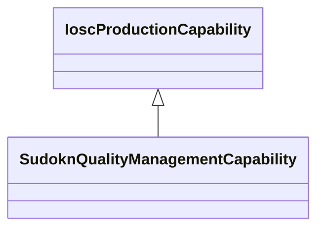

# Class: quality management capability (sudokn_QualityManagementCapability)


This class occurs 1 times.


URI: [sudokn:QualityManagementCapability](http://asu.edu/semantics/SUDOKN/QualityManagementCapability)





## Inheritance
* [IoscProductionCapability](../classes/IoscProductionCapability.md)
    * **SudoknQualityManagementCapability**


## Slots

| Name | Cardinality and Range | Description | Inheritance | Occurrences |
| ---  | --- | --- | --- | --- |


## Usages

| used by | used in | type | used |
| ---  | --- | --- | --- |
| [IoManufacturer](../classes/IoManufacturer.md) | [sudokn_hasManagementCapability](../slots/sudokn_hasManagementCapability.md) | any_of[range] | [SudoknQualityManagementCapability](../classes/SudoknQualityManagementCapability.md) |
| [SudoknAS9100Certificate](../classes/SudoknAS9100Certificate.md) | [sudokn_attestsTo](../slots/sudokn_attestsTo.md) | any_of[range] | [SudoknQualityManagementCapability](../classes/SudoknQualityManagementCapability.md) |
| [SudoknISO9000Certificate](../classes/SudoknISO9000Certificate.md) | [sudokn_attestsTo](../slots/sudokn_attestsTo.md) | any_of[range] | [SudoknQualityManagementCapability](../classes/SudoknQualityManagementCapability.md) |


## LinkML Source

<!-- TODO: investigate https://stackoverflow.com/questions/37606292/how-to-create-tabbed-code-blocks-in-mkdocs-or-sphinx -->

### Direct

<details>

```yaml
name: sudokn_QualityManagementCapability
title: quality management capability
from_schema: okns:sudokn-kg
rank: 1000
is_a: iosc_ProductionCapability
class_uri: sudokn:QualityManagementCapability

```
</details>

### Induced

<details>

```yaml
name: sudokn_QualityManagementCapability
title: quality management capability
from_schema: okns:sudokn-kg
rank: 1000
is_a: iosc_ProductionCapability
class_uri: sudokn:QualityManagementCapability

```
</details>