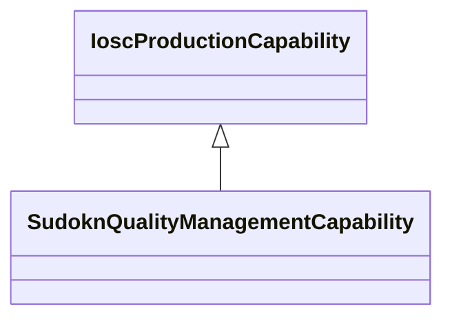

# Class: quality management capability (sudokn_QualityManagementCapability)


_No type description provided_


URI: [sudokn:QualityManagementCapability](http://asu.edu/semantics/SUDOKN/QualityManagementCapability)





## Inheritance
* [IoscProductionCapability](../classes/IoscProductionCapability.md)
    * **SudoknQualityManagementCapability**


## Slots

| Name | Cardinality and Range | Description | Inheritance |
| ---  | --- | --- | --- |


## Usages

| used by | used in | type | used |
| ---  | --- | --- | --- |
| [OwlNamedIndividual](../classes/OwlNamedIndividual.md) | [sudokn_hasManagementCapability](../slots/sudokn_hasManagementCapability.md) | any_of[range] | [SudoknQualityManagementCapability](../classes/SudoknQualityManagementCapability.md) |
| [SudoknAS9100Certificate](../classes/SudoknAS9100Certificate.md) | [sudokn_attestsTo](../slots/sudokn_attestsTo.md) | any_of[range] | [SudoknQualityManagementCapability](../classes/SudoknQualityManagementCapability.md) |
| [SudoknISO9000Certificate](../classes/SudoknISO9000Certificate.md) | [sudokn_attestsTo](../slots/sudokn_attestsTo.md) | any_of[range] | [SudoknQualityManagementCapability](../classes/SudoknQualityManagementCapability.md) |


## Examples

| Value |
| --- |
| sudokn:/QualityManagementCapabiliy_1 |

## TODOs

* TODO -- Todos for this class go here
* or you can delete the todos
* if you think the class is perfect.

## Identifier and Mapping Information


### Schema Source


* from schema: sudokn-kg


## Mappings

| Mapping Type | Mapped Value |
| ---  | ---  |
| self | sudokn:QualityManagementCapability |
| native | sudokn-kg/:SudoknQualityManagementCapability |


## LinkML Source

<!-- TODO: investigate https://stackoverflow.com/questions/37606292/how-to-create-tabbed-code-blocks-in-mkdocs-or-sphinx -->

### Direct

<details>
```yaml
name: sudokn_QualityManagementCapability
description: No type description provided
title: quality management capability
todos:
- TODO -- Todos for this class go here
- or you can delete the todos
- if you think the class is perfect.
notes:
- Class with 1 occurences.
examples:
- value: sudokn:/QualityManagementCapabiliy_1
from_schema: sudokn-kg
rank: 1000
is_a: iosc_ProductionCapability
class_uri: sudokn:QualityManagementCapability

```
</details>

### Induced

<details>
```yaml
name: sudokn_QualityManagementCapability
description: No type description provided
title: quality management capability
todos:
- TODO -- Todos for this class go here
- or you can delete the todos
- if you think the class is perfect.
notes:
- Class with 1 occurences.
examples:
- value: sudokn:/QualityManagementCapabiliy_1
from_schema: sudokn-kg
rank: 1000
is_a: iosc_ProductionCapability
class_uri: sudokn:QualityManagementCapability

```
</details>