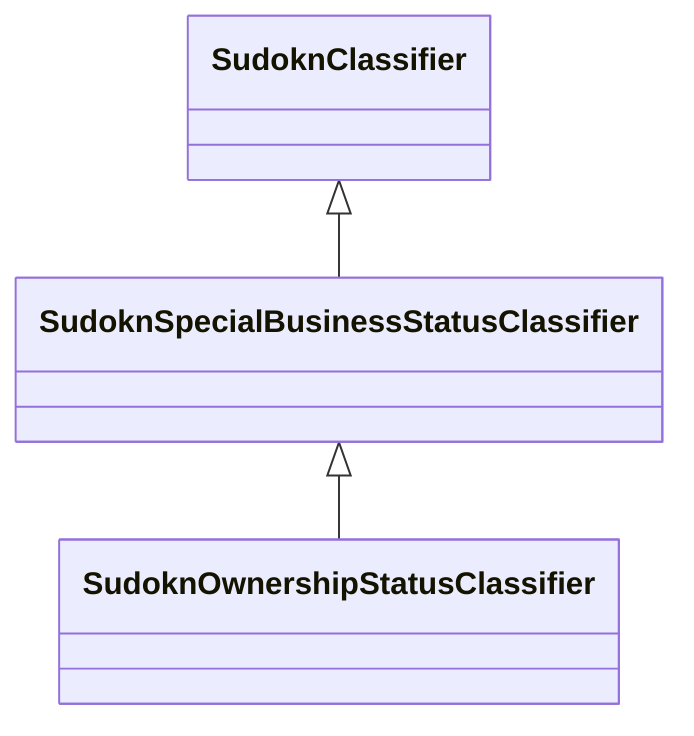

# Class: special business status classifier (sudokn_SpecialBusinessStatusClassifier)


This class occurs 1 times.


URI: [sudokn:SpecialBusinessStatusClassifier](http://asu.edu/semantics/SUDOKN/SpecialBusinessStatusClassifier)





## Inheritance
* [IoInformationContentEntity](../classes/IoInformationContentEntity.md)
    * [SudoknClassifier](../classes/SudoknClassifier.md)
        * **SudoknSpecialBusinessStatusClassifier**
            * [SudoknOwnershipStatusClassifier](../classes/SudoknOwnershipStatusClassifier.md)


## Slots

| Name | Cardinality and Range | Description | Inheritance | Occurrences |
| ---  | --- | --- | --- | --- |


## LinkML Source

<!-- TODO: investigate https://stackoverflow.com/questions/37606292/how-to-create-tabbed-code-blocks-in-mkdocs-or-sphinx -->

### Direct

<details>

```yaml
name: sudokn_SpecialBusinessStatusClassifier
title: special business status classifier
from_schema: okns:sudokn-kg
rank: 1000
is_a: sudokn_Classifier
class_uri: sudokn:SpecialBusinessStatusClassifier

```
</details>

### Induced

<details>

```yaml
name: sudokn_SpecialBusinessStatusClassifier
title: special business status classifier
from_schema: okns:sudokn-kg
rank: 1000
is_a: sudokn_Classifier
class_uri: sudokn:SpecialBusinessStatusClassifier

```
</details>