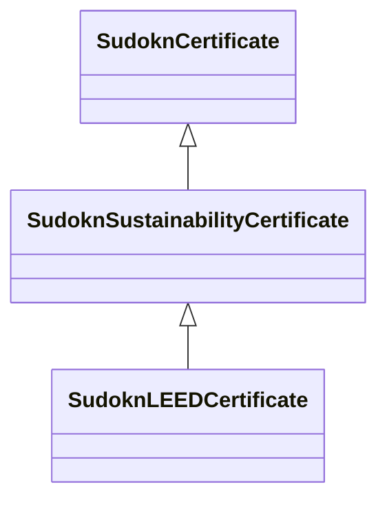

# Class: sustainability certificate (sudokn_SustainabilityCertificate)


URI: [sudokn:SustainabilityCertificate](http://asu.edu/semantics/SUDOKN/SustainabilityCertificate)





## Inheritance
* [IoInformationContentEntity](../classes/IoInformationContentEntity.md)
    * [SudoknCertificate](../classes/SudoknCertificate.md)
        * **SudoknSustainabilityCertificate**
            * [SudoknLEEDCertificate](../classes/SudoknLEEDCertificate.md)


## Slots

| Name | Cardinality and Range | Description | Inheritance | Occurrences |
| ---  | --- | --- | --- | --- |


## LinkML Source

<!-- TODO: investigate https://stackoverflow.com/questions/37606292/how-to-create-tabbed-code-blocks-in-mkdocs-or-sphinx -->

### Direct

<details>

```yaml
name: sudokn_SustainabilityCertificate
title: sustainability certificate
from_schema: okns:sudokn-kg
rank: 1000
is_a: sudokn_Certificate
class_uri: sudokn:SustainabilityCertificate

```
</details>

### Induced

<details>

```yaml
name: sudokn_SustainabilityCertificate
title: sustainability certificate
from_schema: okns:sudokn-kg
rank: 1000
is_a: sudokn_Certificate
class_uri: sudokn:SustainabilityCertificate

```
</details>