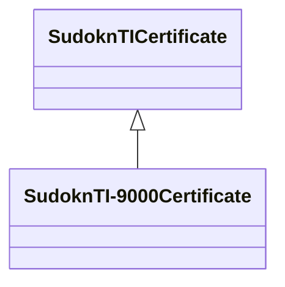

# Class: TI-9000  certificate (sudokn_TI-9000Certificate)


_No type description provided_


URI: [sudokn:TI-9000Certificate](http://asu.edu/semantics/SUDOKN/TI-9000Certificate)





## Inheritance
* [IoInformationContentEntity](../classes/IoInformationContentEntity.md)
    * [SudoknCertificate](../classes/SudoknCertificate.md)
        * [SudoknQualityCertificate](../classes/SudoknQualityCertificate.md)
            * [SudoknTICertificate](../classes/SudoknTICertificate.md)
                * **SudoknTI-9000Certificate**


## Slots

| Name | Cardinality and Range | Description | Inheritance |
| ---  | --- | --- | --- |


## TODOs

* TODO -- Todos for this class go here
* or you can delete the todos
* if you think the class is perfect.

## Identifier and Mapping Information


### Schema Source


* from schema: sudokn-kg


## Mappings

| Mapping Type | Mapped Value |
| ---  | ---  |
| self | sudokn:TI-9000Certificate |
| native | sudokn-kg/:SudoknTI-9000Certificate |


## LinkML Source

<!-- TODO: investigate https://stackoverflow.com/questions/37606292/how-to-create-tabbed-code-blocks-in-mkdocs-or-sphinx -->

### Direct

<details>
```yaml
name: sudokn_TI-9000Certificate
description: No type description provided
title: TI-9000  certificate
todos:
- TODO -- Todos for this class go here
- or you can delete the todos
- if you think the class is perfect.
notes:
- Class with 0 occurences.
from_schema: sudokn-kg
rank: 1000
is_a: sudokn_TICertificate
class_uri: sudokn:TI-9000Certificate

```
</details>

### Induced

<details>
```yaml
name: sudokn_TI-9000Certificate
description: No type description provided
title: TI-9000  certificate
todos:
- TODO -- Todos for this class go here
- or you can delete the todos
- if you think the class is perfect.
notes:
- Class with 0 occurences.
from_schema: sudokn-kg
rank: 1000
is_a: sudokn_TICertificate
class_uri: sudokn:TI-9000Certificate

```
</details>