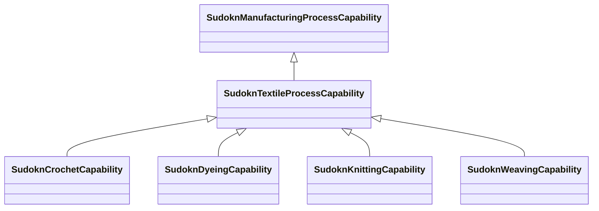

# Class: textile process capability (sudokn_TextileProcessCapability)


URI: [sudokn:TextileProcessCapability](http://asu.edu/semantics/SUDOKN/TextileProcessCapability)





## Inheritance
* [IoscProductionCapability](../classes/IoscProductionCapability.md)
    * [SudoknManufacturingProcessCapability](../classes/SudoknManufacturingProcessCapability.md)
        * **SudoknTextileProcessCapability**
            * [SudoknCrochetCapability](../classes/SudoknCrochetCapability.md)
            * [SudoknDyeingCapability](../classes/SudoknDyeingCapability.md)
            * [SudoknKnittingCapability](../classes/SudoknKnittingCapability.md)
            * [SudoknWeavingCapability](../classes/SudoknWeavingCapability.md)


## Slots

| Name | Cardinality and Range | Description | Inheritance | Occurrences |
| ---  | --- | --- | --- | --- |


## LinkML Source

<!-- TODO: investigate https://stackoverflow.com/questions/37606292/how-to-create-tabbed-code-blocks-in-mkdocs-or-sphinx -->

### Direct

<details>

```yaml
name: sudokn_TextileProcessCapability
title: textile process capability
from_schema: okns:sudokn-kg
rank: 1000
is_a: sudokn_ManufacturingProcessCapability
class_uri: sudokn:TextileProcessCapability

```
</details>

### Induced

<details>

```yaml
name: sudokn_TextileProcessCapability
title: textile process capability
from_schema: okns:sudokn-kg
rank: 1000
is_a: sudokn_ManufacturingProcessCapability
class_uri: sudokn:TextileProcessCapability

```
</details>