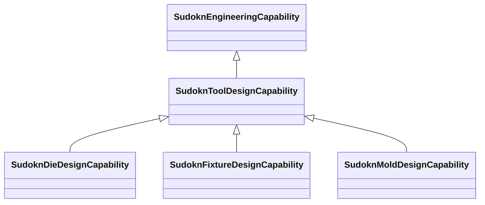

# Class: tool design capability (sudokn_ToolDesignCapability)


URI: [sudokn:ToolDesignCapability](http://asu.edu/semantics/SUDOKN/ToolDesignCapability)





## Inheritance
* [IoscProductionCapability](../classes/IoscProductionCapability.md)
    * [SudoknEngineeringCapability](../classes/SudoknEngineeringCapability.md)
        * **SudoknToolDesignCapability**
            * [SudoknDieDesignCapability](../classes/SudoknDieDesignCapability.md)
            * [SudoknFixtureDesignCapability](../classes/SudoknFixtureDesignCapability.md)
            * [SudoknMoldDesignCapability](../classes/SudoknMoldDesignCapability.md)


## Slots

| Name | Cardinality and Range | Description | Inheritance | Occurrences |
| ---  | --- | --- | --- | --- |


## LinkML Source

<!-- TODO: investigate https://stackoverflow.com/questions/37606292/how-to-create-tabbed-code-blocks-in-mkdocs-or-sphinx -->

### Direct

<details>

```yaml
name: sudokn_ToolDesignCapability
title: tool design capability
from_schema: okns:sudokn-kg
rank: 1000
is_a: sudokn_EngineeringCapability
class_uri: sudokn:ToolDesignCapability

```
</details>

### Induced

<details>

```yaml
name: sudokn_ToolDesignCapability
title: tool design capability
from_schema: okns:sudokn-kg
rank: 1000
is_a: sudokn_EngineeringCapability
class_uri: sudokn:ToolDesignCapability

```
</details>