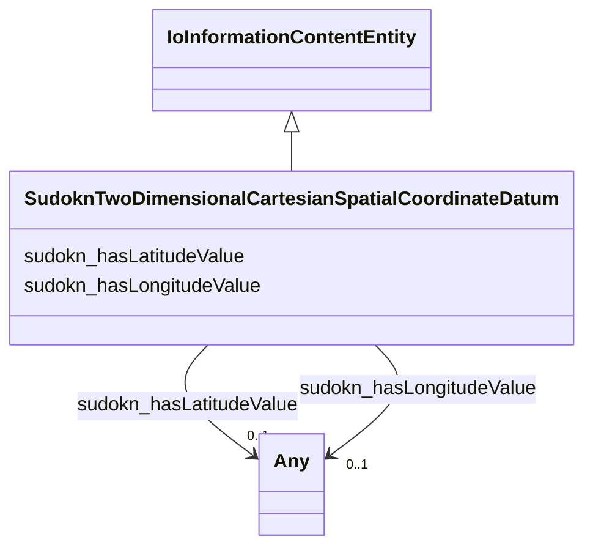

# Class: two dimensional cartesian spatial coordinate datum (sudokn_TwoDimensionalCartesianSpatialCoordinateDatum)


_TODO -- tell the world what this class (type) describes._


URI: [sudokn:TwoDimensionalCartesianSpatialCoordinateDatum](http://asu.edu/semantics/SUDOKN/TwoDimensionalCartesianSpatialCoordinateDatum)





## Inheritance
* [IoInformationContentEntity](../classes/IoInformationContentEntity.md)
    * **SudoknTwoDimensionalCartesianSpatialCoordinateDatum**


## Slots

| Name | Cardinality and Range | Description | Inheritance |
| ---  | --- | --- | --- |
| [sudokn_hasLatitudeValue](../slots/sudokn_hasLatitudeValue.md) | 0..1 <br/> [Any](../classes/Any.md)&nbsp;or&nbsp;<br />[xsd:anyURI](http://www.w3.org/2001/XMLSchema#anyURI)&nbsp;or&nbsp;<br />[xsd:string](http://www.w3.org/2001/XMLSchema#string) | TODO -- tell the world what this slot (predicate) describes | direct |
| [sudokn_hasLongitudeValue](../slots/sudokn_hasLongitudeValue.md) | 0..1 <br/> [Any](../classes/Any.md)&nbsp;or&nbsp;<br />[xsd:anyURI](http://www.w3.org/2001/XMLSchema#anyURI)&nbsp;or&nbsp;<br />[xsd:string](http://www.w3.org/2001/XMLSchema#string) | TODO -- tell the world what this slot (predicate) describes | direct |


## Usages

| used by | used in | type | used |
| ---  | --- | --- | --- |
| [SudoknGeospatialLocation](../classes/SudoknGeospatialLocation.md) | [sudokn_hasSpatialCoordinates](../slots/sudokn_hasSpatialCoordinates.md) | range | [SudoknTwoDimensionalCartesianSpatialCoordinateDatum](../classes/SudoknTwoDimensionalCartesianSpatialCoordinateDatum.md) |


## TODOs

* TODO -- Todos for this class go here
* or you can delete the todos
* if you think the class is perfect.

## Identifier and Mapping Information


### Schema Source


* from schema: sudokn-kg


## Mappings

| Mapping Type | Mapped Value |
| ---  | ---  |
| self | sudokn:TwoDimensionalCartesianSpatialCoordinateDatum |
| native | sudokn-kg/:SudoknTwoDimensionalCartesianSpatialCoordinateDatum |


## LinkML Source

<!-- TODO: investigate https://stackoverflow.com/questions/37606292/how-to-create-tabbed-code-blocks-in-mkdocs-or-sphinx -->

### Direct

<details>
```yaml
name: sudokn_TwoDimensionalCartesianSpatialCoordinateDatum
description: TODO -- tell the world what this class (type) describes.
title: two dimensional cartesian spatial coordinate datum
todos:
- TODO -- Todos for this class go here
- or you can delete the todos
- if you think the class is perfect.
notes:
- Class with 20728 occurences.
from_schema: sudokn-kg
is_a: io_InformationContentEntity
slots:
- sudokn_hasLatitudeValue
- sudokn_hasLongitudeValue
class_uri: sudokn:TwoDimensionalCartesianSpatialCoordinateDatum

```
</details>

### Induced

<details>
```yaml
name: sudokn_TwoDimensionalCartesianSpatialCoordinateDatum
description: TODO -- tell the world what this class (type) describes.
title: two dimensional cartesian spatial coordinate datum
todos:
- TODO -- Todos for this class go here
- or you can delete the todos
- if you think the class is perfect.
notes:
- Class with 20728 occurences.
from_schema: sudokn-kg
is_a: io_InformationContentEntity
attributes:
  sudokn_hasLatitudeValue:
    name: sudokn_hasLatitudeValue
    description: TODO -- tell the world what this slot (predicate) describes.
    title: has latitude value
    todos:
    - TODO -- Todos for this slot go here
    - or you can delete the todos
    - if you think the class is perfect.
    comments:
    - 19082 occurrences with subject type sudokn_TwoDimensionalCartesianSpatialCoordinateDatum
      and object type string.
    examples:
    - value: sudokn:101PIPE-site-FONTANA-92335-coordinates sudokn:hasLatitudeValue
        34.0677902
    from_schema: sudokn-kg
    rank: 1000
    slot_uri: sudokn:hasLatitudeValue
    alias: sudokn_hasLatitudeValue
    owner: sudokn_TwoDimensionalCartesianSpatialCoordinateDatum
    domain_of:
    - sudokn_TwoDimensionalCartesianSpatialCoordinateDatum
    subproperty_of: owl_topDataProperty
    range: Any
    any_of:
    - range: uri
    - range: string
  sudokn_hasLongitudeValue:
    name: sudokn_hasLongitudeValue
    description: TODO -- tell the world what this slot (predicate) describes.
    title: has logitude value
    todos:
    - TODO -- Todos for this slot go here
    - or you can delete the todos
    - if you think the class is perfect.
    comments:
    - 19083 occurrences with subject type sudokn_TwoDimensionalCartesianSpatialCoordinateDatum
      and object type string.
    examples:
    - value: sudokn:101PIPE-site-FONTANA-92335-coordinates sudokn:hasLongitudeValue
        -117.4708951
    from_schema: sudokn-kg
    rank: 1000
    slot_uri: sudokn:hasLongitudeValue
    alias: sudokn_hasLongitudeValue
    owner: sudokn_TwoDimensionalCartesianSpatialCoordinateDatum
    domain_of:
    - sudokn_TwoDimensionalCartesianSpatialCoordinateDatum
    subproperty_of: owl_topDataProperty
    range: Any
    any_of:
    - range: uri
    - range: string
class_uri: sudokn:TwoDimensionalCartesianSpatialCoordinateDatum

```
</details>