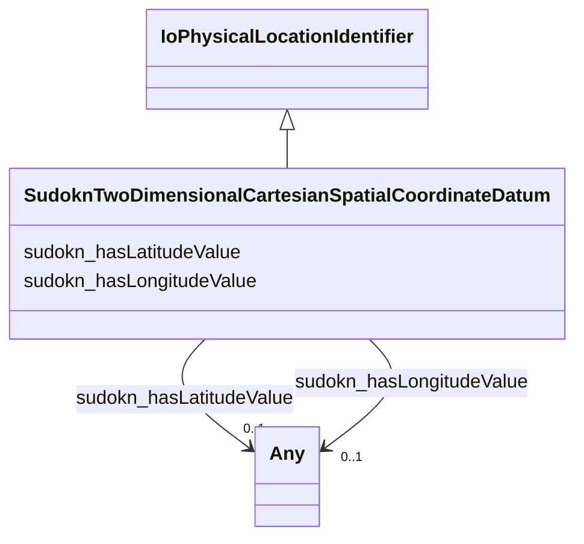

# Class: two dimensional cartesian spatial coordinate datum (sudokn_TwoDimensionalCartesianSpatialCoordinateDatum)


This class occurs 20728 times.


URI: [sudokn:TwoDimensionalCartesianSpatialCoordinateDatum](http://asu.edu/semantics/SUDOKN/TwoDimensionalCartesianSpatialCoordinateDatum)





## Inheritance
* [IoPhysicalLocationIdentifier](../classes/IoPhysicalLocationIdentifier.md)
    * **SudoknTwoDimensionalCartesianSpatialCoordinateDatum**


## Slots

| Name | Cardinality and Range | Description | Inheritance | Occurrences |
| ---  | --- | --- | --- | --- |
| [sudokn_hasLongitudeValue](../slots/sudokn_hasLongitudeValue.md) | 0..1 <br/> [xsd:float](http://www.w3.org/2001/XMLSchema#float)&nbsp;or&nbsp;<br />[xsd:string](http://www.w3.org/2001/XMLSchema#string) |  <br/>  | direct | 19083 |
| [sudokn_hasLatitudeValue](../slots/sudokn_hasLatitudeValue.md) | 0..1 <br/> [xsd:float](http://www.w3.org/2001/XMLSchema#float)&nbsp;or&nbsp;<br />[xsd:string](http://www.w3.org/2001/XMLSchema#string) |  <br/>  | direct | 19082 |


## Usages

| used by | used in | type | used |
| ---  | --- | --- | --- |
| [SudoknGeospatialLocation](../classes/SudoknGeospatialLocation.md) | [sudokn_hasSpatialCoordinates](../slots/sudokn_hasSpatialCoordinates.md) | range | [SudoknTwoDimensionalCartesianSpatialCoordinateDatum](../classes/SudoknTwoDimensionalCartesianSpatialCoordinateDatum.md) |


## LinkML Source

<!-- TODO: investigate https://stackoverflow.com/questions/37606292/how-to-create-tabbed-code-blocks-in-mkdocs-or-sphinx -->

### Direct

<details>

```yaml
name: sudokn_TwoDimensionalCartesianSpatialCoordinateDatum
title: two dimensional cartesian spatial coordinate datum
from_schema: okns:sudokn-kg
rank: 1000
is_a: io_PhysicalLocationIdentifier
slots:
- sudokn_hasLongitudeValue
- sudokn_hasLatitudeValue
class_uri: sudokn:TwoDimensionalCartesianSpatialCoordinateDatum

```
</details>

### Induced

<details>

```yaml
name: sudokn_TwoDimensionalCartesianSpatialCoordinateDatum
title: two dimensional cartesian spatial coordinate datum
from_schema: okns:sudokn-kg
rank: 1000
is_a: io_PhysicalLocationIdentifier
attributes:
  sudokn_hasLongitudeValue:
    name: sudokn_hasLongitudeValue
    title: has logitude value
    from_schema: okns:sudokn-kg
    rank: 1000
    slot_uri: sudokn:hasLongitudeValue
    alias: sudokn_hasLongitudeValue
    owner: sudokn_TwoDimensionalCartesianSpatialCoordinateDatum
    domain_of:
    - sudokn_TwoDimensionalCartesianSpatialCoordinateDatum
    subproperty_of: owl_topDataProperty
    range: Any
    any_of:
    - range: float
    - range: string
  sudokn_hasLatitudeValue:
    name: sudokn_hasLatitudeValue
    title: has latitude value
    from_schema: okns:sudokn-kg
    rank: 1000
    slot_uri: sudokn:hasLatitudeValue
    alias: sudokn_hasLatitudeValue
    owner: sudokn_TwoDimensionalCartesianSpatialCoordinateDatum
    domain_of:
    - sudokn_TwoDimensionalCartesianSpatialCoordinateDatum
    subproperty_of: owl_topDataProperty
    range: Any
    any_of:
    - range: float
    - range: string
class_uri: sudokn:TwoDimensionalCartesianSpatialCoordinateDatum

```
</details>