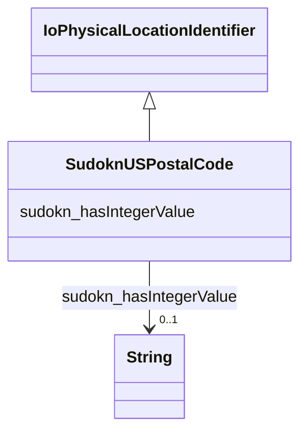

# Class: US postal code (sudokn_USPostalCode)


This class occurs 20425 times.


URI: [sudokn:USPostalCode](http://asu.edu/semantics/SUDOKN/USPostalCode)





## Inheritance
* [IoPhysicalLocationIdentifier](../classes/IoPhysicalLocationIdentifier.md)
    * **SudoknUSPostalCode**


## Slots

| Name | Cardinality and Range | Description | Inheritance | Occurrences |
| ---  | --- | --- | --- | --- |
| [sudokn_hasIntegerValue](../slots/sudokn_hasIntegerValue.md) | 0..1 <br/> [xsd:string](http://www.w3.org/2001/XMLSchema#string) |  <br/>  | direct | 18729 |


## Usages

| used by | used in | type | used |
| ---  | --- | --- | --- |
| [IoManufacturer](../classes/IoManufacturer.md) | [sudokn_hasPostalAddress](../slots/sudokn_hasPostalAddress.md) | any_of[range] | [SudoknUSPostalCode](../classes/SudoknUSPostalCode.md) |
| [SudoknGeospatialLocation](../classes/SudoknGeospatialLocation.md) | [sudokn_hasZIPcode](../slots/sudokn_hasZIPcode.md) | range | [SudoknUSPostalCode](../classes/SudoknUSPostalCode.md) |
| [SudoknGeospatialLocation](../classes/SudoknGeospatialLocation.md) | [sudokn_hasPostalAddress](../slots/sudokn_hasPostalAddress.md) | any_of[range] | [SudoknUSPostalCode](../classes/SudoknUSPostalCode.md) |


## LinkML Source

<!-- TODO: investigate https://stackoverflow.com/questions/37606292/how-to-create-tabbed-code-blocks-in-mkdocs-or-sphinx -->

### Direct

<details>

```yaml
name: sudokn_USPostalCode
title: US postal code
from_schema: okns:sudokn-kg
rank: 1000
is_a: io_PhysicalLocationIdentifier
slots:
- sudokn_hasIntegerValue
class_uri: sudokn:USPostalCode

```
</details>

### Induced

<details>

```yaml
name: sudokn_USPostalCode
title: US postal code
from_schema: okns:sudokn-kg
rank: 1000
is_a: io_PhysicalLocationIdentifier
attributes:
  sudokn_hasIntegerValue:
    name: sudokn_hasIntegerValue
    title: has integer value
    from_schema: okns:sudokn-kg
    rank: 1000
    slot_uri: sudokn:hasIntegerValue
    alias: sudokn_hasIntegerValue
    owner: sudokn_USPostalCode
    domain_of:
    - sudokn_USPostalCode
    subproperty_of: owl_topDataProperty
    range: string
class_uri: sudokn:USPostalCode

```
</details>