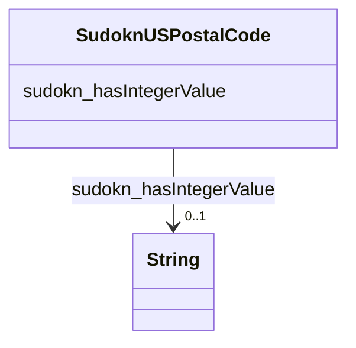

# Class: No class (type) name specified (sudokn_USPostalCode)


_No class (type) description specified_


This class occurs 20424 times.


URI: [sudokn:USPostalCode](http://asu.edu/semantics/SUDOKN/USPostalCode)





<!-- no inheritance hierarchy -->


## Slots

| Name | Cardinality and Range | Description | Inheritance | Occurrences |
| ---  | --- | --- | --- | --- |
| [sudokn_hasIntegerValue](../slots/sudokn_hasIntegerValue.md) | 0..1 <br/> [xsd:string](http://www.w3.org/2001/XMLSchema#string) | No slot (predicate) description specified <br/>  | direct | 18729 |


## Usages

| used by | used in | type | used |
| ---  | --- | --- | --- |
| [SudoknGeospatialLocation](../classes/SudoknGeospatialLocation.md) | [sudokn_hasZIPcode](../slots/sudokn_hasZIPcode.md) | range | [SudoknUSPostalCode](../classes/SudoknUSPostalCode.md) |


## LinkML Source

<!-- TODO: investigate https://stackoverflow.com/questions/37606292/how-to-create-tabbed-code-blocks-in-mkdocs-or-sphinx -->

### Direct

<details>

```yaml
name: sudokn_USPostalCode
conforms_to: No schema conformance document specified
annotations:
  count:
    tag: count
    value: 20424
description: No class (type) description specified
title: No class (type) name specified
from_schema: sudokn-kg
rank: 1000
slots:
- sudokn_hasIntegerValue
slot_usage:
  sudokn_hasIntegerValue:
    name: sudokn_hasIntegerValue
    annotations:
      string:
        tag: string
        value: 18729
class_uri: sudokn:USPostalCode

```
</details>

### Induced

<details>

```yaml
name: sudokn_USPostalCode
conforms_to: No schema conformance document specified
annotations:
  count:
    tag: count
    value: 20424
description: No class (type) description specified
title: No class (type) name specified
from_schema: sudokn-kg
rank: 1000
slot_usage:
  sudokn_hasIntegerValue:
    name: sudokn_hasIntegerValue
    annotations:
      string:
        tag: string
        value: 18729
attributes:
  sudokn_hasIntegerValue:
    name: sudokn_hasIntegerValue
    annotations:
      string:
        tag: string
        value: 18729
    description: No slot (predicate) description specified
    examples:
    - object:
        example_object: '92335'
        example_object_type: string
        example_predicate: sudokn:hasIntegerValue
        example_subject: sudokn:101PIPE-site-FONTANA-92335-site-zip
        example_subject_type: sudokn_USPostalCode
    from_schema: sudokn-kg
    rank: 1000
    slot_uri: sudokn:hasIntegerValue
    alias: sudokn_hasIntegerValue
    owner: sudokn_USPostalCode
    domain_of:
    - sudokn_USPostalCode
    range: string
class_uri: sudokn:USPostalCode

```
</details>