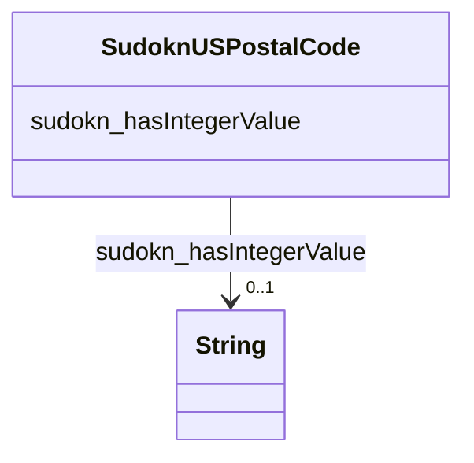

# Class: TODO -- what's a good name for this class (type)? (sudokn_USPostalCode)


_TODO -- tell the world what this class (type) describes._


URI: [sudokn:USPostalCode](http://asu.edu/semantics/SUDOKN/USPostalCode)





<!-- no inheritance hierarchy -->


## Slots

| Name | Cardinality and Range | Description | Inheritance |
| ---  | --- | --- | --- |
| [sudokn_hasIntegerValue](../slots/sudokn_hasIntegerValue.md) | 0..1 <br/> [xsd:string](http://www.w3.org/2001/XMLSchema#string) | TODO -- tell the world what this slot (predicate) describes | direct |


## Usages

| used by | used in | type | used |
| ---  | --- | --- | --- |
| [SudoknGeospatialLocation](../classes/SudoknGeospatialLocation.md) | [sudokn_hasZIPcode](../slots/sudokn_hasZIPcode.md) | range | [SudoknUSPostalCode](../classes/SudoknUSPostalCode.md) |


## TODOs

* TODO -- Todos for this class go here
* or you can delete the todos
* if you think the class is perfect.

## Identifier and Mapping Information


### Schema Source


* from schema: sudokn-kg


## Mappings

| Mapping Type | Mapped Value |
| ---  | ---  |
| self | sudokn:USPostalCode |
| native | sudokn-kg/:SudoknUSPostalCode |


## LinkML Source

<!-- TODO: investigate https://stackoverflow.com/questions/37606292/how-to-create-tabbed-code-blocks-in-mkdocs-or-sphinx -->

### Direct

<details>
```yaml
name: sudokn_USPostalCode
description: TODO -- tell the world what this class (type) describes.
title: TODO -- what's a good name for this class (type)?
todos:
- TODO -- Todos for this class go here
- or you can delete the todos
- if you think the class is perfect.
notes:
- Class with 20424 occurences.
from_schema: sudokn-kg
slots:
- sudokn_hasIntegerValue
class_uri: sudokn:USPostalCode

```
</details>

### Induced

<details>
```yaml
name: sudokn_USPostalCode
description: TODO -- tell the world what this class (type) describes.
title: TODO -- what's a good name for this class (type)?
todos:
- TODO -- Todos for this class go here
- or you can delete the todos
- if you think the class is perfect.
notes:
- Class with 20424 occurences.
from_schema: sudokn-kg
attributes:
  sudokn_hasIntegerValue:
    name: sudokn_hasIntegerValue
    description: TODO -- tell the world what this slot (predicate) describes.
    todos:
    - TODO -- Todos for this slot go here
    - or you can delete the todos
    - if you think the class is perfect.
    comments:
    - 18729 occurrences with subject type sudokn_USPostalCode and object type string.
    examples:
    - value: sudokn:101PIPE-site-FONTANA-92335-site-zip sudokn:hasIntegerValue 92335
    from_schema: sudokn-kg
    rank: 1000
    slot_uri: sudokn:hasIntegerValue
    alias: sudokn_hasIntegerValue
    owner: sudokn_USPostalCode
    domain_of:
    - sudokn_USPostalCode
    range: string
class_uri: sudokn:USPostalCode

```
</details>