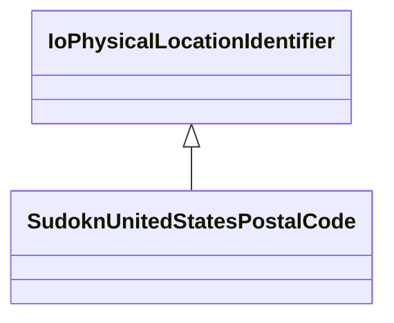

# Class: US postal code (sudokn_UnitedStatesPostalCode)


_No type description provided_


URI: [sudokn:UnitedStatesPostalCode](http://asu.edu/semantics/SUDOKN/UnitedStatesPostalCode)





## Inheritance
* [IoPhysicalLocationIdentifier](../classes/IoPhysicalLocationIdentifier.md)
    * **SudoknUnitedStatesPostalCode**


## Slots

| Name | Cardinality and Range | Description | Inheritance |
| ---  | --- | --- | --- |


## Usages

| used by | used in | type | used |
| ---  | --- | --- | --- |
| [IoManufacturer](../classes/IoManufacturer.md) | [sudokn_hasPostalAddress](../slots/sudokn_hasPostalAddress.md) | any_of[range] | [SudoknUnitedStatesPostalCode](../classes/SudoknUnitedStatesPostalCode.md) |
| [OwlNamedIndividual](../classes/OwlNamedIndividual.md) | [sudokn_hasPostalAddress](../slots/sudokn_hasPostalAddress.md) | any_of[range] | [SudoknUnitedStatesPostalCode](../classes/SudoknUnitedStatesPostalCode.md) |
| [SudoknGeospatialLocation](../classes/SudoknGeospatialLocation.md) | [sudokn_hasPostalAddress](../slots/sudokn_hasPostalAddress.md) | any_of[range] | [SudoknUnitedStatesPostalCode](../classes/SudoknUnitedStatesPostalCode.md) |


## Examples

| Value |
| --- |
| sudokn:/UnitedStatesPostalCode_1 |

## TODOs

* TODO -- Todos for this class go here
* or you can delete the todos
* if you think the class is perfect.

## Identifier and Mapping Information


### Schema Source


* from schema: sudokn-kg


## Mappings

| Mapping Type | Mapped Value |
| ---  | ---  |
| self | sudokn:UnitedStatesPostalCode |
| native | sudokn-kg/:SudoknUnitedStatesPostalCode |


## LinkML Source

<!-- TODO: investigate https://stackoverflow.com/questions/37606292/how-to-create-tabbed-code-blocks-in-mkdocs-or-sphinx -->

### Direct

<details>
```yaml
name: sudokn_UnitedStatesPostalCode
description: No type description provided
title: US postal code
todos:
- TODO -- Todos for this class go here
- or you can delete the todos
- if you think the class is perfect.
notes:
- Class with 1 occurences.
examples:
- value: sudokn:/UnitedStatesPostalCode_1
from_schema: sudokn-kg
rank: 1000
is_a: io_PhysicalLocationIdentifier
class_uri: sudokn:UnitedStatesPostalCode

```
</details>

### Induced

<details>
```yaml
name: sudokn_UnitedStatesPostalCode
description: No type description provided
title: US postal code
todos:
- TODO -- Todos for this class go here
- or you can delete the todos
- if you think the class is perfect.
notes:
- Class with 1 occurences.
examples:
- value: sudokn:/UnitedStatesPostalCode_1
from_schema: sudokn-kg
rank: 1000
is_a: io_PhysicalLocationIdentifier
class_uri: sudokn:UnitedStatesPostalCode

```
</details>