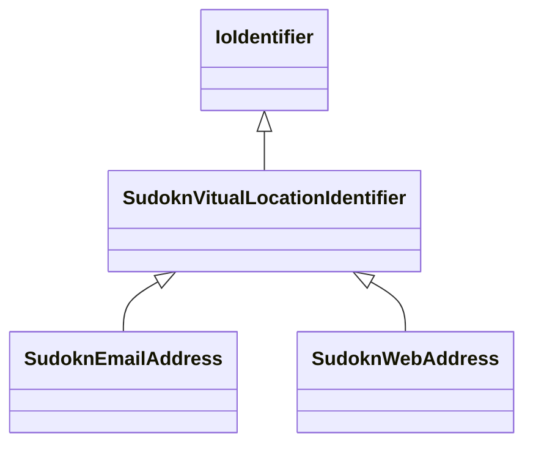

# Class: virtual location identifier (sudokn_VitualLocationIdentifier)


_TODO -- tell the world what this class (type) describes._


URI: [sudokn:VitualLocationIdentifier](http://asu.edu/semantics/SUDOKN/VitualLocationIdentifier)





## Inheritance
* [IoIdentifier](../classes/IoIdentifier.md)
    * **SudoknVitualLocationIdentifier**
        * [SudoknEmailAddress](../classes/SudoknEmailAddress.md)
        * [SudoknWebAddress](../classes/SudoknWebAddress.md)


## Slots

| Name | Cardinality and Range | Description | Inheritance |
| ---  | --- | --- | --- |


## TODOs

* TODO -- Todos for this class go here
* or you can delete the todos
* if you think the class is perfect.

## Identifier and Mapping Information


### Schema Source


* from schema: sudokn-kg


## Mappings

| Mapping Type | Mapped Value |
| ---  | ---  |
| self | sudokn:VitualLocationIdentifier |
| native | sudokn-kg/:SudoknVitualLocationIdentifier |


## LinkML Source

<!-- TODO: investigate https://stackoverflow.com/questions/37606292/how-to-create-tabbed-code-blocks-in-mkdocs-or-sphinx -->

### Direct

<details>
```yaml
name: sudokn_VitualLocationIdentifier
description: TODO -- tell the world what this class (type) describes.
title: virtual location identifier
todos:
- TODO -- Todos for this class go here
- or you can delete the todos
- if you think the class is perfect.
notes:
- Class with 0 occurences.
from_schema: sudokn-kg
is_a: io_Identifier
class_uri: sudokn:VitualLocationIdentifier

```
</details>

### Induced

<details>
```yaml
name: sudokn_VitualLocationIdentifier
description: TODO -- tell the world what this class (type) describes.
title: virtual location identifier
todos:
- TODO -- Todos for this class go here
- or you can delete the todos
- if you think the class is perfect.
notes:
- Class with 0 occurences.
from_schema: sudokn-kg
is_a: io_Identifier
class_uri: sudokn:VitualLocationIdentifier

```
</details>