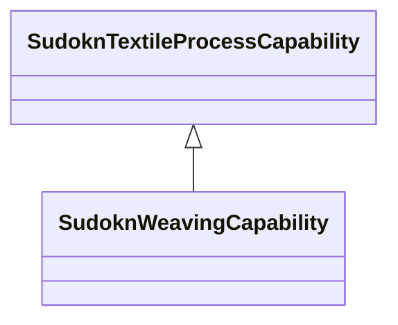

# Class: weaving capability (sudokn_WeavingCapability)


URI: [sudokn:WeavingCapability](http://asu.edu/semantics/SUDOKN/WeavingCapability)





## Inheritance
* [IoscProductionCapability](../classes/IoscProductionCapability.md)
    * [SudoknManufacturingProcessCapability](../classes/SudoknManufacturingProcessCapability.md)
        * [SudoknTextileProcessCapability](../classes/SudoknTextileProcessCapability.md)
            * **SudoknWeavingCapability**


## Slots

| Name | Cardinality and Range | Description | Inheritance | Occurrences |
| ---  | --- | --- | --- | --- |


## LinkML Source

<!-- TODO: investigate https://stackoverflow.com/questions/37606292/how-to-create-tabbed-code-blocks-in-mkdocs-or-sphinx -->

### Direct

<details>

```yaml
name: sudokn_WeavingCapability
title: weaving capability
from_schema: okns:sudokn-kg
rank: 1000
is_a: sudokn_TextileProcessCapability
class_uri: sudokn:WeavingCapability

```
</details>

### Induced

<details>

```yaml
name: sudokn_WeavingCapability
title: weaving capability
from_schema: okns:sudokn-kg
rank: 1000
is_a: sudokn_TextileProcessCapability
class_uri: sudokn:WeavingCapability

```
</details>