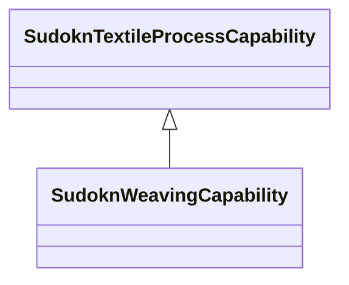

# Class: weaving capability (sudokn_WeavingCapability)


_TODO -- tell the world what this class (type) describes._


URI: [sudokn:WeavingCapability](http://asu.edu/semantics/SUDOKN/WeavingCapability)





## Inheritance
* [IoscProductionCapability](../classes/IoscProductionCapability.md)
    * [SudoknManufacturingProcessCapability](../classes/SudoknManufacturingProcessCapability.md)
        * [SudoknTextileProcessCapability](../classes/SudoknTextileProcessCapability.md)
            * **SudoknWeavingCapability**


## Slots

| Name | Cardinality and Range | Description | Inheritance |
| ---  | --- | --- | --- |


## TODOs

* TODO -- Todos for this class go here
* or you can delete the todos
* if you think the class is perfect.

## Identifier and Mapping Information


### Schema Source


* from schema: sudokn-kg


## Mappings

| Mapping Type | Mapped Value |
| ---  | ---  |
| self | sudokn:WeavingCapability |
| native | sudokn-kg/:SudoknWeavingCapability |


## LinkML Source

<!-- TODO: investigate https://stackoverflow.com/questions/37606292/how-to-create-tabbed-code-blocks-in-mkdocs-or-sphinx -->

### Direct

<details>
```yaml
name: sudokn_WeavingCapability
description: TODO -- tell the world what this class (type) describes.
title: weaving capability
todos:
- TODO -- Todos for this class go here
- or you can delete the todos
- if you think the class is perfect.
notes:
- Class with 0 occurences.
from_schema: sudokn-kg
is_a: sudokn_TextileProcessCapability
class_uri: sudokn:WeavingCapability

```
</details>

### Induced

<details>
```yaml
name: sudokn_WeavingCapability
description: TODO -- tell the world what this class (type) describes.
title: weaving capability
todos:
- TODO -- Todos for this class go here
- or you can delete the todos
- if you think the class is perfect.
notes:
- Class with 0 occurences.
from_schema: sudokn-kg
is_a: sudokn_TextileProcessCapability
class_uri: sudokn:WeavingCapability

```
</details>