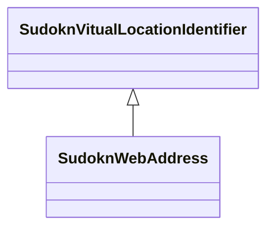

# Class: web address (sudokn_WebAddress)


_No type description provided_


URI: [sudokn:WebAddress](http://asu.edu/semantics/SUDOKN/WebAddress)





## Inheritance
* [IoIdentifier](../classes/IoIdentifier.md)
    * [SudoknVitualLocationIdentifier](../classes/SudoknVitualLocationIdentifier.md)
        * **SudoknWebAddress**


## Slots

| Name | Cardinality and Range | Description | Inheritance |
| ---  | --- | --- | --- |


## Usages

| used by | used in | type | used |
| ---  | --- | --- | --- |
| [OwlNamedIndividual](../classes/OwlNamedIndividual.md) | [sudokn_hasWebAddress](../slots/sudokn_hasWebAddress.md) | any_of[range] | [SudoknWebAddress](../classes/SudoknWebAddress.md) |


## Examples

| Value |
| --- |
| sudokn:/WebAddress_1 |

## TODOs

* TODO -- Todos for this class go here
* or you can delete the todos
* if you think the class is perfect.

## Identifier and Mapping Information


### Schema Source


* from schema: sudokn-kg


## Mappings

| Mapping Type | Mapped Value |
| ---  | ---  |
| self | sudokn:WebAddress |
| native | sudokn-kg/:SudoknWebAddress |


## LinkML Source

<!-- TODO: investigate https://stackoverflow.com/questions/37606292/how-to-create-tabbed-code-blocks-in-mkdocs-or-sphinx -->

### Direct

<details>
```yaml
name: sudokn_WebAddress
description: No type description provided
title: web address
todos:
- TODO -- Todos for this class go here
- or you can delete the todos
- if you think the class is perfect.
notes:
- Class with 1 occurences.
examples:
- value: sudokn:/WebAddress_1
from_schema: sudokn-kg
rank: 1000
is_a: sudokn_VitualLocationIdentifier
class_uri: sudokn:WebAddress

```
</details>

### Induced

<details>
```yaml
name: sudokn_WebAddress
description: No type description provided
title: web address
todos:
- TODO -- Todos for this class go here
- or you can delete the todos
- if you think the class is perfect.
notes:
- Class with 1 occurences.
examples:
- value: sudokn:/WebAddress_1
from_schema: sudokn-kg
rank: 1000
is_a: sudokn_VitualLocationIdentifier
class_uri: sudokn:WebAddress

```
</details>