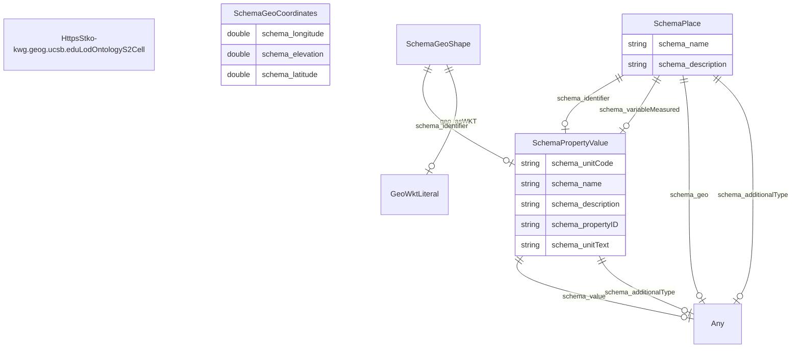

# TODO_Give_this_schema_a_name!

TODO -- tell the world what this schema describes.

URI: ufokn-kg

Name: ufokn-kg

## Schema Diagram

## Classes

| Class | Description |
| --- | --- |
| [Any](classes/Any.md) | None |
| [GeoWktLiteral](classes/GeoWktLiteral.md) | None |
| [HttpsStko-kwg.geog.ucsb.eduLodOntologyS2Cell](classes/HttpsStko-kwg.geog.ucsb.eduLodOntologyS2Cell.md) | TODO -- tell the world what this class (type) describes. |
| [SchemaGeoCoordinates](classes/SchemaGeoCoordinates.md) | The geographic coordinates of a place or event. |
| [SchemaGeoShape](classes/SchemaGeoShape.md) | The geographic shape of a place. A GeoShape can be described using several properties whose values are based on latitude/longitude pairs. Either whitespace or commas can be used to separate latitude and longitude; whitespace should be used when writing a list of several such points. |
| [SchemaPlace](classes/SchemaPlace.md) | Entities that have a somewhat fixed, physical extension. |
| [SchemaPropertyValue](classes/SchemaPropertyValue.md) | A property-value pair, e.g. representing a feature of a product or place. Use the 'name' property for the name of the property. If there is an additional human-readable version of the value, put that into the 'description' property.\n\n Always use specific schema.org properties when a) they exist and b) you can populate them. Using PropertyValue as a substitute will typically not trigger the same effect as using the original, specific property.
     |

## Slots

| Slot | Description |
| --- | --- |
| [geo_asWKT](slots/geo_asWKT.md) | TODO -- tell the world what this slot (predicate) describes |
| [schema_additionalType](slots/schema_additionalType.md) | TODO -- tell the world what this slot (predicate) describes |
| [schema_description](slots/schema_description.md) | TODO -- tell the world what this slot (predicate) describes |
| [schema_elevation](slots/schema_elevation.md) | TODO -- tell the world what this slot (predicate) describes |
| [schema_geo](slots/schema_geo.md) | TODO -- tell the world what this slot (predicate) describes |
| [schema_identifier](slots/schema_identifier.md) | TODO -- tell the world what this slot (predicate) describes |
| [schema_latitude](slots/schema_latitude.md) | TODO -- tell the world what this slot (predicate) describes |
| [schema_longitude](slots/schema_longitude.md) | TODO -- tell the world what this slot (predicate) describes |
| [schema_name](slots/schema_name.md) | TODO -- tell the world what this slot (predicate) describes |
| [schema_propertyID](slots/schema_propertyID.md) | TODO -- tell the world what this slot (predicate) describes |
| [schema_unitCode](slots/schema_unitCode.md) | TODO -- tell the world what this slot (predicate) describes |
| [schema_unitText](slots/schema_unitText.md) | TODO -- tell the world what this slot (predicate) describes |
| [schema_value](slots/schema_value.md) | TODO -- tell the world what this slot (predicate) describes |
| [schema_variableMeasured](slots/schema_variableMeasured.md) | TODO -- tell the world what this slot (predicate) describes |

## Enumerations

| Enumeration | Description |
| --- | --- |

## Types

| Type | Description |
| --- | --- |

## Subsets

| Subset | Description |
| --- | --- |
