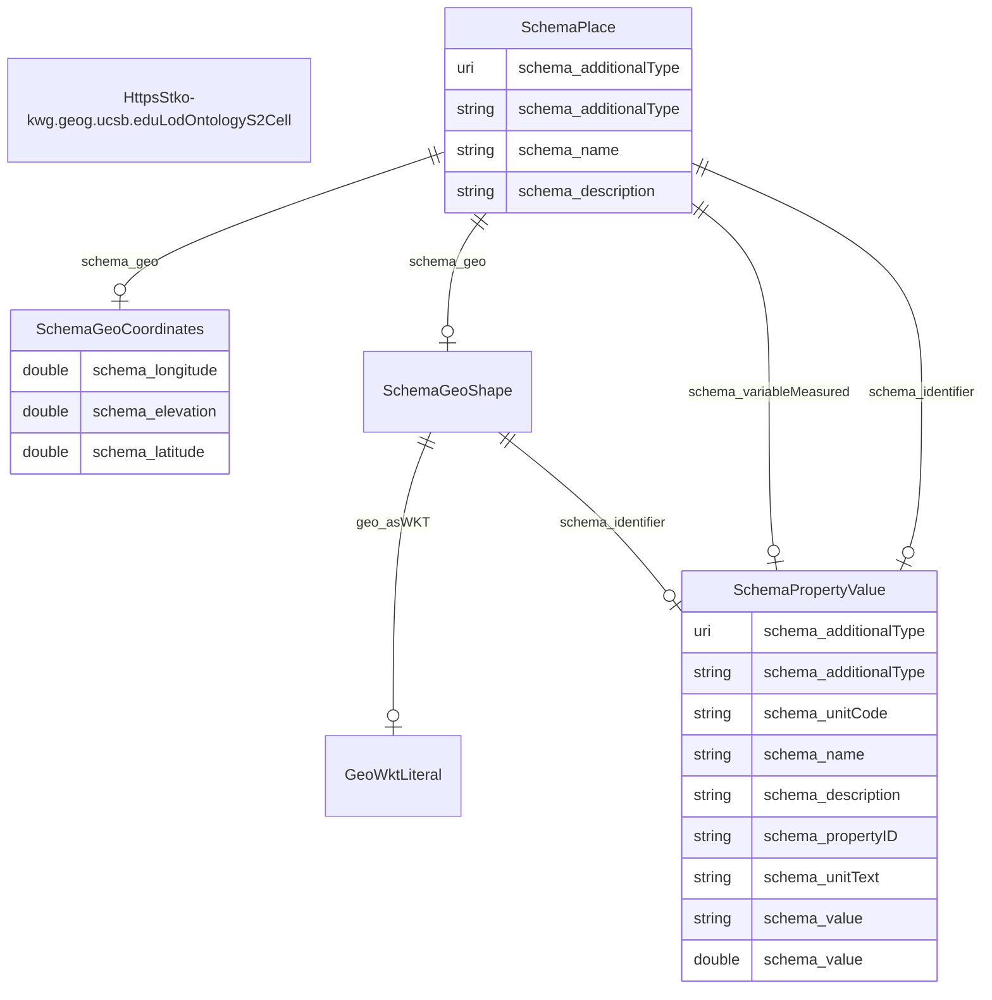

# TODO_Give_this_schema_a_name!

TODO -- tell the world what this schema describes.

URI: ufokn-kg

Name: ufokn-kg

## Schema Diagram

## IRI prefixes

* geo: http://www.opengis.net/ont/geosparql#
* linkml: https://w3id.org/linkml/
* rdf: http://www.w3.org/1999/02/22-rdf-syntax-ns#
* schema: https://schema.org/

## Classes

| Class | Description |
| --- | --- |
| [GeoWktLiteral](classes/GeoWktLiteral.md) | None | 
| [HttpsStko-kwg.geog.ucsb.eduLodOntologyS2Cell](classes/HttpsStko-kwg.geog.ucsb.eduLodOntologyS2Cell.md) | No type description provided Class with 11717916 occurences.| 
| [SchemaGeoCoordinates](classes/SchemaGeoCoordinates.md) | The geographic coordinates of a place or event. Class with 5858958 occurences.| 
| [SchemaGeoShape](classes/SchemaGeoShape.md) | The geographic shape of a place. A GeoShape can be described using several properties whose values are based on latitude/longitude pairs. Either whitespace or commas can be used to separate latitude and longitude; whitespace should be used when writing a list of several such points. Class with 5858958 occurences.| 
| [SchemaPlace](classes/SchemaPlace.md) | Entities that have a somewhat fixed, physical extension. Class with 5839329 occurences.| 
| [SchemaPropertyValue](classes/SchemaPropertyValue.md) | A property-value pair, e.g. representing a feature of a product or place. Use the 'name' property for the name of the property. If there is an additional human-readable version of the value, put that into the 'description' property.\n\n Always use specific schema.org properties when a) they exist and b) you can populate them. Using PropertyValue as a substitute will typically not trigger the same effect as using the original, specific property.
     Class with 41012706 occurences.| 

## Slots

| Slot | Description |
| --- | --- |
| [geo_asWKT](slots/geo_asWKT.md) | No slot description provided 5858958 occurrences with subject type schema_GeoShape and object type geo_wktLiteral.|
| [schema_additionalType](slots/schema_additionalType.md) | No slot description provided 11717916 occurrences with subject type schema_PropertyValue and object type uri. 5839332 occurrences with subject type schema_Place and object type string.|
| [schema_description](slots/schema_description.md) | No slot description provided 17576874 occurrences with subject type schema_PropertyValue and object type string. 5846397 occurrences with subject type schema_Place and object type string.|
| [schema_elevation](slots/schema_elevation.md) | No slot description provided 5858958 occurrences with subject type schema_GeoCoordinates and object type double.|
| [schema_geo](slots/schema_geo.md) | No slot description provided 5858958 occurrences with subject type schema_Place and object type schema_GeoCoordinates. 5858958 occurrences with subject type schema_Place and object type schema_GeoShape.|
| [schema_identifier](slots/schema_identifier.md) | No slot description provided 11717916 occurrences with subject type schema_GeoShape and object type schema_PropertyValue. 23435832 occurrences with subject type schema_Place and object type schema_PropertyValue.|
| [schema_latitude](slots/schema_latitude.md) | No slot description provided 5858958 occurrences with subject type schema_GeoCoordinates and object type double.|
| [schema_longitude](slots/schema_longitude.md) | No slot description provided 5858958 occurrences with subject type schema_GeoCoordinates and object type double.|
| [schema_name](slots/schema_name.md) | No slot description provided 41012706 occurrences with subject type schema_PropertyValue and object type string. 5839329 occurrences with subject type schema_Place and object type string.|
| [schema_propertyID](slots/schema_propertyID.md) | No slot description provided 5858958 occurrences with subject type schema_PropertyValue and object type string.|
| [schema_unitCode](slots/schema_unitCode.md) | No slot description provided 5858958 occurrences with subject type schema_PropertyValue and object type string.|
| [schema_unitText](slots/schema_unitText.md) | No slot description provided 5858958 occurrences with subject type schema_PropertyValue and object type string.|
| [schema_value](slots/schema_value.md) | No slot description provided 35153748 occurrences with subject type schema_PropertyValue and object type string. 5858958 occurrences with subject type schema_PropertyValue and object type double.|
| [schema_variableMeasured](slots/schema_variableMeasured.md) | No slot description provided 5858958 occurrences with subject type schema_Place and object type schema_PropertyValue.|

