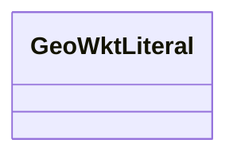

# Class: TODO -- this class is noted as a superclass of another class in this graph but has not itself been defined. (geo_wktLiteral)


URI: [geo:wktLiteral](http://www.opengis.net/ont/geosparql#wktLiteral)





<!-- no inheritance hierarchy -->


## Slots

| Name | Cardinality and Range | Description | Inheritance |
| ---  | --- | --- | --- |


## Usages

| used by | used in | type | used |
| ---  | --- | --- | --- |
| [SchemaGeoShape](../classes/SchemaGeoShape.md) | [geo_asWKT](../slots/geo_asWKT.md) | range | [GeoWktLiteral](../classes/GeoWktLiteral.md) |


## Identifier and Mapping Information


### Schema Source


* from schema: ufokn-kg


## Mappings

| Mapping Type | Mapped Value |
| ---  | ---  |
| self | geo:wktLiteral |
| native | ufokn-kg/:GeoWktLiteral |


## LinkML Source

<!-- TODO: investigate https://stackoverflow.com/questions/37606292/how-to-create-tabbed-code-blocks-in-mkdocs-or-sphinx -->

### Direct

<details>
```yaml
name: geo_wktLiteral
title: TODO -- this class is noted as a superclass of another class in this graph
  but has not itself been defined.
from_schema: ufokn-kg
rank: 1000
class_uri: geo:wktLiteral

```
</details>

### Induced

<details>
```yaml
name: geo_wktLiteral
title: TODO -- this class is noted as a superclass of another class in this graph
  but has not itself been defined.
from_schema: ufokn-kg
rank: 1000
class_uri: geo:wktLiteral

```
</details>