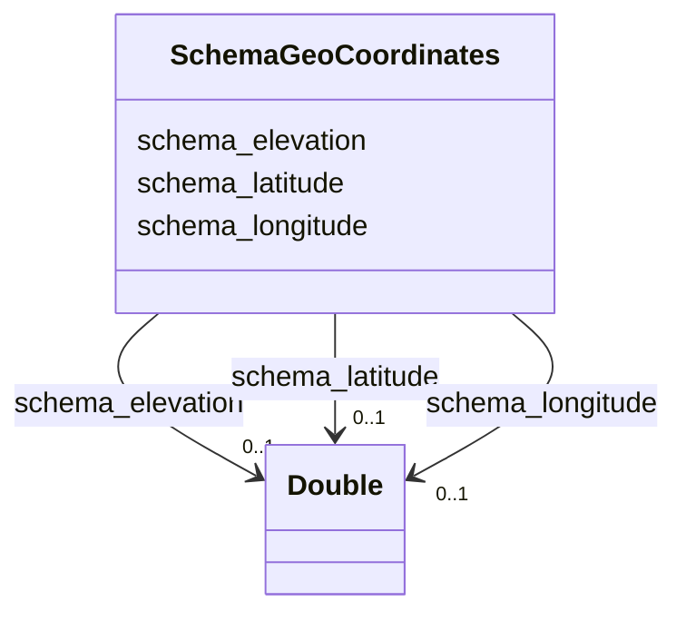

# Class: GeoCoordinates (schema_GeoCoordinates)


_The geographic coordinates of a place or event._


URI: [schema:GeoCoordinates](https://schema.org/GeoCoordinates)





<!-- no inheritance hierarchy -->


## Slots

| Name | Cardinality and Range | Description | Inheritance |
| ---  | --- | --- | --- |
| [schema_longitude](../slots/schema_longitude.md) | 0..1 <br/> [xsd:double](http://www.w3.org/2001/XMLSchema#double) | TODO -- tell the world what this slot (predicate) describes | direct |
| [schema_elevation](../slots/schema_elevation.md) | 0..1 <br/> [xsd:double](http://www.w3.org/2001/XMLSchema#double) | TODO -- tell the world what this slot (predicate) describes | direct |
| [schema_latitude](../slots/schema_latitude.md) | 0..1 <br/> [xsd:double](http://www.w3.org/2001/XMLSchema#double) | TODO -- tell the world what this slot (predicate) describes | direct |


## Usages

| used by | used in | type | used |
| ---  | --- | --- | --- |
| [SchemaPlace](../classes/SchemaPlace.md) | [schema_geo](../slots/schema_geo.md) | any_of[range] | [SchemaGeoCoordinates](../classes/SchemaGeoCoordinates.md) |


## Examples

| Value |
| --- |
| _:10000401186e9dbe9332918d789c5bdf |

## TODOs

* TODO -- Todos for this class go here
* or you can delete the todos
* if you think the class is perfect.

## Identifier and Mapping Information


### Schema Source


* from schema: ufokn-kg


## Mappings

| Mapping Type | Mapped Value |
| ---  | ---  |
| self | schema:GeoCoordinates |
| native | ufokn-kg/:SchemaGeoCoordinates |


## LinkML Source

<!-- TODO: investigate https://stackoverflow.com/questions/37606292/how-to-create-tabbed-code-blocks-in-mkdocs-or-sphinx -->

### Direct

<details>
```yaml
name: schema_GeoCoordinates
description: The geographic coordinates of a place or event.
title: GeoCoordinates
todos:
- TODO -- Todos for this class go here
- or you can delete the todos
- if you think the class is perfect.
notes:
- Class with 5858958 occurences.
examples:
- value: _:10000401186e9dbe9332918d789c5bdf
from_schema: ufokn-kg
slots:
- schema_longitude
- schema_elevation
- schema_latitude
class_uri: schema:GeoCoordinates

```
</details>

### Induced

<details>
```yaml
name: schema_GeoCoordinates
description: The geographic coordinates of a place or event.
title: GeoCoordinates
todos:
- TODO -- Todos for this class go here
- or you can delete the todos
- if you think the class is perfect.
notes:
- Class with 5858958 occurences.
examples:
- value: _:10000401186e9dbe9332918d789c5bdf
from_schema: ufokn-kg
attributes:
  schema_longitude:
    name: schema_longitude
    description: TODO -- tell the world what this slot (predicate) describes.
    todos:
    - TODO -- Todos for this slot go here
    - or you can delete the todos
    - if you think the class is perfect.
    comments:
    - 5858958 occurrences with subject type schema_GeoCoordinates and object type
      double.
    examples:
    - value: _:10000401186e9dbe9332918d789c5bdf schema:longitude -84.24203107219205
    from_schema: ufokn-kg
    rank: 1000
    slot_uri: schema:longitude
    alias: schema_longitude
    owner: schema_GeoCoordinates
    domain_of:
    - schema_GeoCoordinates
    range: double
  schema_elevation:
    name: schema_elevation
    description: TODO -- tell the world what this slot (predicate) describes.
    todos:
    - TODO -- Todos for this slot go here
    - or you can delete the todos
    - if you think the class is perfect.
    comments:
    - 5858958 occurrences with subject type schema_GeoCoordinates and object type
      double.
    examples:
    - value: _:10000401186e9dbe9332918d789c5bdf schema:elevation 52.54320526123047
    from_schema: ufokn-kg
    rank: 1000
    slot_uri: schema:elevation
    alias: schema_elevation
    owner: schema_GeoCoordinates
    domain_of:
    - schema_GeoCoordinates
    range: double
  schema_latitude:
    name: schema_latitude
    description: TODO -- tell the world what this slot (predicate) describes.
    todos:
    - TODO -- Todos for this slot go here
    - or you can delete the todos
    - if you think the class is perfect.
    comments:
    - 5858958 occurrences with subject type schema_GeoCoordinates and object type
      double.
    examples:
    - value: _:10000401186e9dbe9332918d789c5bdf schema:latitude 39.30449296586374
    from_schema: ufokn-kg
    rank: 1000
    slot_uri: schema:latitude
    alias: schema_latitude
    owner: schema_GeoCoordinates
    domain_of:
    - schema_GeoCoordinates
    range: double
class_uri: schema:GeoCoordinates

```
</details>