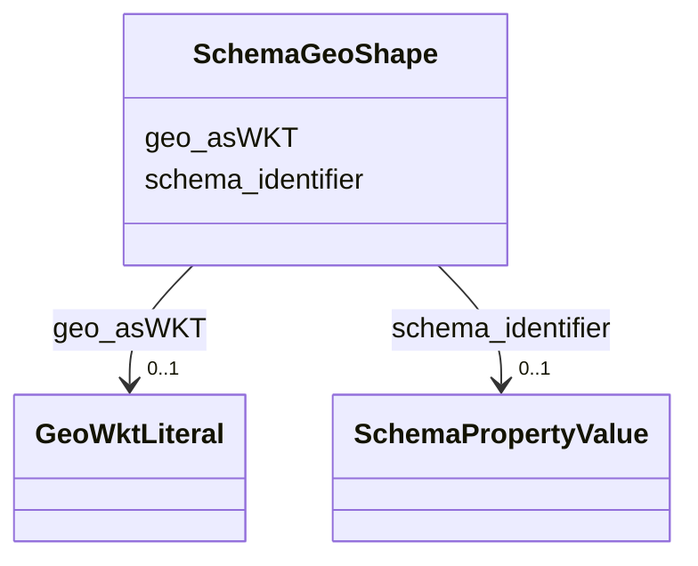

# Class: GeoShape (schema_GeoShape)


_The geographic shape of a place. A GeoShape can be described using several properties whose values are based on latitude/longitude pairs. Either whitespace or commas can be used to separate latitude and longitude; whitespace should be used when writing a list of several such points._


URI: [schema:GeoShape](https://schema.org/GeoShape)





<!-- no inheritance hierarchy -->


## Slots

| Name | Cardinality and Range | Description | Inheritance |
| ---  | --- | --- | --- |
| [geo_asWKT](../slots/geo_asWKT.md) | 0..1 <br/> [GeoWktLiteral](../classes/GeoWktLiteral.md) | No slot description provided | direct |
| [schema_identifier](../slots/schema_identifier.md) | 0..1 <br/> [SchemaPropertyValue](../classes/SchemaPropertyValue.md) | No slot description provided | direct |


## Usages

| used by | used in | type | used |
| ---  | --- | --- | --- |
| [SchemaPlace](../classes/SchemaPlace.md) | [schema_geo](../slots/schema_geo.md) | any_of[range] | [SchemaGeoShape](../classes/SchemaGeoShape.md) |


## TODOs

* TODO -- Todos for this class go here
* or you can delete the todos
* if you think the class is perfect.

## Identifier and Mapping Information


### Schema Source


* from schema: ufokn-kg


## Mappings

| Mapping Type | Mapped Value |
| ---  | ---  |
| self | schema:GeoShape |
| native | ufokn-kg/:SchemaGeoShape |


## LinkML Source

<!-- TODO: investigate https://stackoverflow.com/questions/37606292/how-to-create-tabbed-code-blocks-in-mkdocs-or-sphinx -->

### Direct

<details>
```yaml
name: schema_GeoShape
description: The geographic shape of a place. A GeoShape can be described using several
  properties whose values are based on latitude/longitude pairs. Either whitespace
  or commas can be used to separate latitude and longitude; whitespace should be used
  when writing a list of several such points.
title: GeoShape
todos:
- TODO -- Todos for this class go here
- or you can delete the todos
- if you think the class is perfect.
notes:
- Class with 5858958 occurences.
from_schema: ufokn-kg
rank: 1000
slots:
- geo_asWKT
- schema_identifier
class_uri: schema:GeoShape

```
</details>

### Induced

<details>
```yaml
name: schema_GeoShape
description: The geographic shape of a place. A GeoShape can be described using several
  properties whose values are based on latitude/longitude pairs. Either whitespace
  or commas can be used to separate latitude and longitude; whitespace should be used
  when writing a list of several such points.
title: GeoShape
todos:
- TODO -- Todos for this class go here
- or you can delete the todos
- if you think the class is perfect.
notes:
- Class with 5858958 occurences.
from_schema: ufokn-kg
rank: 1000
attributes:
  geo_asWKT:
    name: geo_asWKT
    description: No slot description provided
    todos:
    - TODO -- Todos for this slot go here
    - or you can delete the todos
    - if you think the class is perfect.
    comments:
    - 5858958 occurrences with subject type schema_GeoShape and object type geo_wktLiteral.
    examples:
    - value: _:100002217f7f477703e7dca48224c9fa geo:asWKT POINT( -81.54166702711412
        39.486225178205494 69.13139343261719 )
    from_schema: ufokn-kg
    rank: 1000
    slot_uri: geo:asWKT
    alias: geo_asWKT
    owner: schema_GeoShape
    domain_of:
    - schema_GeoShape
    range: geo_wktLiteral
  schema_identifier:
    name: schema_identifier
    description: No slot description provided
    todos:
    - TODO -- Todos for this slot go here
    - or you can delete the todos
    - if you think the class is perfect.
    comments:
    - 11717916 occurrences with subject type schema_GeoShape and object type schema_PropertyValue.
    - 23435832 occurrences with subject type schema_Place and object type schema_PropertyValue.
    examples:
    - value: _:fffffdc6eb793b0e1c71e11bd8428e09 schema:identifier _:baef8cae5e57645d663395a719965de1
    - value: https://ufokn.org/id/urmi/dpqwz0m0gs3b schema:identifier _:f8339464d8bf079d34587a15afa37865
    from_schema: ufokn-kg
    rank: 1000
    slot_uri: schema:identifier
    alias: schema_identifier
    owner: schema_GeoShape
    domain_of:
    - schema_GeoShape
    - schema_Place
    range: schema_PropertyValue
class_uri: schema:GeoShape

```
</details>