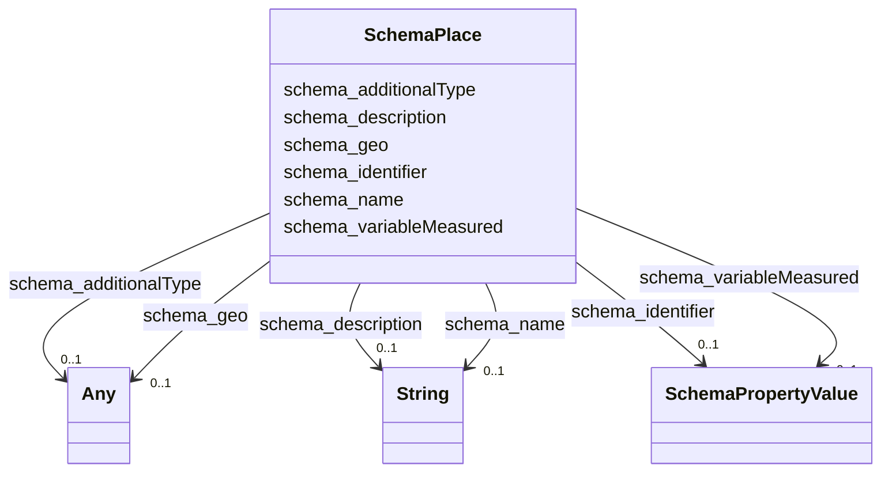

# Class: Place (schema_Place)


_Entities that have a somewhat fixed, physical extension._


URI: [schema:Place](https://schema.org/Place)





<!-- no inheritance hierarchy -->


## Slots

| Name | Cardinality and Range | Description | Inheritance |
| ---  | --- | --- | --- |
| [schema_additionalType](../slots/schema_additionalType.md) | 0..1 <br/> [xsd:anyURI](xsd:anyURI)&nbsp;or&nbsp;<br />[xsd:string](xsd:string) | No slot description provided | direct |
| [schema_name](../slots/schema_name.md) | 0..1 <br/> [xsd:string](xsd:string) | No slot description provided | direct |
| [schema_description](../slots/schema_description.md) | 0..1 <br/> [xsd:string](xsd:string) | No slot description provided | direct |
| [schema_geo](../slots/schema_geo.md) | 0..1 <br/> [SchemaGeoCoordinates](../classes/SchemaGeoCoordinates.md)&nbsp;or&nbsp;<br />[SchemaGeoShape](../classes/SchemaGeoShape.md) | No slot description provided | direct |
| [schema_variableMeasured](../slots/schema_variableMeasured.md) | 0..1 <br/> [SchemaPropertyValue](../classes/SchemaPropertyValue.md) | No slot description provided | direct |
| [schema_identifier](../slots/schema_identifier.md) | 0..1 <br/> [SchemaPropertyValue](../classes/SchemaPropertyValue.md) | No slot description provided | direct |


## Examples

| Value |
| --- |
| https://ufokn.org/id/urmi/dngwmzszm7nt |

## TODOs

* TODO -- Todos for this class go here
* or you can delete the todos
* if you think the class is perfect.

## Identifier and Mapping Information


### Schema Source


* from schema: ufokn-kg


## Mappings

| Mapping Type | Mapped Value |
| ---  | ---  |
| self | schema:Place |
| native | ufokn-kg/:SchemaPlace |


## LinkML Source

<!-- TODO: investigate https://stackoverflow.com/questions/37606292/how-to-create-tabbed-code-blocks-in-mkdocs-or-sphinx -->

### Direct

<details>
```yaml
name: schema_Place
description: Entities that have a somewhat fixed, physical extension.
title: Place
todos:
- TODO -- Todos for this class go here
- or you can delete the todos
- if you think the class is perfect.
notes:
- Class with 5839329 occurences.
examples:
- value: https://ufokn.org/id/urmi/dngwmzszm7nt
from_schema: ufokn-kg
rank: 1000
slots:
- schema_additionalType
- schema_name
- schema_description
- schema_geo
- schema_variableMeasured
- schema_identifier
class_uri: schema:Place

```
</details>

### Induced

<details>
```yaml
name: schema_Place
description: Entities that have a somewhat fixed, physical extension.
title: Place
todos:
- TODO -- Todos for this class go here
- or you can delete the todos
- if you think the class is perfect.
notes:
- Class with 5839329 occurences.
examples:
- value: https://ufokn.org/id/urmi/dngwmzszm7nt
from_schema: ufokn-kg
rank: 1000
attributes:
  schema_additionalType:
    name: schema_additionalType
    description: No slot description provided
    todos:
    - TODO -- Todos for this slot go here
    - or you can delete the todos
    - if you think the class is perfect.
    comments:
    - 11717916 occurrences with subject type schema_PropertyValue and object type
      uri.
    - 5839332 occurrences with subject type schema_Place and object type string.
    examples:
    - value: _:1000004ffdfdf77e2c97998ea1e8da86 schema:additionalType https://stko-kwg.geog.ucsb.edu/lod/ontology#S2Cell
    - value: https://ufokn.org/id/urmi/dngwmzszm7nt schema:additionalType building
    from_schema: ufokn-kg
    rank: 1000
    slot_uri: schema:additionalType
    alias: schema_additionalType
    owner: schema_Place
    domain_of:
    - schema_Place
    - schema_PropertyValue
    range: Any
    any_of:
    - range: uri
    - range: string
  schema_name:
    name: schema_name
    description: No slot description provided
    todos:
    - TODO -- Todos for this slot go here
    - or you can delete the todos
    - if you think the class is perfect.
    comments:
    - 41012706 occurrences with subject type schema_PropertyValue and object type
      string.
    - 5839329 occurrences with subject type schema_Place and object type string.
    examples:
    - value: _:1000004ffdfdf77e2c97998ea1e8da86 schema:name s2Level13
    - value: https://ufokn.org/id/urmi/dngwmzszm7nt schema:name dngwmzszm7nt
    from_schema: ufokn-kg
    rank: 1000
    slot_uri: schema:name
    alias: schema_name
    owner: schema_Place
    domain_of:
    - schema_Place
    - schema_PropertyValue
    range: string
  schema_description:
    name: schema_description
    description: No slot description provided
    todos:
    - TODO -- Todos for this slot go here
    - or you can delete the todos
    - if you think the class is perfect.
    comments:
    - 17576874 occurrences with subject type schema_PropertyValue and object type
      string.
    - 5846397 occurrences with subject type schema_Place and object type string.
    examples:
    - value: _:1000004ffdfdf77e2c97998ea1e8da86 schema:description S2 cell at level
        13
    - value: https://ufokn.org/id/urmi/dngwmzszm7nt schema:description osm:leisure:nature_reserve
    from_schema: ufokn-kg
    rank: 1000
    slot_uri: schema:description
    alias: schema_description
    owner: schema_Place
    domain_of:
    - schema_Place
    - schema_PropertyValue
    range: string
  schema_geo:
    name: schema_geo
    description: No slot description provided
    todos:
    - TODO -- Todos for this slot go here
    - or you can delete the todos
    - if you think the class is perfect.
    comments:
    - 5858958 occurrences with subject type schema_Place and object type schema_GeoCoordinates.
    - 5858958 occurrences with subject type schema_Place and object type schema_GeoShape.
    examples:
    - value: https://ufokn.org/id/urmi/dpqwz0m0gs3b schema:geo _:69e22f093bd3d1f9a269c6454084bdb6
    - value: https://ufokn.org/id/urmi/dpqwz0m0gs3b schema:geo _:92276e1da29d02ff87824f50b449812c
    from_schema: ufokn-kg
    rank: 1000
    slot_uri: schema:geo
    alias: schema_geo
    owner: schema_Place
    domain_of:
    - schema_Place
    range: Any
    any_of:
    - range: schema_GeoCoordinates
    - range: schema_GeoShape
  schema_variableMeasured:
    name: schema_variableMeasured
    description: No slot description provided
    todos:
    - TODO -- Todos for this slot go here
    - or you can delete the todos
    - if you think the class is perfect.
    comments:
    - 5858958 occurrences with subject type schema_Place and object type schema_PropertyValue.
    examples:
    - value: https://ufokn.org/id/urmi/dpqwz0m0gs3b schema:variableMeasured _:d9266c6118e03e61ecbbf8ec7af9c9a1
    from_schema: ufokn-kg
    rank: 1000
    slot_uri: schema:variableMeasured
    alias: schema_variableMeasured
    owner: schema_Place
    domain_of:
    - schema_Place
    range: schema_PropertyValue
  schema_identifier:
    name: schema_identifier
    description: No slot description provided
    todos:
    - TODO -- Todos for this slot go here
    - or you can delete the todos
    - if you think the class is perfect.
    comments:
    - 11717916 occurrences with subject type schema_GeoShape and object type schema_PropertyValue.
    - 23435832 occurrences with subject type schema_Place and object type schema_PropertyValue.
    examples:
    - value: _:fffffdc6eb793b0e1c71e11bd8428e09 schema:identifier _:baef8cae5e57645d663395a719965de1
    - value: https://ufokn.org/id/urmi/dpqwz0m0gs3b schema:identifier _:f8339464d8bf079d34587a15afa37865
    from_schema: ufokn-kg
    rank: 1000
    slot_uri: schema:identifier
    alias: schema_identifier
    owner: schema_Place
    domain_of:
    - schema_GeoShape
    - schema_Place
    range: schema_PropertyValue
class_uri: schema:Place

```
</details>