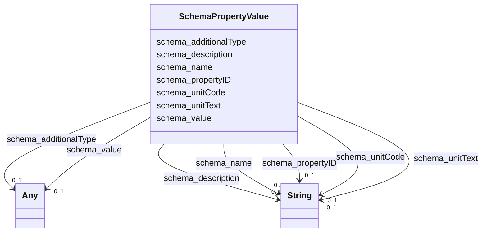

# Class: PropertyValue (schema_PropertyValue)


_A property-value pair, e.g. representing a feature of a product or place. Use the 'name' property for the name of the property. If there is an additional human-readable version of the value, put that into the 'description' property.\n\n Always use specific schema.org properties when a) they exist and b) you can populate them. Using PropertyValue as a substitute will typically not trigger the same effect as using the original, specific property._

_    _


URI: [schema:PropertyValue](https://schema.org/PropertyValue)





<!-- no inheritance hierarchy -->


## Slots

| Name | Cardinality and Range | Description | Inheritance |
| ---  | --- | --- | --- |
| [schema_additionalType](../slots/schema_additionalType.md) | 0..1 <br/> [xsd:anyURI](xsd:anyURI)&nbsp;or&nbsp;<br />[xsd:string](xsd:string) | No slot description provided | direct |
| [schema_unitCode](../slots/schema_unitCode.md) | 0..1 <br/> [xsd:string](xsd:string) | No slot description provided | direct |
| [schema_name](../slots/schema_name.md) | 0..1 <br/> [xsd:string](xsd:string) | No slot description provided | direct |
| [schema_description](../slots/schema_description.md) | 0..1 <br/> [xsd:string](xsd:string) | No slot description provided | direct |
| [schema_propertyID](../slots/schema_propertyID.md) | 0..1 <br/> [xsd:string](xsd:string) | No slot description provided | direct |
| [schema_unitText](../slots/schema_unitText.md) | 0..1 <br/> [xsd:string](xsd:string) | No slot description provided | direct |
| [schema_value](../slots/schema_value.md) | 0..1 <br/> [xsd:string](xsd:string)&nbsp;or&nbsp;<br />[xsd:double](xsd:double) | No slot description provided | direct |


## Usages

| used by | used in | type | used |
| ---  | --- | --- | --- |
| [SchemaGeoShape](../classes/SchemaGeoShape.md) | [schema_identifier](../slots/schema_identifier.md) | range | [SchemaPropertyValue](../classes/SchemaPropertyValue.md) |
| [SchemaPlace](../classes/SchemaPlace.md) | [schema_variableMeasured](../slots/schema_variableMeasured.md) | range | [SchemaPropertyValue](../classes/SchemaPropertyValue.md) |
| [SchemaPlace](../classes/SchemaPlace.md) | [schema_identifier](../slots/schema_identifier.md) | range | [SchemaPropertyValue](../classes/SchemaPropertyValue.md) |


## Examples

| Value |
| --- |
| _:1000004ffdfdf77e2c97998ea1e8da86 |

## TODOs

* TODO -- Todos for this class go here
* or you can delete the todos
* if you think the class is perfect.

## Identifier and Mapping Information


### Schema Source


* from schema: ufokn-kg


## Mappings

| Mapping Type | Mapped Value |
| ---  | ---  |
| self | schema:PropertyValue |
| native | ufokn-kg/:SchemaPropertyValue |


## LinkML Source

<!-- TODO: investigate https://stackoverflow.com/questions/37606292/how-to-create-tabbed-code-blocks-in-mkdocs-or-sphinx -->

### Direct

<details>
```yaml
name: schema_PropertyValue
description: "A property-value pair, e.g. representing a feature of a product or place.\
  \ Use the 'name' property for the name of the property. If there is an additional\
  \ human-readable version of the value, put that into the 'description' property.\\\
  n\\n Always use specific schema.org properties when a) they exist and b) you can\
  \ populate them. Using PropertyValue as a substitute will typically not trigger\
  \ the same effect as using the original, specific property.\n    "
title: PropertyValue
todos:
- TODO -- Todos for this class go here
- or you can delete the todos
- if you think the class is perfect.
notes:
- Class with 41012706 occurences.
examples:
- value: _:1000004ffdfdf77e2c97998ea1e8da86
from_schema: ufokn-kg
rank: 1000
slots:
- schema_additionalType
- schema_unitCode
- schema_name
- schema_description
- schema_propertyID
- schema_unitText
- schema_value
class_uri: schema:PropertyValue

```
</details>

### Induced

<details>
```yaml
name: schema_PropertyValue
description: "A property-value pair, e.g. representing a feature of a product or place.\
  \ Use the 'name' property for the name of the property. If there is an additional\
  \ human-readable version of the value, put that into the 'description' property.\\\
  n\\n Always use specific schema.org properties when a) they exist and b) you can\
  \ populate them. Using PropertyValue as a substitute will typically not trigger\
  \ the same effect as using the original, specific property.\n    "
title: PropertyValue
todos:
- TODO -- Todos for this class go here
- or you can delete the todos
- if you think the class is perfect.
notes:
- Class with 41012706 occurences.
examples:
- value: _:1000004ffdfdf77e2c97998ea1e8da86
from_schema: ufokn-kg
rank: 1000
attributes:
  schema_additionalType:
    name: schema_additionalType
    description: No slot description provided
    todos:
    - TODO -- Todos for this slot go here
    - or you can delete the todos
    - if you think the class is perfect.
    comments:
    - 11717916 occurrences with subject type schema_PropertyValue and object type
      uri.
    - 5839332 occurrences with subject type schema_Place and object type string.
    examples:
    - value: _:1000004ffdfdf77e2c97998ea1e8da86 schema:additionalType https://stko-kwg.geog.ucsb.edu/lod/ontology#S2Cell
    - value: https://ufokn.org/id/urmi/dngwmzszm7nt schema:additionalType building
    from_schema: ufokn-kg
    rank: 1000
    slot_uri: schema:additionalType
    alias: schema_additionalType
    owner: schema_PropertyValue
    domain_of:
    - schema_Place
    - schema_PropertyValue
    range: Any
    any_of:
    - range: uri
    - range: string
  schema_unitCode:
    name: schema_unitCode
    description: No slot description provided
    todos:
    - TODO -- Todos for this slot go here
    - or you can delete the todos
    - if you think the class is perfect.
    comments:
    - 5858958 occurrences with subject type schema_PropertyValue and object type string.
    examples:
    - value: _:100000653c7fb81a8400bfae61447215 schema:unitCode http://qudt.org/vocab/unit/M2
    from_schema: ufokn-kg
    rank: 1000
    slot_uri: schema:unitCode
    alias: schema_unitCode
    owner: schema_PropertyValue
    domain_of:
    - schema_PropertyValue
    range: string
  schema_name:
    name: schema_name
    description: No slot description provided
    todos:
    - TODO -- Todos for this slot go here
    - or you can delete the todos
    - if you think the class is perfect.
    comments:
    - 41012706 occurrences with subject type schema_PropertyValue and object type
      string.
    - 5839329 occurrences with subject type schema_Place and object type string.
    examples:
    - value: _:1000004ffdfdf77e2c97998ea1e8da86 schema:name s2Level13
    - value: https://ufokn.org/id/urmi/dngwmzszm7nt schema:name dngwmzszm7nt
    from_schema: ufokn-kg
    rank: 1000
    slot_uri: schema:name
    alias: schema_name
    owner: schema_PropertyValue
    domain_of:
    - schema_Place
    - schema_PropertyValue
    range: string
  schema_description:
    name: schema_description
    description: No slot description provided
    todos:
    - TODO -- Todos for this slot go here
    - or you can delete the todos
    - if you think the class is perfect.
    comments:
    - 17576874 occurrences with subject type schema_PropertyValue and object type
      string.
    - 5846397 occurrences with subject type schema_Place and object type string.
    examples:
    - value: _:1000004ffdfdf77e2c97998ea1e8da86 schema:description S2 cell at level
        13
    - value: https://ufokn.org/id/urmi/dngwmzszm7nt schema:description osm:leisure:nature_reserve
    from_schema: ufokn-kg
    rank: 1000
    slot_uri: schema:description
    alias: schema_description
    owner: schema_PropertyValue
    domain_of:
    - schema_Place
    - schema_PropertyValue
    range: string
  schema_propertyID:
    name: schema_propertyID
    description: No slot description provided
    todos:
    - TODO -- Todos for this slot go here
    - or you can delete the todos
    - if you think the class is perfect.
    comments:
    - 5858958 occurrences with subject type schema_PropertyValue and object type string.
    examples:
    - value: _:100000653c7fb81a8400bfae61447215 schema:propertyID https://www.wikidata.org/wiki/Q25343
    from_schema: ufokn-kg
    rank: 1000
    slot_uri: schema:propertyID
    alias: schema_propertyID
    owner: schema_PropertyValue
    domain_of:
    - schema_PropertyValue
    range: string
  schema_unitText:
    name: schema_unitText
    description: No slot description provided
    todos:
    - TODO -- Todos for this slot go here
    - or you can delete the todos
    - if you think the class is perfect.
    comments:
    - 5858958 occurrences with subject type schema_PropertyValue and object type string.
    examples:
    - value: _:100000653c7fb81a8400bfae61447215 schema:unitText m^2
    from_schema: ufokn-kg
    rank: 1000
    slot_uri: schema:unitText
    alias: schema_unitText
    owner: schema_PropertyValue
    domain_of:
    - schema_PropertyValue
    range: string
  schema_value:
    name: schema_value
    description: No slot description provided
    todos:
    - TODO -- Todos for this slot go here
    - or you can delete the todos
    - if you think the class is perfect.
    comments:
    - 35153748 occurrences with subject type schema_PropertyValue and object type
      string.
    - 5858958 occurrences with subject type schema_PropertyValue and object type double.
    examples:
    - value: _:1000004ffdfdf77e2c97998ea1e8da86 schema:value 9813806808853118976
    - value: _:100000653c7fb81a8400bfae61447215 schema:value 272.4525347332547
    from_schema: ufokn-kg
    rank: 1000
    slot_uri: schema:value
    alias: schema_value
    owner: schema_PropertyValue
    domain_of:
    - schema_PropertyValue
    range: Any
    any_of:
    - range: string
    - range: double
class_uri: schema:PropertyValue

```
</details>