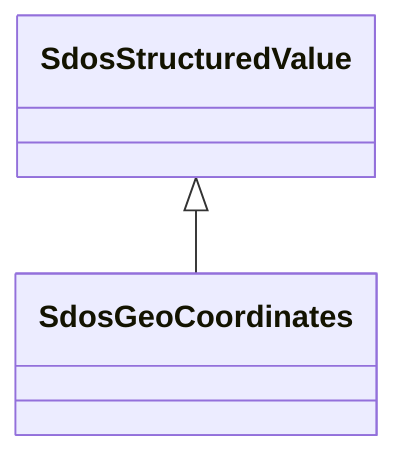

# Class: GeoCoordinates (sdos_GeoCoordinates)


_The geographic coordinates of a place or event._


This class occurs 2324211 times.


URI: [sdos:GeoCoordinates](https://schema.org/GeoCoordinates)





## Inheritance
* [SdosThing](../classes/SdosThing.md)
    * [SdosIntangible](../classes/SdosIntangible.md)
        * [SdosStructuredValue](../classes/SdosStructuredValue.md)
            * **SdosGeoCoordinates**


## Slots

| Name | Cardinality and Range | Description | Inheritance | Occurrences |
| ---  | --- | --- | --- | --- |


## LinkML Source

<!-- TODO: investigate https://stackoverflow.com/questions/37606292/how-to-create-tabbed-code-blocks-in-mkdocs-or-sphinx -->

### Direct

<details>

```yaml
name: sdos_GeoCoordinates
description: The geographic coordinates of a place or event.
title: GeoCoordinates
from_schema: okns:sdo
is_a: sdos_StructuredValue
class_uri: sdos:GeoCoordinates

```
</details>

### Induced

<details>

```yaml
name: sdos_GeoCoordinates
description: The geographic coordinates of a place or event.
title: GeoCoordinates
from_schema: okns:sdo
is_a: sdos_StructuredValue
class_uri: sdos:GeoCoordinates

```
</details>