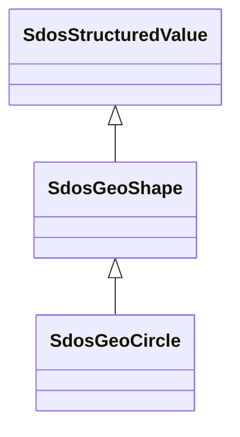

# Class: GeoShape (sdos_GeoShape)


_The geographic shape of a place. A GeoShape can be described using several properties whose values are based on latitude/longitude pairs. Either whitespace or commas can be used to separate latitude and longitude; whitespace should be used when writing a list of several such points._


This class occurs 2324951 times.


URI: [sdos:GeoShape](https://schema.org/GeoShape)





## Inheritance
* [SdosThing](../classes/SdosThing.md)
    * [SdosIntangible](../classes/SdosIntangible.md)
        * [SdosStructuredValue](../classes/SdosStructuredValue.md)
            * **SdosGeoShape**
                * [SdosGeoCircle](../classes/SdosGeoCircle.md)


## Slots

| Name | Cardinality and Range | Description | Inheritance | Occurrences |
| ---  | --- | --- | --- | --- |


## LinkML Source

<!-- TODO: investigate https://stackoverflow.com/questions/37606292/how-to-create-tabbed-code-blocks-in-mkdocs-or-sphinx -->

### Direct

<details>

```yaml
name: sdos_GeoShape
description: The geographic shape of a place. A GeoShape can be described using several
  properties whose values are based on latitude/longitude pairs. Either whitespace
  or commas can be used to separate latitude and longitude; whitespace should be used
  when writing a list of several such points.
title: GeoShape
from_schema: okns:sdo
contributors:
- https://schema.org/docs/collab/rNews
is_a: sdos_StructuredValue
class_uri: sdos:GeoShape

```
</details>

### Induced

<details>

```yaml
name: sdos_GeoShape
description: The geographic shape of a place. A GeoShape can be described using several
  properties whose values are based on latitude/longitude pairs. Either whitespace
  or commas can be used to separate latitude and longitude; whitespace should be used
  when writing a list of several such points.
title: GeoShape
from_schema: okns:sdo
contributors:
- https://schema.org/docs/collab/rNews
is_a: sdos_StructuredValue
class_uri: sdos:GeoShape

```
</details>