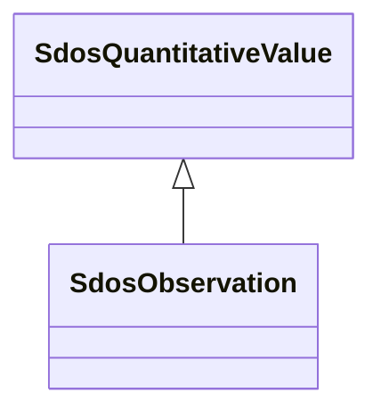

# Class: Observation (sdos_Observation)


_Instances of the class [[Observation]] are used to specify observations about an entity at a particular time. The principal properties of an [[Observation]] are [[observationAbout]], [[measuredProperty]], [[statType]], [[value] and [[observationDate]]  and [[measuredProperty]]. Some but not all Observations represent a [[QuantitativeValue]]. Quantitative observations can be about a [[StatisticalVariable]], which is an abstract specification about which we can make observations that are grounded at a particular location and time.␊␊Observations can also encode a subset of simple RDF-like statements (its observationAbout, a StatisticalVariable, defining the measuredPoperty; its observationAbout property indicating the entity the statement is about, and [[value]] )␊␊In the context of a quantitative knowledge graph, typical properties could include [[measuredProperty]], [[observationAbout]], [[observationDate]], [[value]], [[unitCode]], [[unitText]], [[measurementMethod]]._


This class occurs 67760 times.


URI: [sdos:Observation](https://schema.org/Observation)





## Inheritance
* [SdosThing](../classes/SdosThing.md)
    * [SdosIntangible](../classes/SdosIntangible.md)
        * [SdosStructuredValue](../classes/SdosStructuredValue.md)
            * [SdosQuantitativeValue](../classes/SdosQuantitativeValue.md)
                * **SdosObservation**


## Slots

| Name | Cardinality and Range | Description | Inheritance | Occurrences |
| ---  | --- | --- | --- | --- |


## LinkML Source

<!-- TODO: investigate https://stackoverflow.com/questions/37606292/how-to-create-tabbed-code-blocks-in-mkdocs-or-sphinx -->

### Direct

<details>

```yaml
name: sdos_Observation
description: Instances of the class [[Observation]] are used to specify observations
  about an entity at a particular time. The principal properties of an [[Observation]]
  are [[observationAbout]], [[measuredProperty]], [[statType]], [[value] and [[observationDate]]  and
  [[measuredProperty]]. Some but not all Observations represent a [[QuantitativeValue]].
  Quantitative observations can be about a [[StatisticalVariable]], which is an abstract
  specification about which we can make observations that are grounded at a particular
  location and time.␊␊Observations can also encode a subset of simple RDF-like statements
  (its observationAbout, a StatisticalVariable, defining the measuredPoperty; its
  observationAbout property indicating the entity the statement is about, and [[value]]
  )␊␊In the context of a quantitative knowledge graph, typical properties could include
  [[measuredProperty]], [[observationAbout]], [[observationDate]], [[value]], [[unitCode]],
  [[unitText]], [[measurementMethod]].
title: Observation
from_schema: okns:sdo
source: https://github.com/schemaorg/schemaorg/issues/2291
is_a: sdos_QuantitativeValue
class_uri: sdos:Observation

```
</details>

### Induced

<details>

```yaml
name: sdos_Observation
description: Instances of the class [[Observation]] are used to specify observations
  about an entity at a particular time. The principal properties of an [[Observation]]
  are [[observationAbout]], [[measuredProperty]], [[statType]], [[value] and [[observationDate]]  and
  [[measuredProperty]]. Some but not all Observations represent a [[QuantitativeValue]].
  Quantitative observations can be about a [[StatisticalVariable]], which is an abstract
  specification about which we can make observations that are grounded at a particular
  location and time.␊␊Observations can also encode a subset of simple RDF-like statements
  (its observationAbout, a StatisticalVariable, defining the measuredPoperty; its
  observationAbout property indicating the entity the statement is about, and [[value]]
  )␊␊In the context of a quantitative knowledge graph, typical properties could include
  [[measuredProperty]], [[observationAbout]], [[observationDate]], [[value]], [[unitCode]],
  [[unitText]], [[measurementMethod]].
title: Observation
from_schema: okns:sdo
source: https://github.com/schemaorg/schemaorg/issues/2291
is_a: sdos_QuantitativeValue
class_uri: sdos:Observation

```
</details>