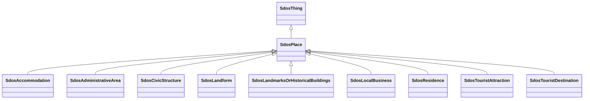

# Class: Place (sdos_Place)


_Entities that have a somewhat fixed, physical extension._


This class occurs 5839329 times.


URI: [sdos:Place](https://schema.org/Place)





## Inheritance
* [SdosThing](../classes/SdosThing.md)
    * **SdosPlace**
        * [SdosAccommodation](../classes/SdosAccommodation.md)
        * [SdosAdministrativeArea](../classes/SdosAdministrativeArea.md)
        * [SdosCivicStructure](../classes/SdosCivicStructure.md)
        * [SdosLandform](../classes/SdosLandform.md)
        * [SdosLandmarksOrHistoricalBuildings](../classes/SdosLandmarksOrHistoricalBuildings.md)
        * [SdosLocalBusiness](../classes/SdosLocalBusiness.md)
        * [SdosResidence](../classes/SdosResidence.md)
        * [SdosTouristAttraction](../classes/SdosTouristAttraction.md)
        * [SdosTouristDestination](../classes/SdosTouristDestination.md)


## Slots

| Name | Cardinality and Range | Description | Inheritance | Occurrences |
| ---  | --- | --- | --- | --- |


## LinkML Source

<!-- TODO: investigate https://stackoverflow.com/questions/37606292/how-to-create-tabbed-code-blocks-in-mkdocs-or-sphinx -->

### Direct

<details>

```yaml
name: sdos_Place
description: Entities that have a somewhat fixed, physical extension.
title: Place
from_schema: okns:sdo
is_a: sdos_Thing
class_uri: sdos:Place

```
</details>

### Induced

<details>

```yaml
name: sdos_Place
description: Entities that have a somewhat fixed, physical extension.
title: Place
from_schema: okns:sdo
is_a: sdos_Thing
class_uri: sdos:Place

```
</details>