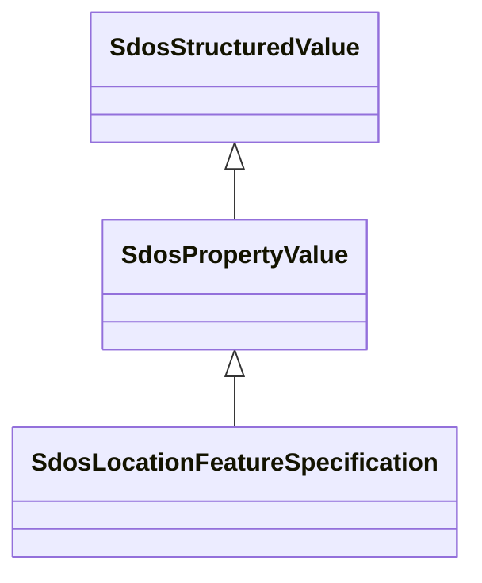

# Class: PropertyValue (sdos_PropertyValue)


_A property-value pair, e.g. representing a feature of a product or place. Use the 'name' property for the name of the property. If there is an additional human-readable version of the value, put that into the 'description' property.\n\n Always use specific schema.org properties when a) they exist and b) you can populate them. Using PropertyValue as a substitute will typically not trigger the same effect as using the original, specific property._


This class occurs 41080766 times.


URI: [sdos:PropertyValue](https://schema.org/PropertyValue)





## Inheritance
* [SdosThing](../classes/SdosThing.md)
    * [SdosIntangible](../classes/SdosIntangible.md)
        * [SdosStructuredValue](../classes/SdosStructuredValue.md)
            * **SdosPropertyValue**
                * [SdosLocationFeatureSpecification](../classes/SdosLocationFeatureSpecification.md)


## Slots

| Name | Cardinality and Range | Description | Inheritance | Occurrences |
| ---  | --- | --- | --- | --- |


## LinkML Source

<!-- TODO: investigate https://stackoverflow.com/questions/37606292/how-to-create-tabbed-code-blocks-in-mkdocs-or-sphinx -->

### Direct

<details>

```yaml
name: sdos_PropertyValue
description: A property-value pair, e.g. representing a feature of a product or place.
  Use the 'name' property for the name of the property. If there is an additional
  human-readable version of the value, put that into the 'description' property.\n\n
  Always use specific schema.org properties when a) they exist and b) you can populate
  them. Using PropertyValue as a substitute will typically not trigger the same effect
  as using the original, specific property.
title: PropertyValue
from_schema: okns:sdo
contributors:
- https://schema.org/docs/collab/GoodRelationsClass
is_a: sdos_StructuredValue
class_uri: sdos:PropertyValue

```
</details>

### Induced

<details>

```yaml
name: sdos_PropertyValue
description: A property-value pair, e.g. representing a feature of a product or place.
  Use the 'name' property for the name of the property. If there is an additional
  human-readable version of the value, put that into the 'description' property.\n\n
  Always use specific schema.org properties when a) they exist and b) you can populate
  them. Using PropertyValue as a substitute will typically not trigger the same effect
  as using the original, specific property.
title: PropertyValue
from_schema: okns:sdo
contributors:
- https://schema.org/docs/collab/GoodRelationsClass
is_a: sdos_StructuredValue
class_uri: sdos:PropertyValue

```
</details>