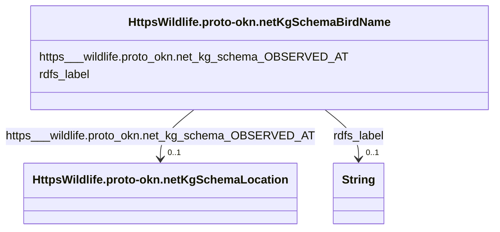

# Class: No class (type) name specified (https___wildlife.proto-okn.net_kg_schema_Bird_name)


_No class (type) description specified_


This class occurs 303 times.


URI: [https://wildlife.proto-okn.net/kg/schema/Bird_name](https://wildlife.proto-okn.net/kg/schema/Bird_name)





<!-- no inheritance hierarchy -->


## Slots

| Name | Cardinality and Range | Description | Inheritance | Occurrences |
| ---  | --- | --- | --- | --- |
| [rdfs_label](../slots/rdfs_label.md) | 0..1 <br/> [xsd:string](http://www.w3.org/2001/XMLSchema#string) | No slot (predicate) description specified <br/>  | direct | 303 |
| [https___wildlife.proto_okn.net_kg_schema_OBSERVED_AT](../slots/https___wildlife.proto_okn.net_kg_schema_OBSERVED_AT.md) | 0..1 <br/> [HttpsWildlife.proto-okn.netKgSchemaLocation](../classes/HttpsWildlife.proto-okn.netKgSchemaLocation.md) | No slot (predicate) description specified <br/>  | direct | 2482 |


## Usages

| used by | used in | type | used |
| ---  | --- | --- | --- |
| [RdfStatement](../classes/RdfStatement.md) | [rdf_subject](../slots/rdf_subject.md) | any_of[range] | [HttpsWildlife.proto-okn.netKgSchemaBirdName](../classes/HttpsWildlife.proto-okn.netKgSchemaBirdName.md) |


## LinkML Source

<!-- TODO: investigate https://stackoverflow.com/questions/37606292/how-to-create-tabbed-code-blocks-in-mkdocs-or-sphinx -->

### Direct

<details>

```yaml
name: https___wildlife.proto-okn.net_kg_schema_Bird_name
conforms_to: No schema conformance document specified
annotations:
  count:
    tag: count
    value: 303
description: No class (type) description specified
title: No class (type) name specified
from_schema: wildlife-kg
rank: 1000
slots:
- rdfs_label
- https___wildlife.proto-okn.net_kg_schema_OBSERVED_AT
slot_usage:
  https___wildlife.proto-okn.net_kg_schema_OBSERVED_AT:
    name: https___wildlife.proto-okn.net_kg_schema_OBSERVED_AT
    annotations:
      https___wildlife.proto-okn.net_kg_schema_Location:
        tag: https___wildlife.proto-okn.net_kg_schema_Location
        value: 2482
  rdfs_label:
    name: rdfs_label
    annotations:
      string:
        tag: string
        value: 303
class_uri: https://wildlife.proto-okn.net/kg/schema/Bird_name

```
</details>

### Induced

<details>

```yaml
name: https___wildlife.proto-okn.net_kg_schema_Bird_name
conforms_to: No schema conformance document specified
annotations:
  count:
    tag: count
    value: 303
description: No class (type) description specified
title: No class (type) name specified
from_schema: wildlife-kg
rank: 1000
slot_usage:
  https___wildlife.proto-okn.net_kg_schema_OBSERVED_AT:
    name: https___wildlife.proto-okn.net_kg_schema_OBSERVED_AT
    annotations:
      https___wildlife.proto-okn.net_kg_schema_Location:
        tag: https___wildlife.proto-okn.net_kg_schema_Location
        value: 2482
  rdfs_label:
    name: rdfs_label
    annotations:
      string:
        tag: string
        value: 303
attributes:
  rdfs_label:
    name: rdfs_label
    annotations:
      string:
        tag: string
        value: 303
    description: No slot (predicate) description specified
    examples:
    - object:
        example_object: Saint Petersburg
        example_object_type: string
        example_predicate: rdfs:label
        example_subject: https://wildlife.proto-okn.net/kg/node/2216
        example_subject_type: https___wildlife.proto-okn.net_kg_schema_Location
    - object:
        example_object: Ardea alba Linnaeus, 1758
        example_object_type: string
        example_predicate: rdfs:label
        example_subject: https://wildlife.proto-okn.net/kg/node/2217
        example_subject_type: https___wildlife.proto-okn.net_kg_schema_Bird_name
    - object:
        example_object: Lithobates sphenocephalus
        example_object_type: string
        example_predicate: rdfs:label
        example_subject: https://wildlife.proto-okn.net/kg/node/2861
        example_subject_type: https___wildlife.proto-okn.net_kg_schema_Amphibian_name
    from_schema: wildlife-kg
    rank: 1000
    slot_uri: rdfs:label
    alias: rdfs_label
    owner: https___wildlife.proto-okn.net_kg_schema_Bird_name
    domain_of:
    - https___wildlife.proto-okn.net_kg_schema_Amphibian_name
    - https___wildlife.proto-okn.net_kg_schema_Bird_name
    - https___wildlife.proto-okn.net_kg_schema_Location
    range: string
  https___wildlife.proto-okn.net_kg_schema_OBSERVED_AT:
    name: https___wildlife.proto-okn.net_kg_schema_OBSERVED_AT
    annotations:
      https___wildlife.proto-okn.net_kg_schema_Location:
        tag: https___wildlife.proto-okn.net_kg_schema_Location
        value: 2482
    description: No slot (predicate) description specified
    examples:
    - object:
        example_object: https://wildlife.proto-okn.net/kg/node/2216
        example_object_type: https___wildlife.proto-okn.net_kg_schema_Location
        example_predicate: https://wildlife.proto-okn.net/kg/schema/OBSERVED_AT
        example_subject: https://wildlife.proto-okn.net/kg/node/2217
        example_subject_type: https___wildlife.proto-okn.net_kg_schema_Bird_name
    - object:
        example_object: https://wildlife.proto-okn.net/kg/node/2216
        example_object_type: https___wildlife.proto-okn.net_kg_schema_Location
        example_predicate: https://wildlife.proto-okn.net/kg/schema/OBSERVED_AT
        example_subject: https://wildlife.proto-okn.net/kg/node/2861
        example_subject_type: https___wildlife.proto-okn.net_kg_schema_Amphibian_name
    from_schema: wildlife-kg
    rank: 1000
    slot_uri: https://wildlife.proto-okn.net/kg/schema/OBSERVED_AT
    alias: https___wildlife.proto_okn.net_kg_schema_OBSERVED_AT
    owner: https___wildlife.proto-okn.net_kg_schema_Bird_name
    domain_of:
    - https___wildlife.proto-okn.net_kg_schema_Amphibian_name
    - https___wildlife.proto-okn.net_kg_schema_Bird_name
    range: https___wildlife.proto-okn.net_kg_schema_Location
class_uri: https://wildlife.proto-okn.net/kg/schema/Bird_name

```
</details>