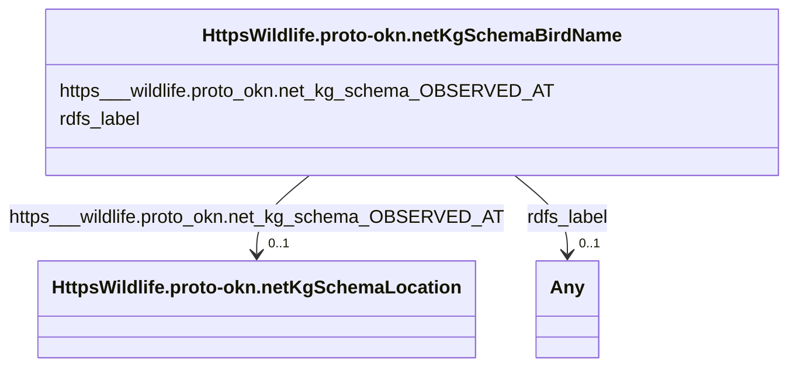

# Class: HttpsWildlife.proto-okn.netKgSchemaBirdName


This class occurs 303 times.


URI: [https://wildlife.proto-okn.net/kg/schema/Bird_name](https://wildlife.proto-okn.net/kg/schema/Bird_name)





<!-- no inheritance hierarchy -->


## Slots

| Name | Cardinality and Range | Description | Inheritance | Occurrences |
| ---  | --- | --- | --- | --- |
| [https___wildlife.proto_okn.net_kg_schema_OBSERVED_AT](../slots/https___wildlife.proto_okn.net_kg_schema_OBSERVED_AT.md) | 0..1 <br/> [HttpsWildlife.proto-okn.netKgSchemaLocation](../classes/HttpsWildlife.proto-okn.netKgSchemaLocation.md) |  <br/>  | direct | 2482 |
| [rdfs_label](../slots/rdfs_label.md) | 0..1 <br/> [RdfsLiteral](../classes/RdfsLiteral.md)&nbsp;or&nbsp;<br />[xsd:string](http://www.w3.org/2001/XMLSchema#string) | A human-readable name for the subject <br/>  | direct | 303 |


## LinkML Source

<!-- TODO: investigate https://stackoverflow.com/questions/37606292/how-to-create-tabbed-code-blocks-in-mkdocs-or-sphinx -->

### Direct

<details>

```yaml
name: https___wildlife.proto-okn.net_kg_schema_Bird_name
from_schema: okns:wildlife-kg
rank: 1000
slots:
- https___wildlife.proto-okn.net_kg_schema_OBSERVED_AT
- rdfs_label
class_uri: https://wildlife.proto-okn.net/kg/schema/Bird_name

```
</details>

### Induced

<details>

```yaml
name: https___wildlife.proto-okn.net_kg_schema_Bird_name
from_schema: okns:wildlife-kg
rank: 1000
attributes:
  https___wildlife.proto-okn.net_kg_schema_OBSERVED_AT:
    name: https___wildlife.proto-okn.net_kg_schema_OBSERVED_AT
    from_schema: okns:wildlife-kg
    rank: 1000
    slot_uri: https://wildlife.proto-okn.net/kg/schema/OBSERVED_AT
    alias: https___wildlife.proto_okn.net_kg_schema_OBSERVED_AT
    owner: https___wildlife.proto-okn.net_kg_schema_Bird_name
    domain_of:
    - https___wildlife.proto-okn.net_kg_schema_Amphibian_name
    - https___wildlife.proto-okn.net_kg_schema_Bird_name
    range: https___wildlife.proto-okn.net_kg_schema_Location
  rdfs_label:
    name: rdfs_label
    description: A human-readable name for the subject.
    title: label
    from_schema: okns:owl-rdf-rdfs
    source: http://www.w3.org/2000/01/rdf-schema#
    domain: rdfs_Resource
    slot_uri: rdfs:label
    alias: rdfs_label
    owner: https___wildlife.proto-okn.net_kg_schema_Bird_name
    domain_of:
    - rdf_List
    - rdfs_Datatype
    - sdos_ActionStatusType
    - sdos_AdultOrientedEnumeration
    - sdos_BoardingPolicyType
    - sdos_BodyMeasurementTypeEnumeration
    - sdos_BookFormatType
    - sdos_Boolean
    - sdos_CarUsageType
    - sdos_CertificationStatusEnumeration
    - sdos_ContactPointOption
    - sdos_DataType
    - sdos_DayOfWeek
    - sdos_DeliveryMethod
    - sdos_DigitalDocumentPermissionType
    - sdos_DigitalPlatformEnumeration
    - sdos_DriveWheelConfigurationValue
    - sdos_DrugCostCategory
    - sdos_DrugPregnancyCategory
    - sdos_DrugPrescriptionStatus
    - sdos_EUEnergyEfficiencyEnumeration
    - sdos_EnergyStarEnergyEfficiencyEnumeration
    - sdos_EventAttendanceModeEnumeration
    - sdos_EventStatusType
    - sdos_FulfillmentTypeEnumeration
    - sdos_GameAvailabilityEnumeration
    - sdos_GamePlayMode
    - sdos_GameServerStatus
    - sdos_GenderType
    - sdos_GovernmentBenefitsType
    - sdos_HealthAspectEnumeration
    - sdos_IPTCDigitalSourceEnumeration
    - sdos_IncentiveQualifiedExpenseType
    - sdos_IncentiveStatus
    - sdos_IncentiveType
    - sdos_InfectiousAgentClass
    - sdos_ItemAvailability
    - sdos_ItemListOrderType
    - sdos_LegalForceStatus
    - sdos_LegalValueLevel
    - sdos_MapCategoryType
    - sdos_MeasurementMethodEnum
    - sdos_MediaManipulationRatingEnumeration
    - sdos_MedicalAudienceType
    - sdos_MedicalDevicePurpose
    - sdos_MedicalEvidenceLevel
    - sdos_MedicalImagingTechnique
    - sdos_MedicalObservationalStudyDesign
    - sdos_MedicalProcedureType
    - sdos_MedicalSpecialty
    - sdos_MedicalStudyStatus
    - sdos_MedicalTrialDesign
    - sdos_MedicineSystem
    - sdos_MerchantReturnEnumeration
    - sdos_MusicAlbumProductionType
    - sdos_MusicAlbumReleaseType
    - sdos_MusicReleaseFormatType
    - sdos_NLNonprofitType
    - sdos_OfferItemCondition
    - sdos_OrderStatus
    - sdos_PaymentMethodType
    - sdos_PaymentStatusType
    - sdos_PhysicalActivityCategory
    - sdos_PhysicalExam
    - sdos_PriceComponentTypeEnumeration
    - sdos_PriceTypeEnumeration
    - sdos_ProductReturnEnumeration
    - sdos_PurchaseType
    - sdos_RefundTypeEnumeration
    - sdos_ReservationStatusType
    - sdos_RestrictedDiet
    - sdos_ReturnFeesEnumeration
    - sdos_ReturnLabelSourceEnumeration
    - sdos_ReturnMethodEnumeration
    - sdos_RsvpResponseType
    - sdos_SizeSystemEnumeration
    - sdos_SteeringPositionValue
    - sdos_TierBenefitEnumeration
    - sdos_UKNonprofitType
    - sdos_USNonprofitType
    - sdos_WearableMeasurementTypeEnumeration
    - sdos_WearableSizeGroupEnumeration
    - sdos_WearableSizeSystemEnumeration
    - dcam_VocabularyEncodingScheme
    - dct_AgentClass
    - https___wildlife.proto-okn.net_kg_Amphibian_name
    - https___wildlife.proto-okn.net_kg_Bird_name
    - https___wildlife.proto-okn.net_kg_Location
    - https___wildlife.proto-okn.net_kg_schema_Amphibian_name
    - https___wildlife.proto-okn.net_kg_schema_Bird_name
    - https___wildlife.proto-okn.net_kg_schema_Location
    range: Any
    any_of:
    - range: rdfs_Literal
    - range: string
class_uri: https://wildlife.proto-okn.net/kg/schema/Bird_name

```
</details>