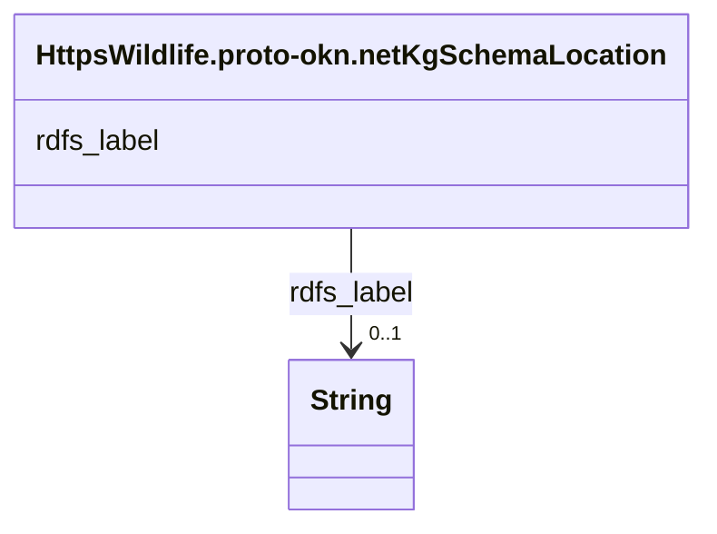

# Class: No class (type) name specified (https___wildlife.proto-okn.net_kg_schema_Location)


_No class (type) description specified_


This class occurs 657 times.


URI: [https://wildlife.proto-okn.net/kg/schema/Location](https://wildlife.proto-okn.net/kg/schema/Location)





<!-- no inheritance hierarchy -->


## Slots

| Name | Cardinality and Range | Description | Inheritance | Occurrences |
| ---  | --- | --- | --- | --- |
| [rdfs_label](../slots/rdfs_label.md) | 0..1 <br/> [xsd:string](http://www.w3.org/2001/XMLSchema#string) | No slot (predicate) description specified <br/>  | direct | 657 |


## Usages

| used by | used in | type | used |
| ---  | --- | --- | --- |
| [HttpsWildlife.proto-okn.netKgSchemaAmphibianName](../classes/HttpsWildlife.proto-okn.netKgSchemaAmphibianName.md) | [https___wildlife.proto_okn.net_kg_schema_OBSERVED_AT](../slots/https___wildlife.proto_okn.net_kg_schema_OBSERVED_AT.md) | range | [HttpsWildlife.proto-okn.netKgSchemaLocation](../classes/HttpsWildlife.proto-okn.netKgSchemaLocation.md) |
| [HttpsWildlife.proto-okn.netKgSchemaBirdName](../classes/HttpsWildlife.proto-okn.netKgSchemaBirdName.md) | [https___wildlife.proto_okn.net_kg_schema_OBSERVED_AT](../slots/https___wildlife.proto_okn.net_kg_schema_OBSERVED_AT.md) | range | [HttpsWildlife.proto-okn.netKgSchemaLocation](../classes/HttpsWildlife.proto-okn.netKgSchemaLocation.md) |
| [RdfStatement](../classes/RdfStatement.md) | [rdf_object](../slots/rdf_object.md) | range | [HttpsWildlife.proto-okn.netKgSchemaLocation](../classes/HttpsWildlife.proto-okn.netKgSchemaLocation.md) |


## LinkML Source

<!-- TODO: investigate https://stackoverflow.com/questions/37606292/how-to-create-tabbed-code-blocks-in-mkdocs-or-sphinx -->

### Direct

<details>

```yaml
name: https___wildlife.proto-okn.net_kg_schema_Location
conforms_to: No schema conformance document specified
annotations:
  count:
    tag: count
    value: 657
description: No class (type) description specified
title: No class (type) name specified
from_schema: wildlife-kg
rank: 1000
slots:
- rdfs_label
slot_usage:
  rdfs_label:
    name: rdfs_label
    annotations:
      string:
        tag: string
        value: 657
class_uri: https://wildlife.proto-okn.net/kg/schema/Location

```
</details>

### Induced

<details>

```yaml
name: https___wildlife.proto-okn.net_kg_schema_Location
conforms_to: No schema conformance document specified
annotations:
  count:
    tag: count
    value: 657
description: No class (type) description specified
title: No class (type) name specified
from_schema: wildlife-kg
rank: 1000
slot_usage:
  rdfs_label:
    name: rdfs_label
    annotations:
      string:
        tag: string
        value: 657
attributes:
  rdfs_label:
    name: rdfs_label
    annotations:
      string:
        tag: string
        value: 657
    description: No slot (predicate) description specified
    examples:
    - object:
        example_object: Saint Petersburg
        example_object_type: string
        example_predicate: rdfs:label
        example_subject: https://wildlife.proto-okn.net/kg/node/2216
        example_subject_type: https___wildlife.proto-okn.net_kg_schema_Location
    - object:
        example_object: Ardea alba Linnaeus, 1758
        example_object_type: string
        example_predicate: rdfs:label
        example_subject: https://wildlife.proto-okn.net/kg/node/2217
        example_subject_type: https___wildlife.proto-okn.net_kg_schema_Bird_name
    - object:
        example_object: Lithobates sphenocephalus
        example_object_type: string
        example_predicate: rdfs:label
        example_subject: https://wildlife.proto-okn.net/kg/node/2861
        example_subject_type: https___wildlife.proto-okn.net_kg_schema_Amphibian_name
    from_schema: wildlife-kg
    rank: 1000
    slot_uri: rdfs:label
    alias: rdfs_label
    owner: https___wildlife.proto-okn.net_kg_schema_Location
    domain_of:
    - https___wildlife.proto-okn.net_kg_schema_Amphibian_name
    - https___wildlife.proto-okn.net_kg_schema_Bird_name
    - https___wildlife.proto-okn.net_kg_schema_Location
    range: string
class_uri: https://wildlife.proto-okn.net/kg/schema/Location

```
</details>