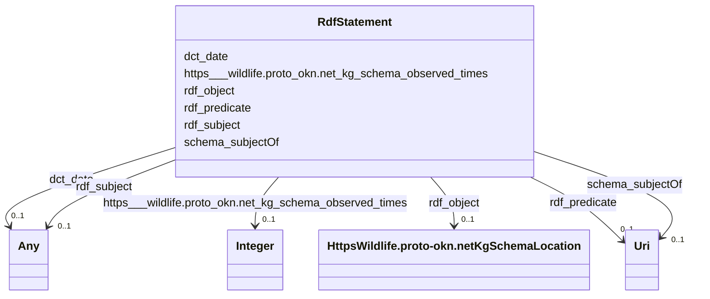

# Class: No class (type) name specified (rdf_Statement)


_No class (type) description specified_


This class occurs 5205 times.


URI: [rdf:Statement](http://www.w3.org/1999/02/22-rdf-syntax-ns#Statement)





<!-- no inheritance hierarchy -->


## Slots

| Name | Cardinality and Range | Description | Inheritance | Occurrences |
| ---  | --- | --- | --- | --- |
| [rdf_subject](../slots/rdf_subject.md) | 0..1 <br/> [HttpsWildlife.proto-okn.netKgSchemaBirdName](../classes/HttpsWildlife.proto-okn.netKgSchemaBirdName.md)&nbsp;or&nbsp;<br />[HttpsWildlife.proto-okn.netKgSchemaAmphibianName](../classes/HttpsWildlife.proto-okn.netKgSchemaAmphibianName.md) | No slot (predicate) description specified <br/>  | direct | 5205 |
| [schema_subjectOf](../slots/schema_subjectOf.md) | 0..1 <br/> [xsd:anyURI](http://www.w3.org/2001/XMLSchema#anyURI) | A CreativeWork or Event about this Thing <br/>  | direct | 5205 |
| [dct_date](../slots/dct_date.md) | 0..1 <br/> [xsd:dateTime](http://www.w3.org/2001/XMLSchema#dateTime)&nbsp;or&nbsp;<br />[xsd:date](http://www.w3.org/2001/XMLSchema#date) | No slot (predicate) description specified <br/>  | direct | 5205 |
| [https___wildlife.proto_okn.net_kg_schema_observed_times](../slots/https___wildlife.proto_okn.net_kg_schema_observed_times.md) | 0..1 <br/> [xsd:integer](http://www.w3.org/2001/XMLSchema#integer) | No slot (predicate) description specified <br/>  | direct | 5205 |
| [rdf_object](../slots/rdf_object.md) | 0..1 <br/> [HttpsWildlife.proto-okn.netKgSchemaLocation](../classes/HttpsWildlife.proto-okn.netKgSchemaLocation.md) | No slot (predicate) description specified <br/>  | direct | 5205 |
| [rdf_predicate](../slots/rdf_predicate.md) | 0..1 <br/> [xsd:anyURI](http://www.w3.org/2001/XMLSchema#anyURI) | No slot (predicate) description specified <br/>  | direct | 5205 |


## LinkML Source

<!-- TODO: investigate https://stackoverflow.com/questions/37606292/how-to-create-tabbed-code-blocks-in-mkdocs-or-sphinx -->

### Direct

<details>

```yaml
name: rdf_Statement
conforms_to: No schema conformance document specified
annotations:
  count:
    tag: count
    value: 5205
description: No class (type) description specified
title: No class (type) name specified
from_schema: wildlife-kg
rank: 1000
slots:
- rdf_subject
- schema_subjectOf
- dct_date
- https___wildlife.proto-okn.net_kg_schema_observed_times
- rdf_object
- rdf_predicate
slot_usage:
  dct_date:
    name: dct_date
    annotations:
      date:
        tag: date
        value: 87
      datetime:
        tag: datetime
        value: 5118
  https___wildlife.proto-okn.net_kg_schema_observed_times:
    name: https___wildlife.proto-okn.net_kg_schema_observed_times
    annotations:
      integer:
        tag: integer
        value: 5205
  rdf_object:
    name: rdf_object
    annotations:
      https___wildlife.proto-okn.net_kg_schema_Location:
        tag: https___wildlife.proto-okn.net_kg_schema_Location
        value: 5205
  rdf_predicate:
    name: rdf_predicate
    annotations:
      uri:
        tag: uri
        value: 5205
  rdf_subject:
    name: rdf_subject
    annotations:
      https___wildlife.proto-okn.net_kg_schema_Amphibian_name:
        tag: https___wildlife.proto-okn.net_kg_schema_Amphibian_name
        value: 2723
      https___wildlife.proto-okn.net_kg_schema_Bird_name:
        tag: https___wildlife.proto-okn.net_kg_schema_Bird_name
        value: 2482
  schema_subjectOf:
    name: schema_subjectOf
    annotations:
      uri:
        tag: uri
        value: 5205
class_uri: rdf:Statement

```
</details>

### Induced

<details>

```yaml
name: rdf_Statement
conforms_to: No schema conformance document specified
annotations:
  count:
    tag: count
    value: 5205
description: No class (type) description specified
title: No class (type) name specified
from_schema: wildlife-kg
rank: 1000
slot_usage:
  dct_date:
    name: dct_date
    annotations:
      date:
        tag: date
        value: 87
      datetime:
        tag: datetime
        value: 5118
  https___wildlife.proto-okn.net_kg_schema_observed_times:
    name: https___wildlife.proto-okn.net_kg_schema_observed_times
    annotations:
      integer:
        tag: integer
        value: 5205
  rdf_object:
    name: rdf_object
    annotations:
      https___wildlife.proto-okn.net_kg_schema_Location:
        tag: https___wildlife.proto-okn.net_kg_schema_Location
        value: 5205
  rdf_predicate:
    name: rdf_predicate
    annotations:
      uri:
        tag: uri
        value: 5205
  rdf_subject:
    name: rdf_subject
    annotations:
      https___wildlife.proto-okn.net_kg_schema_Amphibian_name:
        tag: https___wildlife.proto-okn.net_kg_schema_Amphibian_name
        value: 2723
      https___wildlife.proto-okn.net_kg_schema_Bird_name:
        tag: https___wildlife.proto-okn.net_kg_schema_Bird_name
        value: 2482
  schema_subjectOf:
    name: schema_subjectOf
    annotations:
      uri:
        tag: uri
        value: 5205
attributes:
  rdf_subject:
    name: rdf_subject
    annotations:
      https___wildlife.proto-okn.net_kg_schema_Amphibian_name:
        tag: https___wildlife.proto-okn.net_kg_schema_Amphibian_name
        value: 2723
      https___wildlife.proto-okn.net_kg_schema_Bird_name:
        tag: https___wildlife.proto-okn.net_kg_schema_Bird_name
        value: 2482
    description: No slot (predicate) description specified
    examples:
    - object:
        example_object: https://wildlife.proto-okn.net/kg/node/2368
        example_object_type: https___wildlife.proto-okn.net_kg_schema_Bird_name
        example_predicate: rdf:subject
        example_subject: https://wildlife.proto-okn.net/kg/relationship/14856
        example_subject_type: rdf_Statement
    - object:
        example_object: https://wildlife.proto-okn.net/kg/node/2861
        example_object_type: https___wildlife.proto-okn.net_kg_schema_Amphibian_name
        example_predicate: rdf:subject
        example_subject: https://wildlife.proto-okn.net/kg/relationship/16140
        example_subject_type: rdf_Statement
    from_schema: wildlife-kg
    rank: 1000
    slot_uri: rdf:subject
    alias: rdf_subject
    owner: rdf_Statement
    domain_of:
    - rdf_Statement
    range: Any
    any_of:
    - range: https___wildlife.proto-okn.net_kg_schema_Bird_name
    - range: https___wildlife.proto-okn.net_kg_schema_Amphibian_name
  schema_subjectOf:
    name: schema_subjectOf
    annotations:
      uri:
        tag: uri
        value: 5205
    description: A CreativeWork or Event about this Thing.
    title: subjectOf
    examples:
    - object:
        example_object: https://www.inaturalist.org/observations/19259838
        example_object_type: uri
        example_predicate: schema:subjectOf
        example_subject: https://wildlife.proto-okn.net/kg/relationship/14856
        example_subject_type: rdf_Statement
    from_schema: wildlife-kg
    rank: 1000
    slot_uri: schema:subjectOf
    alias: schema_subjectOf
    owner: rdf_Statement
    domain_of:
    - rdf_Statement
    range: uri
  dct_date:
    name: dct_date
    annotations:
      date:
        tag: date
        value: 87
      datetime:
        tag: datetime
        value: 5118
    description: No slot (predicate) description specified
    examples:
    - object:
        example_object: '2018-12-26T18:04:00'
        example_object_type: datetime
        example_predicate: dct:date
        example_subject: https://wildlife.proto-okn.net/kg/relationship/14856
        example_subject_type: rdf_Statement
    - object:
        example_object: '2023-10-18'
        example_object_type: date
        example_predicate: dct:date
        example_subject: https://wildlife.proto-okn.net/kg/relationship/15004
        example_subject_type: rdf_Statement
    from_schema: wildlife-kg
    rank: 1000
    slot_uri: dct:date
    alias: dct_date
    owner: rdf_Statement
    domain_of:
    - rdf_Statement
    range: Any
    any_of:
    - range: datetime
    - range: date
  https___wildlife.proto-okn.net_kg_schema_observed_times:
    name: https___wildlife.proto-okn.net_kg_schema_observed_times
    annotations:
      integer:
        tag: integer
        value: 5205
    description: No slot (predicate) description specified
    examples:
    - object:
        example_object: '2'
        example_object_type: integer
        example_predicate: https://wildlife.proto-okn.net/kg/schema/observed_times
        example_subject: https://wildlife.proto-okn.net/kg/relationship/14856
        example_subject_type: rdf_Statement
    from_schema: wildlife-kg
    rank: 1000
    slot_uri: https://wildlife.proto-okn.net/kg/schema/observed_times
    alias: https___wildlife.proto_okn.net_kg_schema_observed_times
    owner: rdf_Statement
    domain_of:
    - rdf_Statement
    range: integer
  rdf_object:
    name: rdf_object
    annotations:
      https___wildlife.proto-okn.net_kg_schema_Location:
        tag: https___wildlife.proto-okn.net_kg_schema_Location
        value: 5205
    description: No slot (predicate) description specified
    examples:
    - object:
        example_object: https://wildlife.proto-okn.net/kg/node/2426
        example_object_type: https___wildlife.proto-okn.net_kg_schema_Location
        example_predicate: rdf:object
        example_subject: https://wildlife.proto-okn.net/kg/relationship/14856
        example_subject_type: rdf_Statement
    from_schema: wildlife-kg
    rank: 1000
    slot_uri: rdf:object
    alias: rdf_object
    owner: rdf_Statement
    domain_of:
    - rdf_Statement
    range: https___wildlife.proto-okn.net_kg_schema_Location
  rdf_predicate:
    name: rdf_predicate
    annotations:
      uri:
        tag: uri
        value: 5205
    description: No slot (predicate) description specified
    examples:
    - object:
        example_object: https://wildlife.proto-okn.net/kg/schema/OBSERVED_AT
        example_object_type: uri
        example_predicate: rdf:predicate
        example_subject: https://wildlife.proto-okn.net/kg/relationship/14856
        example_subject_type: rdf_Statement
    from_schema: wildlife-kg
    rank: 1000
    slot_uri: rdf:predicate
    alias: rdf_predicate
    owner: rdf_Statement
    domain_of:
    - rdf_Statement
    range: uri
class_uri: rdf:Statement

```
</details>